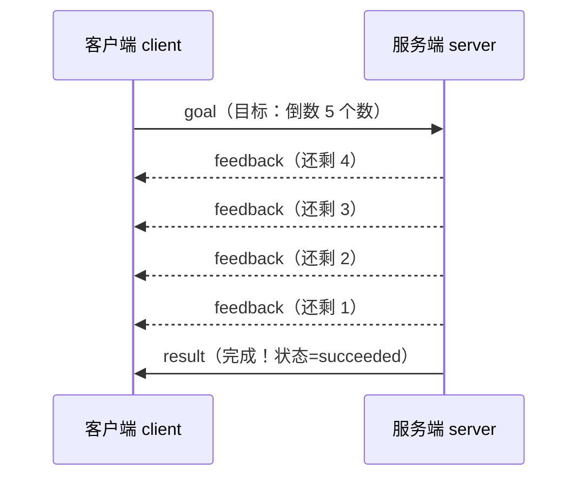
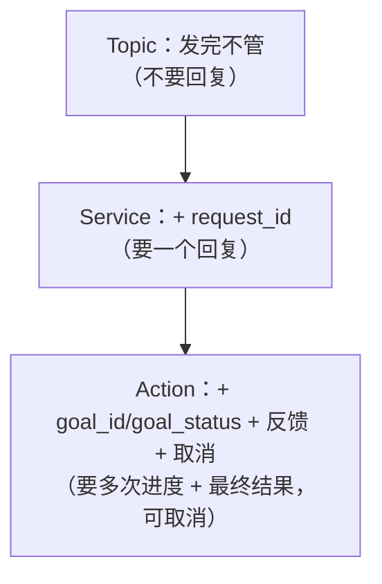

# 6.3 Action 长任务

Service 适合"一问一答、立刻能答"的事。但如果小莫要做的是一件**很耗时**的事呢？比如"走到门口"——这得走好几秒。要是用 Service，小莫就得**傻等到走完才收到一个"到了"**，中间毫无音讯，也没法喊停。

这时候需要第三种模式：**Action（动作）长任务**。它专为"耗时任务"设计：**发一个目标，服务端边做边汇报进度，做完给最终结果，中途还能取消。**

:::info 小莫说
"走到门口""把手臂抬到 90 度"这类活儿都得花时间。我可不想布置完就干等着——我想随时知道"走到一半了""快到了"，必要时还能喊"停，别走了！"
:::

## 学习目标

学完本节，你将能够：

- 说清 Action 的三件套：**目标（goal）→ 反馈（feedback）→ 结果（result）**；
- 理解 **`goal_id`（目标编号）** 和 **`goal_status`（目标状态）** 两个关键元数据；
- 用纯 Python 实现一个"边做边报进度"的长任务服务端；
- 理解 Action 的**取消（cancel）**机制。

## 前置要求

- 完成 [6.2 Service](./service)，理解 `request_id` 配对与元数据的用法；
- Action 的编号机制和 Service 很像，建议先弄懂 Service 再学本节。

## 先回到黑板教室

第一章这样点过 Action：

> **老师布置一张卷子，同学边做边举手报进度："做一半了""快了""交卷！"**

对比前两种模式，Action 的特别之处是**过程中有多次反馈**：

| | Service | Action |
|---|---------|--------|
| 耗时 | 短，立刻答 | 长，要做一阵 |
| 回复次数 | 一次（就一个答复） | 多次（多个进度 + 一个最终结果） |
| 能否取消 | 不能 | 能，中途可喊停 |
| 课堂类比 | 一问一答 | 布置卷子，边做边报，可提前收卷 |

Action 有三种消息：

- **目标（goal）**：客户端布置的任务（"做这张卷子"）；
- **反馈（feedback）**：服务端做的过程中，不断汇报的**进度**（"做一半了"）；
- **结果（result）**：任务做完时的**最终结论**（"交卷，得分 95"）。



## 两个关键元数据：goal_id 和 goal_status

和 Service 用 `request_id` 配对一样，Action 也要靠元数据来协调。它用两个：

| 元数据 | 作用 | 类比 |
|--------|------|------|
| **`goal_id`** | 目标的唯一编号，把反馈/结果都对应到某个目标 | 和 Service 的取餐号一个道理 |
| **`goal_status`** | 任务的最终状态 | 卷子的批改结果 |

`goal_status` 有三种约定好的值（**必须小写、拼写精确**）：

| 值 | 含义 |
|----|------|
| `succeeded` | 成功完成 |
| `aborted` | 服务端主动放弃（比如出错了） |
| `canceled` | 被客户端取消 |

:::warning goal_status 的值大小写敏感
必须用精确的小写字符串：`"succeeded"`、`"aborted"`、`"canceled"`。写成 `"Succeeded"` 或拼错，接收方就认不出，任务状态会乱。
:::

## 动手实现：一个倒计时任务

我们做个直观的例子：客户端布置"从 N 倒数到 0"的目标，服务端每步汇报"还剩几"，数到 0 就报告完成。目录 `course/ch06-action`。

### 服务端 `server.py`

服务端要"边做边报"。它的诀窍是：**不要在一次事件里把整个长任务做完**（那样会卡住），而是**每次被触发就推进一步**，靠自己维护"还剩几"的状态。

```python
# server.py —— 倒计时长任务服务端：每步推进 + 汇报进度
import pyarrow as pa
from dora import Node


def main():
    node = Node()

    active_goals = {}      # 正在进行的目标：goal_id -> 还剩几

    for event in node:
        if event["type"] == "INPUT":

            if event["id"] == "goal":
                # 收到新目标：取出要倒数的起始值和它的编号
                start = event["value"][0].as_py()
                goal_id = event["metadata"]["goal_id"]
                active_goals[goal_id] = start
                print(f"[服务端] 接到目标 {goal_id[:8]}：从 {start} 倒数", flush=True)

            elif event["id"] == "cancel":
                # 收到取消请求：把对应目标标记为取消
                goal_id = event["metadata"]["goal_id"]
                if goal_id in active_goals:
                    del active_goals[goal_id]
                    node.send_output(
                        "result",
                        pa.array([-1]),
                        metadata={"goal_id": goal_id, "goal_status": "canceled"},
                    )
                    print(f"[服务端] 目标 {goal_id[:8]} 已取消", flush=True)

            elif event["id"] == "tick":
                # 定时器：推进所有进行中的目标各一步
                for goal_id in list(active_goals.keys()):
                    remaining = active_goals[goal_id] - 1

                    if remaining > 0:
                        # 还没数完：更新状态，发一条反馈
                        active_goals[goal_id] = remaining
                        node.send_output(
                            "feedback",
                            pa.array([remaining]),
                            metadata={"goal_id": goal_id},
                        )
                    else:
                        # 数到 0：发最终结果，状态 succeeded，并移除
                        del active_goals[goal_id]
                        node.send_output(
                            "result",
                            pa.array([0]),
                            metadata={"goal_id": goal_id, "goal_status": "succeeded"},
                        )

        elif event["type"] == "STOP":
            break


if __name__ == "__main__":
    main()
```

核心思路：`active_goals` 字典记住每个目标"还剩几"，`tick` 每次到点就让每个目标**前进一步**——这样长任务被拆成了许多小步，既能持续汇报，又不会卡住事件循环。

### 客户端 `client.py`

```python
# client.py —— 布置倒计时目标，接收进度与结果
import uuid
import pyarrow as pa
from dora import Node


def main():
    node = Node()

    sent = False       # 这个简单示例只布置一个目标

    for event in node:
        if event["type"] == "INPUT":

            if event["id"] == "tick":
                if not sent:
                    goal_id = str(uuid.uuid4())        # 目标编号
                    node.send_output(
                        "goal",
                        pa.array([5]),                 # 目标：从 5 倒数
                        metadata={"goal_id": goal_id},
                    )
                    print(f"[客户端] 布置目标 {goal_id[:8]}：从 5 倒数", flush=True)
                    sent = True

            elif event["id"] == "feedback":
                remaining = event["value"][0].as_py()
                print(f"[客户端] 进度：还剩 {remaining}", flush=True)

            elif event["id"] == "result":
                status = event["metadata"]["goal_status"]
                print(f"[客户端] 任务结束，状态：{status}  🎉", flush=True)

        elif event["type"] == "STOP":
            break


if __name__ == "__main__":
    main()
```

### 连成数据流 `dataflow.yml`

Action 的连线比 Service 更"热闹"——客户端有 `goal`/`cancel` 两个输出，服务端有 `feedback`/`result` 两个输出，双向都要连：

```yaml
nodes:
  - id: client
    path: client.py
    inputs:
      tick: dora/timer/millis/1000    # 用于布置目标
      feedback: server/feedback       # 接收进度反馈
      result: server/result           # 接收最终结果
    outputs:
      - goal
      - cancel

  - id: server
    path: server.py
    inputs:
      goal: client/goal               # 接收目标
      cancel: client/cancel           # 接收取消请求
      tick: dora/timer/millis/1000    # 用于每步推进倒计时
    outputs:
      - feedback
      - result
```

### 跑起来

```bash
dora run dataflow.yml
```

你会看到任务边做边报、最后完成：

```
[客户端] 布置目标 a3f8c1d2：从 5 倒数
[服务端] 接到目标 a3f8c1d2：从 5 倒数
[客户端] 进度：还剩 4
[客户端] 进度：还剩 3
[客户端] 进度：还剩 2
[客户端] 进度：还剩 1
[客户端] 任务结束，状态：succeeded  🎉
```

**从"布置"到"边做边报"再到"完成"——这就是 Action 的完整生命周期！**

:::info 小莫说
看到那一条条"还剩 X"了吗？这就是我要的！布置完不用干等，全程都知道进展到哪了，心里踏实多啦。
:::

## 取消（cancel）：中途喊停

Action 比 Service 强的另一点，是**能中途取消**。机制很简单：

1. 客户端往 `cancel` 输出发一条消息，带上要取消的 `goal_id`；
2. 服务端在处理中检查到 cancel，就停止那个目标，并发一个 `goal_status = "canceled"` 的结果。

我们的服务端代码已经写好了 cancel 分支。你可以改客户端，在收到"还剩 3"时发一条取消试试：

```python
elif event["id"] == "feedback":
    remaining = event["value"][0].as_py()
    print(f"[客户端] 进度：还剩 {remaining}", flush=True)
    if remaining == 3:                          # 剩 3 时反悔，取消
        node.send_output("cancel", pa.array([0]),
                         metadata={"goal_id": current_goal_id})
```

（需要你把 `goal_id` 存成一个变量 `current_goal_id` 以便这里引用。）

:::tip 为什么取消很重要？
真实机器人里，"取消"是安全刚需。比如小莫正伸手去抓杯子，你突然喊停——必须能立刻中止，否则可能撞坏东西。Action 天生支持这种"随时喊停"，这是它比 Service 更适合真实动作任务的关键原因。
:::

## 三种模式的递进关系

到这里，前三种模式的关系就清晰了——它们是**层层加码**的：



- Topic 什么都不要；
- Service 加了"配对编号"，换来一个回复；
- Action 再加"状态 + 多次反馈 + 取消"，换来对长任务的完整掌控。

**它们底层都还是 Topic（pub/sub）+ 元数据约定**——你已经能看出这套设计的优雅了。

:::details 进阶延伸：并发多个目标与容错（可跳过）
我们的服务端用 `active_goals` 字典，其实**天然支持同时进行多个目标**——每个 `goal_id` 独立倒计时、独立汇报。DORA 官方的 action 示例服务端能同时管理多达 64 个目标。

真实系统还要考虑：服务端崩溃重启后，进行中的目标怎么办？成熟做法会用超时和"服务端重启"信号来兜底（Rust API 有 `recv_action_result` 辅助）。这些等你做真实项目再深入，现在掌握"目标→反馈→结果 + 取消"的主干即可。
:::

## 动手练习

:::tip 练习：给倒计时加"百分比进度"
改造服务端的反馈：除了"还剩几"，再算出完成百分比（比如从 5 倒数、剩 2 时，完成度 = (5-2)/5 = 60%），一起发给客户端显示。

提示：反馈时可以发一个包含两个数的数组 `pa.array([remaining, percent])`，客户端两个都读出来。
:::

:::details 参考答案思路
服务端记住每个目标的**起始值**（不只是剩余值），才能算百分比。可以把 `active_goals[goal_id]` 从"剩余值"改成一个元组 `(起始值, 剩余值)`：

```python
# 接到目标时
active_goals[goal_id] = (start, start)      # (起始, 剩余)

# tick 推进时
start, remaining = active_goals[goal_id]
remaining -= 1
if remaining > 0:
    percent = int((start - remaining) / start * 100)
    active_goals[goal_id] = (start, remaining)
    node.send_output("feedback", pa.array([remaining, percent]),
                     metadata={"goal_id": goal_id})
```

客户端 `event["value"].to_pylist()` 拿到 `[剩余, 百分比]` 两个值分别显示。
:::

## 常见报错 FAQ

:::warning 客户端收不到 feedback / result
检查 `dataflow.yml` 里客户端是否订阅了 `server/feedback` 和 `server/result`，服务端是否声明了这两个 `outputs`。Action 双向连线多，容易漏一条。
:::

:::warning 任务一次就结束，没有中间进度
确认服务端配了 `tick` 定时器，并且倒计时逻辑放在 `tick` 分支里"每次推进一步"。如果你把整个倒计时写成一个 `for` 循环一次做完，就没有"边做边报"的效果了（还会卡住事件循环）。
:::

:::warning 取消不生效
确认取消消息带了正确的 `goal_id`，且服务端的 `cancel` 分支能在 `active_goals` 里找到它。编号对不上就取消不了。
:::

## 小结

- **Action（长任务）** 专为耗时任务设计：**目标（goal）→ 反馈（feedback）→ 结果（result）**，还能中途**取消**。
- 靠 **`goal_id`** 配对、靠 **`goal_status`**（`succeeded`/`aborted`/`canceled`，小写）表示最终状态。
- 服务端要把长任务**拆成小步**，每次 `tick` 推进一步并汇报，避免卡住事件循环。
- Topic → Service → Action 是**层层加码**的递进，底层都是 pub/sub + 元数据。

下一节学最后一种模式 **Streaming（流式）**——处理像语音、视频这样**连续不断、还能随时打断**的数据流。
