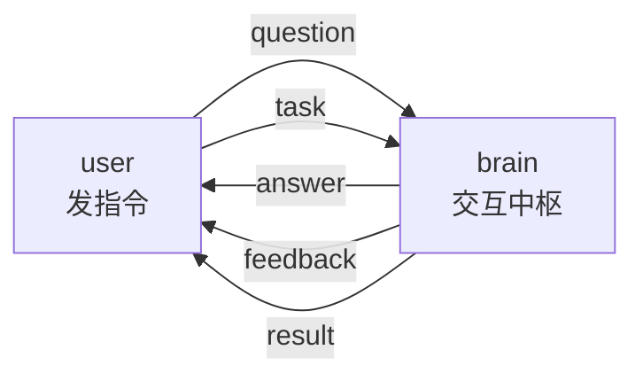

# 🎯 小项目③：问答 / 任务交互

本章学了四种通信模式，是时候把它们用起来了。这个小项目里，我们给小莫做一个**交互中枢**：它既能回答简单问题（用 **Service**），又能接受耗时任务并汇报进度（用 **Action**）。

做完这个项目，小莫就真正**掌握了"沟通"**——不再只会单向收发，而是能一问一答、能派活儿边做边报。

:::info 小莫说
以前我只会闷头收发数据。现在我能"对话"了：你问我答，你派活我边干边汇报。感觉自己越来越像个能交流的伙伴啦！💬
:::

## 项目目标

搭一个三节点的交互系统：



- **user**：模拟用户，轮流发两类指令——**提问**（走 Service）和**派任务**（走 Action）；
- **brain**：小莫的交互中枢，收到提问立刻答复，收到任务就边做边报进度、最后给结果；
- 反馈都打印出来，让我们看到两种模式同时工作。

## 你将综合运用

- 6.1 Topic：所有连线的底层；
- 6.2 Service：`request_id` 配对的一问一答；
- 6.3 Action：`goal_id` / `goal_status` + 反馈 + 结果的长任务；
- 前几章：写节点、多输入 `event["id"]`、元数据、定时器。

## 前置要求

- 完成 6.1 - 6.4；
- 手边有能运行 DORA 的开发环境。

## 准备目录

import { Tab, Tabs } from '@rspress/core/theme';

<Tabs groupId="os">
<Tab label="macOS / Linux">

```bash
mkdir -p course/ch06-interaction
cd course/ch06-interaction
source ../.venv/bin/activate
```

</Tab>
<Tab label="Windows">

```powershell
mkdir course\ch06-interaction
cd course\ch06-interaction
..\.venv\Scripts\activate
```

</Tab>
</Tabs>

## 第一步：brain（交互中枢）

brain 要同时扮演两个角色：Service 的服务端（答问题）+ Action 的服务端（做任务）。它靠 `event["id"]` 区分收到的是提问还是任务。

新建 `brain.py`：

```python
# brain.py —— 小莫的交互中枢：既答问题（Service），又做长任务（Action）
import pyarrow as pa
from dora import Node

# 一个简单的"知识库"，用于回答问题
KNOWLEDGE = {
    "你是谁": "我是小莫，你的机器人伙伴！",
    "几点了": "我还没装时钟，第八章见～",
    "会什么": "我正在学习四种沟通方式！",
}


def main():
    node = Node()

    active_tasks = {}      # 进行中的任务：goal_id -> 还剩几步

    for event in node:
        if event["type"] == "INPUT":

            # ===== 角色一：Service 服务端，回答提问 =====
            if event["id"] == "question":
                q = event["value"][0].as_py()
                answer = KNOWLEDGE.get(q, "这个问题我还答不上来～")
                # 关键：把 request_id 原样贴回答复
                node.send_output(
                    "answer",
                    pa.array([answer]),
                    metadata=event["metadata"],
                )
                print(f"[brain] 收到提问「{q}」，已回答", flush=True)

            # ===== 角色二：Action 服务端，接收长任务 =====
            elif event["id"] == "task":
                steps = event["value"][0].as_py()          # 任务需要几步
                goal_id = event["metadata"]["goal_id"]
                active_tasks[goal_id] = steps
                print(f"[brain] 接到任务 {goal_id[:8]}：共 {steps} 步", flush=True)

            # ===== 定时器：推进所有进行中的任务各一步 =====
            elif event["id"] == "tick":
                for goal_id in list(active_tasks.keys()):
                    remaining = active_tasks[goal_id] - 1
                    if remaining > 0:
                        active_tasks[goal_id] = remaining
                        node.send_output(
                            "feedback",
                            pa.array([remaining]),
                            metadata={"goal_id": goal_id},
                        )
                    else:
                        del active_tasks[goal_id]
                        node.send_output(
                            "result",
                            pa.array([0]),
                            metadata={"goal_id": goal_id, "goal_status": "succeeded"},
                        )

        elif event["type"] == "STOP":
            break


if __name__ == "__main__":
    main()
```

一个节点同时是两种模式的服务端——靠 `event["id"]` 分流到不同处理逻辑。这在真实机器人里很常见：一个"大脑"要应对多种交互。

## 第二步：user（模拟用户）

user 轮流干两件事：提个问题（Service）、派个任务（Action），并接收所有回复。

新建 `user.py`：

```python
# user.py —— 模拟用户：轮流提问和派任务，接收所有回复
import uuid
import pyarrow as pa
from dora import Node

QUESTIONS = ["你是谁", "会什么", "几点了"]


def main():
    node = Node()

    pending_q = {}       # 未收到答复的提问：request_id -> 问题
    round_num = 0

    for event in node:
        if event["type"] == "INPUT":

            if event["id"] == "tick":
                # 偶数轮提问（Service），奇数轮派任务（Action）
                if round_num % 2 == 0:
                    q = QUESTIONS[(round_num // 2) % len(QUESTIONS)]
                    req_id = str(uuid.uuid4())
                    pending_q[req_id] = q
                    node.send_output("question", pa.array([q]),
                                     metadata={"request_id": req_id})
                    print(f"[user] 提问：{q}", flush=True)
                else:
                    goal_id = str(uuid.uuid4())
                    node.send_output("task", pa.array([3]),      # 派一个 3 步的任务
                                     metadata={"goal_id": goal_id})
                    print(f"[user] 派任务：请做 3 步（{goal_id[:8]}）", flush=True)
                round_num += 1

            # 收到 Service 答复
            elif event["id"] == "answer":
                req_id = event["metadata"]["request_id"]
                ans = event["value"][0].as_py()
                if req_id in pending_q:
                    q = pending_q.pop(req_id)
                    print(f"[user]   答复「{q}」→ {ans}", flush=True)

            # 收到 Action 反馈
            elif event["id"] == "feedback":
                remaining = event["value"][0].as_py()
                print(f"[user]   任务进度：还剩 {remaining} 步", flush=True)

            # 收到 Action 结果
            elif event["id"] == "result":
                status = event["metadata"]["goal_status"]
                print(f"[user]   任务完成：{status} 🎉", flush=True)

        elif event["type"] == "STOP":
            break


if __name__ == "__main__":
    main()
```

## 第三步：连成数据流 `dataflow.yml`

这是本章最"热闹"的一张数据流图——Service 的一来一回 + Action 的双向多路，全在里面：

```yaml
nodes:
  - id: user
    path: user.py
    inputs:
      tick: dora/timer/millis/1500    # 每 1.5 秒发起一次交互
      answer: brain/answer            # Service 答复
      feedback: brain/feedback        # Action 反馈
      result: brain/result            # Action 结果
    outputs:
      - question                      # Service 请求
      - task                          # Action 目标

  - id: brain
    path: brain.py
    inputs:
      question: user/question         # 收提问
      task: user/task                 # 收任务
      tick: dora/timer/millis/1500    # 推进任务
    outputs:
      - answer
      - feedback
      - result
```

## 第四步：跑起来

```bash
dora run dataflow.yml
```

你会看到问答和任务交替进行、各自有条不紊：

```
[user] 提问：你是谁
[brain] 收到提问「你是谁」，已回答
[user]   答复「你是谁」→ 我是小莫，你的机器人伙伴！
[user] 派任务：请做 3 步（a3f8c1d2）
[brain] 接到任务 a3f8c1d2：共 3 步
[user]   任务进度：还剩 2 步
[user]   任务进度：还剩 1 步
[user]   任务完成：succeeded 🎉
[user] 提问：会什么
[brain] 收到提问「会什么」，已回答
[user]   答复「会什么」→ 我正在学习四种沟通方式！
...
```

**同一个 brain，既能秒答问题，又能边做任务边报进度——两种模式在一张数据流里和谐共存！** 按 `Ctrl+C` 停止。

:::info 小莫说
你看！我能一边回答你的问题，一边默默推进手头的任务。这种"多线程沟通"的能力，让我离真正的机器人助手又近了一大步～💬
:::

## 玩一玩

- 给 brain 的 `KNOWLEDGE` 加几条你自己的问答；
- 把 user 派的任务步数从 3 改成 6，观察反馈变多；
- 想想：如果要给任务加"中途取消"，该怎么改？（提示：回看 [6.3 的 cancel 机制](./action#取消cancel中途喊停)）

## 动手挑战

:::tip 挑战：给交互中枢加"任务取消"
让 user 在收到"还剩 2 步"时发一个 cancel 取消当前任务；brain 收到后停止该任务并回一个 `goal_status = "canceled"` 的结果。
:::

:::details 参考答案思路
- user 派任务时把 `goal_id` 存进变量（如 `current_goal`），并加一个 `cancel` 输出；
- user 的 `feedback` 分支里，`if remaining == 2:` 就 `send_output("cancel", ..., metadata={"goal_id": current_goal})`；
- brain 加一个 `cancel` 输入分支：`del active_tasks[goal_id]` 并发 `goal_status="canceled"` 的 result；
- `dataflow.yml` 里给 user 加 `outputs: [..., cancel]`，给 brain 加 `inputs: { cancel: user/cancel }`。

这就是把 6.3 的取消机制整合进了交互中枢。
:::

## 常见报错 FAQ

:::warning 提问有来无回 / 答复对不上
检查 brain 是否用 `metadata=event["metadata"]` 把 `request_id` 原样传回；user 是否用同一个 `request_id` 在 `pending_q` 里匹配。这是 Service 的老要点（见 6.2）。
:::

:::warning 任务没有进度反馈
确认 brain 配了 `tick` 定时器，且倒计时逻辑在 `tick` 分支里"每次推进一步"。见 6.3 的说明。
:::

:::warning 连线报错 input source not found
这张图连线多，容易漏。逐条核对：user 的 4 个输入、2 个输出，brain 的 3 个输入、3 个输出，名字层层对应。
:::

## 小结

你完成了**小项目③：问答 / 任务交互**！在这个项目里，你：

- 让一个 brain 节点**同时扮演 Service 和 Action 的服务端**，靠 `event["id"]` 分流；
- 用 `request_id` 实现了问答配对；
- 用 `goal_id` / `goal_status` + 反馈实现了长任务的进度汇报；
- 亲手把多种通信模式**组合**进一张真实可用的数据流。

## 本章回顾 💬 掌握 4 种沟通方式

第六章到此圆满。回顾这一章的收获：

- **6.1 Topic**：一发多收、发完不管——所有通信的基石；
- **6.2 Service**：`request_id` 配对的一问一答；
- **6.3 Action**：`goal_id`/`goal_status` + 反馈 + 取消的长任务；
- **6.4 Streaming**：`session_id`/`seq`/`fin`/`flush` 的连续可打断流；
- **小项目③**：把 Service 和 Action 组合成一个交互中枢。

最重要的一句话：**四种模式底层都是 Topic（pub/sub），区别只在约定的元数据。**

:::info 小莫说
我会沟通啦！接下来，是时候让我"睁开眼睛"了——下一章，我要装上摄像头，学着看懂这个世界！👁
:::

下一章 [第七章 · 让小莫看见](../vision/)，我们给小莫接上摄像头和物体检测，让它拥有"视觉"。
