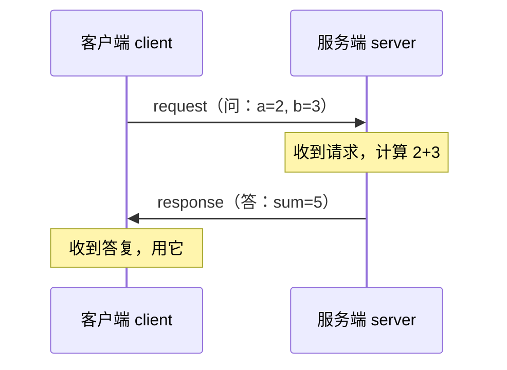
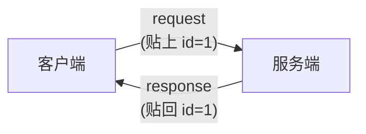

# 6.2 Service 请求应答

上一节的 Topic 是"喊一嗓子、发完不管"。但很多时候，小莫需要的是**一问一答**：问一句"现在几点？"，然后**等一个明确的答复**。这就是第二种模式——**Service（服务）请求应答**。

:::info 小莫说
有时候我不是广播，而是想**问某个零件一个具体问题，并等它回答我**。比如问"电池还剩多少电？"——喊一嗓子可不行，我要的是那个准确的数字。
:::

## 学习目标

学完本节，你将能够：

- 说清 Service 模式的核心："一问一答，有来有回"；
- 理解为什么需要 **`request_id`（请求编号）** 把"问"和"答"对上号；
- 用纯 Python + 元数据（metadata）实现一对完整的"客户端 / 服务端"；
- 明白 Service 和 Topic 的本质区别与联系。

## 前置要求

- 完成 [6.1 Topic](./topic)，理解发布订阅与"四种模式都建立在 Topic 之上"；
- 会用 `event["id"]` 区分多输入（[5.3 多输入合并](../data/multi-input)）。

## 先回到黑板教室

第一章我们这样点过 Service：

> **小明问小红"第三题答案？"，小红答"42"。**

对比一下 Topic 和 Service：

| | Topic | Service |
|---|-------|---------|
| 方向 | 单向：发完不管 | 双向：有问必有答 |
| 对象 | 广播给所有订阅者 | 一对一：谁问谁得答 |
| 是否等待 | 不等 | 问的一方等着答复 |
| 课堂类比 | 讲台喊话 | 同桌间一问一答 |

Service 里有两个角色：

- **客户端（Client）**：发起提问的一方（小明）；
- **服务端（Server）**：负责回答的一方（小红）。



## 关键难题：怎么把"答"和"问"对上号？

这是 Service 最核心的机制，一定要理解。

想象一个热闹的场景：小莫**同时**问了服务端三个问题（"几点了？""剩多少电？""温度多少？"）。服务端陆续回了三个答复。问题来了——**小莫怎么知道哪个答复对应哪个问题？**

如果答复只是"42""87""25"三个数字飞回来，小莫完全对不上号！

**解决办法：给每个问题编一个号。** 小莫问的时候，在问题上贴个标签"这是 1 号问题"；服务端回答时，也在答复上贴回"这是对 1 号问题的回答"。这样小莫一看编号就对上了。

这个编号，在 DORA 里叫 **`request_id`（请求编号）**。它就是上一节说的"在黑板角落多写的小暗号"——**Service 本质还是 Topic，只是多约定了一个 `request_id` 元数据来配对。**



:::info 小莫说
就像去食堂点餐拿的**取餐号**！我点餐时拿个"38 号"，做好了广播"38 号取餐"，我一听就知道是我的。`request_id` 就是这个取餐号，让我的问和答不会错乱。
:::

## 元数据（metadata）：贴在数据上的"便签"

要贴这个编号，我们要用到一个新东西：**元数据（metadata）**。

回忆第四章的 echo，它转发时写过 `event["metadata"]`，当时我们说它是"写在黑板角落的备注"。现在正式认识它：

- **数据（value）**：消息的主体内容（比如问题的参数 `a=2, b=3`）；
- **元数据（metadata）**：附在数据旁边的**额外说明**（比如"这是 1 号请求"）。

在 Python 里，发送时通过 `send_output` 的第三个参数带上元数据，它是一个**普通字典**：

```python
node.send_output(
    "request",                          # 输出名
    pa.array([...]),                    # 数据本体
    metadata={"request_id": "1号"},     # ← 元数据：贴个编号
)
```

接收方从事件里读回元数据：

```python
metadata = event["metadata"]           # 拿到那张便签
req_id = metadata["request_id"]        # 读出编号
```

## 动手实现：一个加法服务

我们来做一个完整的例子：客户端不断问"a + b 等于几"，服务端算出来答回去。目录 `course/ch06-service`。

### 客户端 `client.py`

```python
# client.py —— 加法服务的客户端：不断提问，并匹配答复
import uuid
import pyarrow as pa
from dora import Node


def main():
    node = Node()

    pending = {}          # 记录"发出去还没收到答复"的请求：编号 -> 问的是什么
    a = 0

    for event in node:
        if event["type"] == "INPUT":

            if event["id"] == "tick":
                # 定时器到点，问一个新问题：a + (a+10) 等于几？
                b = a + 10
                req_id = str(uuid.uuid4())        # ① 生成一个唯一编号

                pending[req_id] = (a, b)          # 记下来，等答复时好核对

                node.send_output(
                    "request",
                    pa.array([a, b]),             # 数据：两个加数
                    metadata={"request_id": req_id},   # ② 贴上编号
                )
                print(f"问：{a} + {b} = ?  (编号 {req_id[:8]})", flush=True)
                a += 1

            elif event["id"] == "response":
                # 收到服务端的答复
                req_id = event["metadata"]["request_id"]   # ③ 读回编号
                answer = event["value"][0].as_py()

                if req_id in pending:              # ④ 用编号对上当初的问题
                    qa, qb = pending.pop(req_id)
                    print(f"答：{qa} + {qb} = {answer}  ✓", flush=True)

        elif event["type"] == "STOP":
            break


if __name__ == "__main__":
    main()
```

四个关键步骤都标了号：① 生成编号 → ② 发请求时贴上 → ③ 收答复时读回 → ④ 用编号找回当初的问题。

### 服务端 `server.py`

```python
# server.py —— 加法服务的服务端：收到请求就计算，把编号原样贴回答复
import pyarrow as pa
from dora import Node


def main():
    node = Node()

    for event in node:
        if event["type"] == "INPUT":
            if event["id"] == "request":
                # 取出两个加数
                nums = event["value"].to_pylist()
                result = nums[0] + nums[1]         # 计算 a + b

                # 关键：把请求的 request_id 原样贴回答复，客户端才能对上号
                node.send_output(
                    "response",
                    pa.array([result]),
                    metadata=event["metadata"],    # ← 直接把收到的元数据转回去
                )

        elif event["type"] == "STOP":
            break


if __name__ == "__main__":
    main()
```

:::warning 服务端必须把 request_id 原样传回
服务端计算完，回答复时**必须带回请求里的 `request_id`**。最省事的做法就是 `metadata=event["metadata"]`——把收到的整张便签原样贴回去。忘了传，客户端就对不上号、认不出这是谁的答复。
:::

### 连成数据流 `dataflow.yml`

```yaml
nodes:
  - id: client
    path: client.py
    inputs:
      tick: dora/timer/millis/1000    # 每秒问一次
      response: server/response       # 订阅服务端的答复
    outputs:
      - request

  - id: server
    path: server.py
    inputs:
      request: client/request         # 订阅客户端的请求
    outputs:
      - response
```

注意这里的连线形成了一个**回路**：client 的 `request` → server，server 的 `response` → client。一问一答的双向就是这么连出来的。

### 跑起来

```bash
dora run dataflow.yml
```

你会看到问答成对出现：

```
问：0 + 10 = ?  (编号 3f8a1c2d)
答：0 + 10 = 10  ✓
问：1 + 11 = ?  (编号 9b2e4f01)
答：1 + 11 = 12  ✓
...
```

**每个"答"都精确对上了它的"问"**——这就是 `request_id` 的功劳。

:::info 小莫说
看那个 ✓！每次我都能确认"这个答复正是我刚才那个问题的"。哪怕我一口气问一堆，也不会张冠李戴。取餐号真好用～
:::

## Service 和 Topic 到底啥关系？

回扣上一节埋的伏笔。你可能发现了：上面的代码里，**我们从头到尾用的还是 `send_output` 和 `inputs`/`outputs`**——和 Topic 一模一样！

区别只有两点：

1. **连成了回路**：client 和 server 互为对方的上下游（双向）；
2. **约定了 `request_id`**：靠这个元数据把请求和应答配对。

所以正如上节所说：**Service 不是新机制，它就是"Topic + request_id 约定"。** 底层还是那块黑板，只是多贴了取餐号。

:::details 进阶延伸：真实项目里的超时与容错（可跳过）
我们的例子假设服务端总能及时回答。但真实系统里，服务端可能崩溃、可能很慢。成熟的做法会给"等答复"加一个**超时（timeout）**：等太久就放弃、走备用方案，避免客户端傻等。

DORA 的 Rust API 提供了 `recv_service_response` 这样的辅助方法，内置超时和"服务端重启"处理。Python 里目前多用手写逻辑（记录 pending、配合超时判断）。零基础阶段先掌握"编号配对"的核心思想即可，超时容错等你做真实项目时再深入。
:::

## 动手练习

:::tip 练习：把加法服务改成"回显时间戳"服务
改造服务端：收到请求后，不做加法，而是回一个当前的计数值（每收到一个请求就 +1，表示"这是我处理的第几个请求"）。客户端照常用 `request_id` 匹配。

想一想：`request_id` 的匹配逻辑需要改吗？
:::

:::details 参考答案
服务端维护一个计数器，`request_id` 匹配逻辑**完全不用改**——因为编号配对和"回答内容是什么"无关：

```python
import pyarrow as pa
from dora import Node

def main():
    node = Node()
    count = 0
    for event in node:
        if event["type"] == "INPUT":
            if event["id"] == "request":
                count += 1
                node.send_output(
                    "response",
                    pa.array([count]),
                    metadata=event["metadata"],   # 编号照样原样传回
                )
        elif event["type"] == "STOP":
            break

if __name__ == "__main__":
    main()
```

这说明 `request_id` 机制是**通用的配对手段**，和业务内容解耦。
:::

## 常见报错 FAQ

:::warning 客户端收到答复，但 `req_id in pending` 总是 False（对不上）
最常见原因：服务端没把 `request_id` 传回来。检查服务端 `send_output` 是否带了 `metadata=event["metadata"]`。
:::

:::warning `KeyError: 'request_id'`
读元数据时键名拼错，或发送方根本没写这个键。确认发送和接收两端用的键名完全一致（都用 `"request_id"`）。
:::

:::warning `uuid` 相关报错
确认文件顶部 `import uuid`。我们用的是 `uuid.uuid4()`（随机编号），它在所有 Python 版本都能用，适合做配对。
:::

## 小结

- **Service（请求应答）** 是"一问一答、有来有回"的双向通信，有**客户端**和**服务端**两个角色。
- 靠 **`request_id`（请求编号，像取餐号）** 把每个应答和它对应的请求配对。
- **元数据（metadata）** 是贴在数据上的便签，用 `send_output(..., metadata={...})` 发、用 `event["metadata"]` 读；服务端要把编号**原样传回**。
- Service 本质是 **Topic + request_id 约定**——底层还是发布订阅。

下一节学第三种模式 **Action（长任务）**——当小莫要做一件**耗时**的事、还想**边做边汇报进度**时该怎么办。
