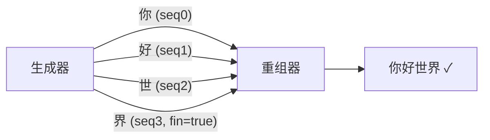
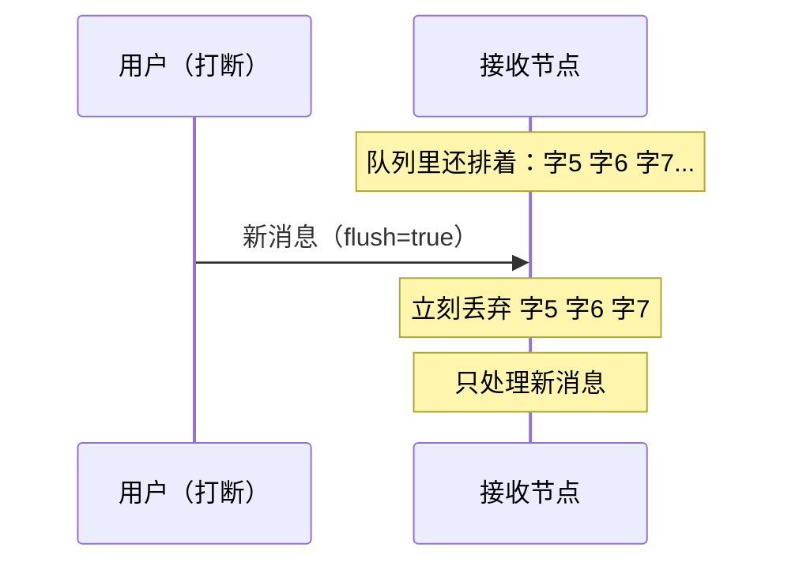

# 6.4 Streaming 流式

前三种模式处理的都是"一条条独立的消息"。但小多的语音、视频这类数据不一样——它们是**连续不断的流**：一句话由很多个字连着蹦出来，一段视频由很多帧连着播。而且，你还得能**随时打断**它（比如小多正说着话，你插一句，它得马上停下来听你的）。

这就是第四种、也是最后一种模式：**Streaming（流式）**。

:::info 小多说
等我学会说话（第八章），我可不想一次憋一大段才开口——我想像人一样，一个字一个字往外蹦。而且你要是中途打断我，我得立刻闭嘴听你说。这就得靠"流式"啦！
:::

## 学习目标

学完本节，你将能够：

- 说清 Streaming 的核心："连续的数据块，串成一段，可随时打断"；
- 理解 **`session_id`（会话）/ `seq`（序号）/ `fin`（结束标记）** 怎么把碎块重组成完整内容；
- 理解 **`flush`（冲刷）** 如何实现"即时打断"；
- 用纯 Python 实现一个"逐字生成 + 逐字重组"的流式示例。

## 前置要求

- 完成 [6.3 Action](./action)，熟悉用元数据协调通信；
- 理解元数据字典的发送与读取（[6.2 Service](./service)）。

## 先回到黑板教室

第一章这样点过 Streaming：

> **老师带读课文，你可以随时举手打断。**

Streaming 的两个关键特征：

1. **连续流**：数据不是一条大消息，而是**一小块一小块连着来**（老师一个词一个词地读）；
2. **可打断**：接收方可以在中途喊停，**丢弃还没处理的旧内容**（你举手，老师停下，之前排队要读的词作废）。

它和前几种模式的区别：

| | Service/Action | Streaming |
|---|----------------|-----------|
| 数据形态 | 一次一个完整消息 | 连续的小块，一段有很多块 |
| 典型数据 | 一个请求、一个目标 | 语音、视频、逐字生成的文本 |
| 打断 | Action 可取消整个任务 | 可 flush 丢弃排队的旧数据，立刻换新 |

## 核心难题一：碎块怎么重组？

假设小多要说"你好世界"，它逐字发出去：`你` → `好` → `世` → `界`。接收方（比如喇叭）收到四个碎块，怎么知道：

- 这四块**属于同一句话**？
- 它们的**先后顺序**？
- 哪一块是**最后一块**（这样它才知道"这句话说完了"）？

解决办法还是老朋友——**元数据**。Streaming 约定了几个键：

| 元数据 | 作用 | 类比 |
|--------|------|------|
| **`session_id`** | 会话编号：同一段内容的碎块用同一个编号 | 同一句话的所有字，贴同一个标签 |
| **`seq`** | 序号：0、1、2……标明这是第几块 | 字的先后顺序 |
| **`fin`** | 结束标记：最后一块为 `true` | "这句话到此为止" |

有了这三个，接收方就能：**按 `session_id` 归类 → 按 `seq` 排序 → 见到 `fin=true` 就知道收齐了**。



:::info 小多说
就像寄一套明信片：每张都写上"这是给同一个人的第 1/2/3 张，最后一张写'完'"。收信人按编号排好、看到"完"就知道整套齐了。
:::

## 动手实现：逐字生成与重组

我们来做流式的经典场景：一个"生成器"把一句话逐字发出（模拟 AI 逐字回答），一个"重组器"把碎字拼回完整句子。这正是第八、十一章语音和大模型要用的模式。目录 `course/ch06-streaming`。

### 生成器 `generator.py`

```python
# generator.py —— 把一句话逐字流式发出
import time
import uuid
import pyarrow as pa
from dora import Node

RESPONSES = ["你好世界", "我是小多", "很高兴认识你"]


def main():
    node = Node()
    index = 0

    for event in node:
        if event["type"] == "INPUT":
            if event["id"] == "tick":
                sentence = RESPONSES[index % len(RESPONSES)]
                index += 1

                session_id = str(uuid.uuid4())     # 这一整句用一个会话编号
                chars = list(sentence)             # 拆成一个个字

                for seq, ch in enumerate(chars):
                    is_last = (seq == len(chars) - 1)   # 是不是最后一个字
                    node.send_output(
                        "tokens",
                        pa.array([ch]),
                        metadata={
                            "session_id": session_id,
                            "seq": str(seq),               # 序号
                            "fin": str(is_last).lower(),   # 最后一块为 "true"
                        },
                    )
                    time.sleep(0.1)     # 模拟"逐字生成"的节奏
                print(f"[生成器] 发完一句：{sentence}", flush=True)

        elif event["type"] == "STOP":
            break


if __name__ == "__main__":
    main()
```

要点：

- **一整句共用一个 `session_id`**；每个字带自己的 `seq`；最后一个字 `fin="true"`。
- 元数据的值都用**字符串**（`str(seq)`、`str(is_last).lower()`）——这是 DORA 流式元数据的约定写法。
- `time.sleep(0.1)` 模拟真实 AI"想一个字、蹦一个字"的节奏。

### 重组器 `sink.py`

```python
# sink.py —— 按 session 收集碎字，见到 fin 就拼成完整句子
from dora import Node


def main():
    node = Node()
    sessions = {}       # session_id -> 已收到的字列表

    for event in node:
        if event["type"] == "INPUT":
            if event["id"] == "tokens":
                ch = event["value"][0].as_py()
                meta = event["metadata"]
                session_id = meta.get("session_id", "unknown")
                fin = meta.get("fin", "false") == "true"

                # 按会话归类累积
                if session_id not in sessions:
                    sessions[session_id] = []
                sessions[session_id].append(ch)

                # 边收边显示（逐字出现，像打字机效果）
                print(ch, end="", flush=True)

                if fin:
                    # 收到结束标记：这一句齐了，拼起来
                    full = "".join(sessions.pop(session_id))
                    print(f"\n[重组器] 完整收到：{full}", flush=True)

        elif event["type"] == "STOP":
            break


if __name__ == "__main__":
    main()
```

要点：`sessions` 字典按 `session_id` 分别累积；`print(ch, end="")` 让字一个个冒出来（打字机效果）；见到 `fin=true` 就把这句 pop 出来拼成完整字符串。

### 连成数据流 `dataflow.yml`

```yaml
nodes:
  - id: generator
    path: generator.py
    inputs:
      tick: dora/timer/secs/2       # 每 2 秒生成一句
    outputs:
      - tokens

  - id: sink
    path: sink.py
    inputs:
      tokens: generator/tokens
```

### 跑起来

```bash
dora run dataflow.yml
```

你会看到字一个个蹦出来，然后整句确认：

```
你好世界
[重组器] 完整收到：你好世界
我是小多
[重组器] 完整收到：我是小多
...
```

**碎字被完美重组成了完整句子**——这就是流式传输的精髓。

:::info 小多说
看那些字一个个冒出来，像我在打字聊天一样！这种"边生成边输出"的感觉，正是聊天机器人和语音助手给人"很流畅"的秘密。
:::

## 核心难题二：怎么"即时打断"？

流式最有价值的能力是**打断**。想象小多正在逐字念一大段话，你突然说话——它必须**立刻停下**，并把"还没念出口、正排队等着的那些字"全部**扔掉**，转而处理你的新指令。

DORA 用一个元数据键 **`flush`（冲刷）** 实现这件事：

> 当一条消息带着 `flush: true` 到达时，接收方会**先清空这个输入队列里所有还没处理的旧消息**，再处理这条新消息。

用黑板比喻：你举手打断，老师立刻把"接下来准备读的词"全划掉（清空队列），开始响应你。



发送打断信号的写法（概念示意）：

```python
# 打断：发一条 flush=true 的消息，让下游丢弃排队的旧数据
node.send_output(
    "tokens",
    pa.array([""]),                       # 内容可以是空
    metadata={"flush": "true"},           # ← 冲刷信号
)
```

:::warning flush 会清空整个输入队列
`flush` 会丢弃该输入上**所有**排队的旧消息，不区分 `session_id`。所以**不要在同一个输入上混用多个独立会话**——否则打断一个会误伤另一个。这在第八章做"可打断语音对话"时非常关键。
:::

:::tip 为什么"打断"对小多这么重要？
一个不能被打断的语音助手是很糟糕的体验——你说了半天它还在自顾自念旧内容。`flush` 让小多能像真人对话一样"你一开口我就停下听你的"。第八章的语音项目会真正用上它。
:::

## 四种模式全景回顾

学完四种，我们用一张表把它们彻底串起来（这也是第一章那张表的"通关版"）：

| 模式 | 一句话 | 关键元数据 | 典型场景 | 底层 |
|------|--------|-----------|---------|------|
| **Topic** | 一发多收，发完不管 | 无 | 传感器流、状态播报 | pub/sub |
| **Service** | 一问一答 | `request_id` | 查询、计算 | pub/sub + 约定 |
| **Action** | 长任务，边做边报，可取消 | `goal_id`、`goal_status` | 移动、抓取 | pub/sub + 约定 |
| **Streaming** | 连续流，可打断 | `session_id`、`seq`、`fin`、`flush` | 语音、视频、逐字生成 | pub/sub + 约定 |

**最重要的一句话**：四种模式底层**都是 Topic（pub/sub）**，区别只在于"约定了哪些元数据"。理解了这一点，你就真正掌握了 DORA 通信的设计哲学。

:::info 小多说
绕了一圈，原来万变不离其宗——都是往那块黑板上写字！只是不同场合，大家约定了不同的"暗号"来配合。这套设计真聪明，学一种就懂了全部～
:::

## 动手练习

:::tip 练习：给重组器加"字数统计"
改造 `sink.py`：每收齐一句（见到 `fin=true`），除了打印完整句子，再报告这句话有几个字。
:::

:::details 参考答案
在 `fin` 分支里，pop 出来的列表长度就是字数：

```python
if fin:
    chars = sessions.pop(session_id)
    full = "".join(chars)
    print(f"\n[重组器] 完整收到：{full}（共 {len(chars)} 个字）", flush=True)
```
:::

## 常见报错 FAQ

:::warning 句子重组后顺序乱了 / 缺字
本地 `dora run` 下顺序通常没问题。若做更复杂的流式，需靠 `seq` 序号**显式排序**再拼接，而不是依赖到达顺序。健壮的做法是按 `seq` 存进字典再排序。
:::

:::warning 收不到 `fin`，句子永远拼不完整
检查生成器最后一块是否正确设了 `fin="true"`（字符串小写）。拼写成 `"True"` 或漏发，重组器就永远等不到结束信号。
:::

:::warning 元数据的值是数字导致报错
Streaming 元数据的值统一用**字符串**：`seq` 用 `str(seq)`、`fin` 用 `str(is_last).lower()`。读取时相应地按字符串比较（如 `== "true"`）。
:::

## 小结

- **Streaming（流式）** 处理连续、可打断的数据流：**碎块串成一段，随时能打断**。
- 靠 **`session_id`（归类）+ `seq`（排序）+ `fin`（结束）** 把碎块重组成完整内容。
- 靠 **`flush`（冲刷）** 清空输入队列实现**即时打断**——语音对话的关键。
- 至此四种模式学完，它们**底层都是 Topic**，只是约定的元数据不同。

下一节是本章实战——**小项目③：问答 / 任务交互**，我们综合运用这几种模式，给小多加一个能"问答 + 派任务"的交互能力。
