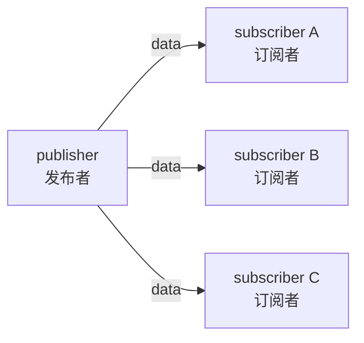
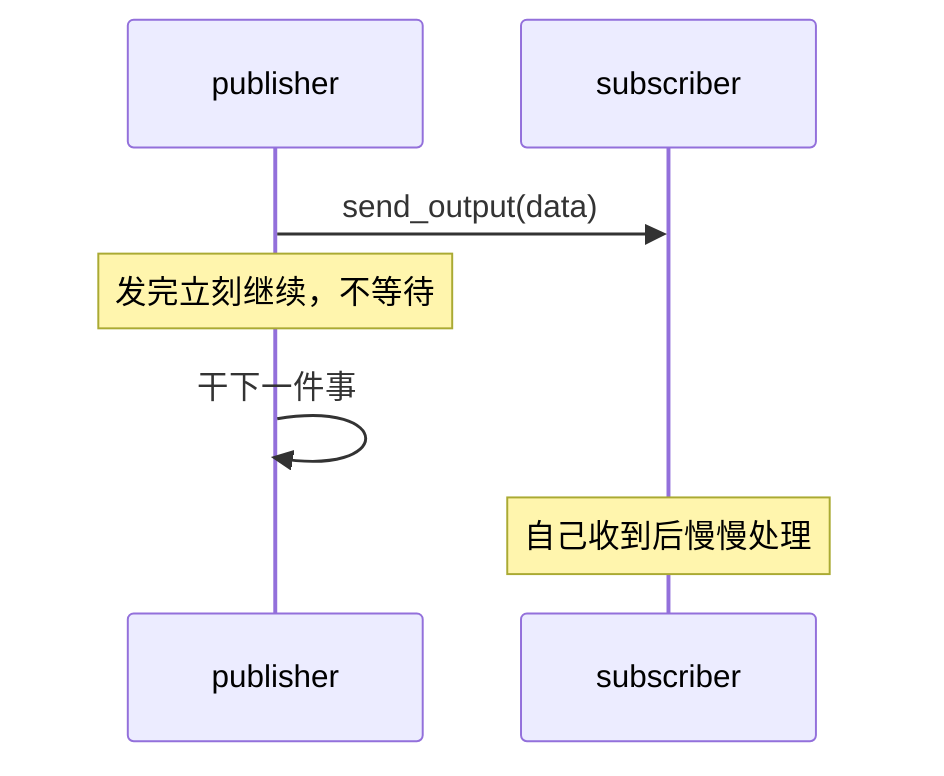

# 6.1 Topic 发布订阅

从这一章开始，小莫要解锁 **💬 沟通能力**。前面几章里，节点之间其实已经在"说话"了——只是我们没给这种说话方式起名字。这一章，我们把节点间的**四种对话方式**一次讲清。

第一种，也是最基础的一种，叫 **Topic（主题）发布订阅**。

:::info 小莫说
我身上的零件越来越多，它们之间得会"聊天"才能配合。原来聊天还分好几种方式呢——这一节先学最常见的那种：站上讲台喊一嗓子，全班都听见。
:::

## 学习目标

学完本节，你将能够：

- 说清 Topic（发布订阅）模式的核心："一个发、多个收、发完不管"；
- 理解**一个输出可以被多个节点同时订阅**（fan-out，扇出）；
- 明白你在第四、五章写的节点，用的其实就是 Topic 模式；
- 知道为什么 Topic 是 DORA 里最基础、也是其它三种模式的**基石**。

## 前置要求

- 完成[第四章](../python-node/)、[第五章](../data/)，会写节点、连数据流、传数据；
- 记得第一章[四种通信模式先认个脸](../concepts/comm-patterns-intro)里的课堂类比。

## 先回到黑板教室

第一章我们用一句话点过 Topic：

> **老师站上讲台喊"看黑板！"，全班同时听见。**

这就是 Topic 的精髓。把它拆成三个特点：

1. **一个发**：有一个"发布者"把消息写到黑板上（讲台喊话）；
2. **多个收**：所有"订阅了"这块黑板的同学，都能收到（全班都听见）；
3. **发完不管**：发布者喊完就继续做自己的事，**不等任何人回应**，也不关心谁听到了。

用专业词说：Topic 是一种**发布/订阅（Publish / Subscribe，简称 pub/sub）**模式。



:::tip 你其实早就用过它了
还记得第四章的 sender → echo → printer 吗？sender 把数据 `send_output` 出去，根本不管谁在收——这就是标准的 Topic！**DORA 里最默认、最基础的通信方式就是 Topic**，你一直在用，只是现在才知道它的名字。
:::

## 一个发、多个收：扇出（fan-out）

Topic 最有用的特性是：**同一个输出，可以同时被好几个节点订阅。** 发布者只发一次，所有订阅者都能收到各自的一份。这叫**扇出（fan-out）**。

用黑板比喻：老师在黑板上写一道题，班里 30 个同学都能抬头看到——老师只写了**一次**，不用给每人单独抄一遍。

看 YAML 怎么表达"多个节点订阅同一个输出"：

```yaml
nodes:
  - id: sender             # 发布者：只声明一个 data 输出
    path: sender.py
    inputs:
      tick: dora/timer/millis/500
    outputs:
      - data

  - id: printer_a          # 订阅者 A：订阅 sender/data
    path: printer.py
    inputs:
      data: sender/data

  - id: printer_b          # 订阅者 B：也订阅同一个 sender/data
    path: printer.py
    inputs:
      data: sender/data
```

`printer_a` 和 `printer_b` 都把输入连到了 `sender/data`。sender 每发一条，两个 printer **都会各收到一条**。

:::info 小莫说
一次广播，人人有份！这就像上课铃一响，整栋楼的同学都听见了——不用一间间教室去敲门通知。省事又高效。
:::

## 动手试试：一发两收

我们用第四章的节点验证扇出。在一个新目录里准备 `sender.py` 和 `printer.py`（就用第四章 4.2/4.3 写过的那两个），然后写这样一份 `dataflow.yml`：

import { Tab, Tabs } from '@rspress/core/theme';

<Tabs groupId="os">
<Tab label="macOS / Linux">

```bash
mkdir -p course/ch06-topic
cd course/ch06-topic
source ../.venv/bin/activate
# 把第四章的 sender.py 和 printer.py 复制进来
```

</Tab>
<Tab label="Windows">

```powershell
mkdir course\ch06-topic
cd course\ch06-topic
..\.venv\Scripts\activate
# 把第四章的 sender.py 和 printer.py 复制进来
```

</Tab>
</Tabs>

`dataflow.yml`：

```yaml
nodes:
  - id: sender
    path: sender.py
    inputs:
      tick: dora/timer/millis/500
    outputs:
      - data

  - id: printer_a
    path: printer.py
    inputs:
      data: sender/data

  - id: printer_b
    path: printer.py
    inputs:
      data: sender/data
```

运行：

```bash
dora run dataflow.yml
```

你会看到**两个 printer 各自都在打印**——同一条数据，被两个订阅者同时收到了。这就是扇出的效果。

## "发完不管"意味着什么？

Topic 的第三个特点"发完不管"，是它和后面三种模式最大的区别，值得单独说清：

- 发布者 `send_output` 之后，**立刻继续**执行下一行，不会停下来等订阅者；
- 发布者**不知道、也不关心**有没有人收到、收到后做了什么；
- 如果暂时没有订阅者，消息就……没人收（不会报错，也不会等）。

这种"不等回应"的特性，专业上叫**发后即忘（fire-and-forget）**。



:::warning "发完不管"是优点还是缺点？
两者都是——**取决于你的需求**。
- 对"传感器每秒发 30 帧图像"这种场景，发后即忘**正是我们要的**：发布者只管高速发，不能被任何订阅者拖慢。
- 但如果你需要"问一句、等一个明确答复"，Topic 就不够用了——那正是下一节 **Service** 要解决的。

:::

## Topic 适合什么场景？

| 场景 | 为什么适合 Topic |
|------|-----------------|
| 传感器数据流（摄像头、麦克风） | 高速、连续、发后即忘，不能等 |
| 周期性状态播报（"我还活着"） | 一发多收，谁关心谁订阅 |
| 事件通知（"检测到障碍物"） | 广播出去，多个节点各自反应 |

一句话：**只要"不需要对方回话"，就用 Topic。** 它是 DORA 里最轻、最快、最默认的方式。

## 一个重要认知：四种模式都建立在 Topic 之上

这是本章一个关键的"啊哈"点，先埋下：

> DORA 的底层**只有 pub/sub（Topic）这一种真正的通信机制**。后面要学的 Service、Action、Streaming，**都不是全新的东西**——它们是在 Topic 的基础上，靠"**约定一些额外的备注信息（metadata）**"实现的更高级对话方式。

用黑板比喻：黑板永远是那块黑板（Topic）。所谓"一问一答""长任务边做边报"，只是大家**约定好在黑板角落多写几个记号**（比如"这是第 3 号提问的回答"），从而实现更复杂的配合。

:::info 小莫说
原来那三种"高级聊天"都是在"喊话"的基础上加了点小暗号呀！底子还是同一块黑板，难怪学起来不会太难～
:::

现在不用深究 metadata，记住这个认知即可——它会让你后面三节学得特别顺。

## 动手练习（思考题）

小莫的摄像头节点（`camera`）输出图像。现在"物体检测"和"录像存盘"两个节点都需要这份图像。请你写出 YAML 里这三个节点的 `inputs`/`outputs` 连线，并说明这用到了 Topic 的什么特性。

:::details 参考答案
```yaml
nodes:
  - id: camera
    path: camera.py
    outputs:
      - image
  - id: detection
    path: detection.py
    inputs:
      image: camera/image        # 订阅摄像头图像
  - id: recorder
    path: recorder.py
    inputs:
      image: camera/image        # 也订阅同一份图像
```

用到了 Topic 的**扇出（fan-out）**特性：`camera` 只发一次 `image`，`detection` 和 `recorder` 两个节点同时订阅、各收一份。摄像头不用为两个下游各发一次，也不用关心它们是谁。
:::

## 常见报错 FAQ

:::warning 只有一个订阅者收到数据，另一个没反应
检查两个订阅者的 `inputs` 是否都正确连到了 `sender/data`（来源节点 id 和输出名要拼对）。任何一个写错，那一路就收不到。
:::

:::warning 发布者一直发，但没有任何订阅者
这不会报错——Topic 是发后即忘，没人订阅时消息就是没人收。运行不会出错，只是"白发了"。确认你的数据流里确实有节点订阅了这个输出。
:::

## 小结

- **Topic（发布订阅）** 是 DORA 最基础的通信模式：**一个发、多个收、发完不管**。
- 你在第四、五章写的节点，用的就是 Topic——它是 DORA 的默认方式。
- **扇出（fan-out）**：一个输出能被多个节点同时订阅，发布者只发一次。
- Topic 是**发后即忘**，不等回应，适合传感器流、状态播报、事件通知。
- **关键认知**：Service、Action、Streaming 三种模式，都建立在 Topic 之上，靠 metadata 约定实现。

下一节，我们学第二种模式 **Service（请求应答）**——当小莫需要"问一句、等一个答复"时该怎么办。
