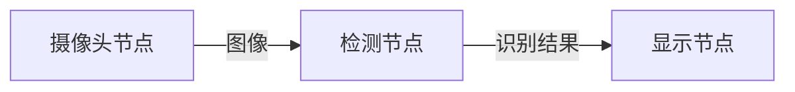

# 1.3 核心概念图解

这一节我们认识"黑板教室"里的几位主角。别担心，每个概念都对应一个你熟悉的画面。

## 节点（Node）

**节点（Node）** 就是教室里的一名**同学**，负责一件独立的事：有的读数据、有的算数据、有的写结果。

在小莫身上，"摄像头"是一个节点、"物体检测"是一个节点、"显示画面"又是一个节点。每个节点各管一摊，互不打扰。

## 数据流（Dataflow）

**数据流（Dataflow）** 描述的是：**哪些节点、它们之间的数据怎么流动**——相当于一张"谁写黑板、谁看黑板"的**值日表**。

比如小莫"看东西"这件事，就是这样一条数据流：



摄像头把图像写上黑板，检测节点看到图像、算出"这是什么"，再把结果写上黑板，显示节点拿去展示。

## 输入与输出（Input / Output）

- **输出（Output）**：一个节点把结果**写到黑板上**。
- **输入（Input）**：一个节点**从黑板上读取**它需要的东西。

上面的箭头，就是"谁的输出 → 接到谁的输入"。

## 共享内存与零拷贝

这是 DORA 最关键的两个词，但用黑板一讲就通：

- **共享内存（Shared Memory）** = 那块**大家都看得见的黑板本身**。数据放在这块公共区域，节点们直接看，不用互相"递纸条"。
- **零拷贝（Zero-copy）** = 没人会把黑板上的内容**先抄到自己本子上再用**，而是直接对着黑板处理。省掉了抄写，所以极快。

:::info 小莫说
就是因为有这块"黑板"，我的眼睛把一大张图片放上去，大脑能马上看到，中间不用打包、不用誊抄——又快又省力！
:::

## Arrow：黑板的统一书写规范

如果每个同学用自己的火星文写黑板，别人还得先翻译，就慢了。所以 DORA 规定大家都用一套**统一的书写规范**——这就是 **Apache Arrow**（一种标准的数据格式）。

有了它，无论是 Python 同学还是 Rust 同学写的数据，别人都能**直接读懂，不用翻译**。

## 算子（Operator）

**算子（Operator）** 你可以理解为一种更轻量的节点——住在同一个"运行时"里的小处理单元。入门阶段先知道有这么个词即可，后面用到再细说。

## 把它们串起来

回到那张"看东西"的数据流，用刚学的词复述一遍：

> 三个**节点**（摄像头/检测/显示）按一张**数据流**值日表协作；数据用 **Arrow** 格式写在**共享内存**（黑板）上，节点们**零拷贝**地直接读用。

是不是清晰多了？

## 动手练习（思考题）

小莫"听人说话并回答"也可以画成一条数据流。请你试着写出它的节点顺序（用箭头连起来）。

:::details 参考答案
一种画法：

```
麦克风节点 --音频--> 语音识别节点 --文字--> 大脑节点 --回答文字--> 语音合成节点 --声音--> 扬声器节点
```

每个节点只做一件事，数据一路"写黑板、看黑板"地往下流。
:::

## 小结

- **节点**＝干活的同学；**数据流**＝谁写谁看的值日表。
- **共享内存**＝公共黑板；**零拷贝**＝不抄写、直接用。
- **Arrow**＝统一书写规范，多语言零翻译。
- 记住那条 `摄像头 → 检测 → 显示` 的小数据流，后面会反复见到它。

下一节，我们快速认个脸：DORA 的**四种通信方式**。
