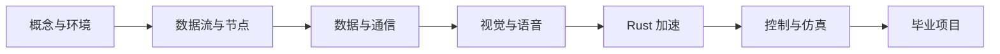

# 1.5 认识小莫

到这里，第一章的概念就学得差不多了。最后介绍一下本课程示例中使用的角色——**小莫**。

## DORA 是框架，小莫是示例节点

- **DORA**：我们要学的**技术**——那套"给机器人配一块共享黑板"的数据流框架。
- **小莫**：课程中使用的**示例机器人节点名**，出现在代码示例和演示中，帮助你在具体场景中理解抽象概念。

## 课程路线

接下来的章节从前到后逐步递进，每章在前一章基础上增加一个新知识点：

到最后的**毕业项目**，你就能让示例机器人**看到并抓取**你指定的东西——这是具身智能的完整闭环。

## 小结

- **DORA = 数据流框架**，**小莫 = 示例机器人节点名**。
- 本章建立了对 DORA 的整体认识：它是什么、为什么快、有哪些核心概念、四种通信方式。**恭喜完成第一章！**
- 下一章：搭建 DORA 开发环境，正式开工。
