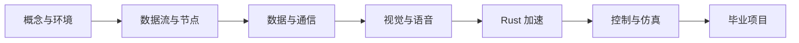

# 1.1 认识小莫

**小莫**是本课程最终打造的机器人名称，基于 DORA 框架构建。从第三章开始，你会陆续在代码示例、dataflow.yml、命令行日志中看到这个名字。

## 小莫的能力

课程结束后，小莫将具备以下能力：

| 能力 | 对应章节 |
|------|---------|
| 接收并执行控制指令（能动了） | 第三章 |
| 运行自己写的 Python 节点 | 第四章 |
| 处理多种数据（数字、数组、图像） | 第五章 |
| 掌握四种通信方式 | 第六章 |
| 通过摄像头识别物体 | 第七章 |
| 听懂语音并开口说话 | 第八章 |
| Rust 节点加速关键计算 | 第九章 |
| 在仿真中控制机械臂 | 第十章 |
| 看懂指令并自主抓取（毕业项目） | 第十一章 |

每一章都在前一章的基础上增加一项新能力，最终合体为一个完整的具身智能系统。

## DORA 与小莫的关系

DORA 和小莫的关系很简单：**DORA 是工具，小莫是成果。**

- **DORA** 是一套数据流中间件，为机器人和 AI 场景设计。课程中你学到的所有概念（节点、数据流、共享内存、Arrow）都属于 DORA。
- **小莫**是你用 DORA 打造的机器人。每学一章，小莫就多一项能力。

## 课程路线

```mermaid
flowchart LR
  A[概念与环境] --> B[数据流与节点] --> C[数据与通信] --> D[视觉与语音] --> E[Rust 加速] --> F[控制与仿真] --> G[毕业项目]
```

## 小结

- **小莫**是本课程最终打造的机器人。
- **DORA** 是打造小莫所用的数据流框架。
- 下一节开始进入技术概念——什么是数据流中间件。
