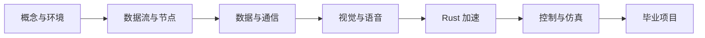

# 1.1 认识小莫

在开始学习 DORA 的各种概念之前，先认识一下贯穿课程的"主角"——**小莫**。

## 小莫是谁？

**小莫**是本课程中使用的**示例机器人名称**。从第三章开始，你会陆续在代码示例、数据流配置、命令行日志中看到它的身影。它不是一个"故事角色"，而是一个统一的命名约定——让你在学习过程中始终有一个具体的参照物。

简单来说：

- 当代码里出现 `小莫` 时，它就是示例中的机器人节点名
- 当数据流里出现 `小莫` 时，它表示正在驱动的机器人实例
- 不同章节通过小莫演示不同的能力——从收发消息到看见物体

## DORA 与小莫的关系

```
DORA（框架）—— 你要学的数据流技术
   ↓ 使用 DORA 构建
小莫（示例）—— 课程中用来演示的机器人
```

- **DORA** 是那套"给机器人配一块共享黑板"的数据流框架——这是你要学的技术。
- **小莫**是课程中用来演示的示例机器人——你通过它来理解抽象概念。

:::tip
很自然地，从下一章开始你会看到类似"打开摄像头让小莫看见世界"这样的描述——它的意思是"用 DORA 写一个摄像头节点，让示例机器人具备视觉能力"。
:::

## 小莫在课程中怎么用

| 章节 | 小莫出现的方式 |
|------|--------------|
| 第三章 | 小莫以"小飞机"的形式出现，接收控制指令飞行 |
| 第四章 | 用自己的 Python 节点驱动小莫 |
| 第五章 | 小莫处理多种数据格式 |
| 第六章 | 小莫学会四种通信方式 |
| 第七章 | 小莫接上摄像头"看见"世界 |
| 第八章 | 小莫能听懂并开口说话 |
| 第九章 | Rust 给小莫加速 |
| 第十章 | 小莫在仿真中控制机械臂 |
| 第十一章 | 小莫完成"看到并抓取"的毕业项目 |

## 课程路线

接下来的章节从前到后逐步递进，每章在前一章基础上增加一个新知识点：


```mermaid
flowchart LR
  A[概念与环境] --> B[数据流与节点] --> C[数据与通信] --> D[视觉与语音] --> E[Rust 加速] --> F[控制与仿真] --> G[毕业项目]
```

## 小结

- **小莫**是本课程中贯穿的示例机器人名称，出现在代码和演示中。
- **DORA** 是数据流框架，小莫是用 DORA 驱动的示例节点。
- 下一节开始进入真正的技术概念——先弄懂什么是"数据流中间件"。
