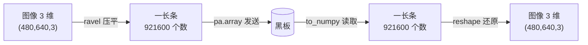

# 5.2 常见数据类型

上一节讲清了"为什么用 Arrow"。这一节我们动手：把小莫最常打交道的**三类数据**——数字、数组、图像——一个个学会怎么**造**（发出去）、怎么**读**（收进来）。

学完这节，你就有了处理各种数据的"基本功"。

:::info 小莫说
数字、数组、图像，就像我要认识的三种"食材"。学会处理它们，我才能做出各种"菜"——从简单的开关灯，到看懂一整张照片！
:::

## 学习目标

学完本节，你将能够：

- 熟练造和读三类数据：**数字**、**数组**、**图像**；
- 用对 `.to_pylist()`、`.as_py()`、`.to_numpy()` 三种读法；
- 理解图像为什么要 `ravel()` 压平、`reshape()` 还原；
- 知道什么时候该配合 **NumPy** 使用。

## 前置要求

- 完成 [5.1 为什么是 Arrow](./why-arrow)，理解 `pa.array` 与 `.to_pylist()` 的互逆关系。

## 准备：认识 NumPy

处理数组和图像时，我们会频繁用到一个库叫 **NumPy**（读作"南派"），它是 Python 里做数值计算的标准工具。你现在只需知道：

- **NumPy 数组**是一种高效存放"一堆数字"的容器，写作 `np.array([...])`；
- 图像在电脑里本质就是"一大堆数字"，所以用 NumPy 表示最自然；
- Arrow 和 NumPy 是好搭档，能高效互转。

环境中已经装好了 NumPy，直接 `import numpy as np` 就能用。

## 一、数字（最简单）

### 造数字

DORA 传的永远是"数组"，所以哪怕只发一个数字，也要放进 `pa.array([...])` 的方括号里：

```python
import pyarrow as pa

node.send_output("count", pa.array([42]))          # 发一个整数
node.send_output("speed", pa.array([3.14]))        # 发一个小数
node.send_output("flags", pa.array([1, 2, 3]))     # 发一串数字
```

:::warning 一个数字也要用列表包起来
`pa.array(42)` ❌ 会报错——`pa.array` 要的是一个**列表**。哪怕只有一个值，也得写成 `pa.array([42])` ✅。方括号不能省。
:::

### 读数字

读回来有两种常见写法，看你要一个还是要一串：

```python
# 场景 A：我知道里面就一个值，想直接拿到它
value = event["value"][0].as_py()      # 取第 0 个，转成普通 Python 数字 → 42

# 场景 B：里面是一串值，我全都要
values = event["value"].to_pylist()    # 转成 Python 列表 → [1, 2, 3]
```

| 写法 | 得到什么 | 什么时候用 |
|------|---------|-----------|
| `event["value"][0].as_py()` | 单个普通值（如 `42`） | 你确定里面只有一个值 |
| `event["value"].to_pylist()` | Python 列表（如 `[1,2,3]`） | 里面有多个值，或不确定几个 |

:::info 小莫说
`[0]` 是"取第一个"，`.as_py()` 是"变回普通 Python 值"。两个连用 `[0].as_py()` 就是"把第一个值原样取出来"，非常常用。
:::

### 完整小例子：加倍节点

一个把收到的每个数字乘以 2 再发出去的节点（改编自 DORA 官方示例）：

```python
# doubler.py —— 把收到的每个数字翻倍
import pyarrow as pa
from dora import Node


def main():
    node = Node()
    for event in node:
        if event["type"] == "INPUT":
            values = event["value"].to_pylist()      # Arrow → [1, 2, 3]
            doubled = [v * 2 for v in values]        # 每个乘 2 → [2, 4, 6]
            node.send_output("doubled", pa.array(doubled))   # 列表 → Arrow 发出
        elif event["type"] == "STOP":
            break


if __name__ == "__main__":
    main()
```

注意 `doubled` 已经是普通 Python 列表，所以直接 `pa.array(doubled)` 即可（它本身就是列表，不用再加方括号）。

## 二、数组（一串数字）

数组就是"一串数字"。小飞机的 `cmd`（旋转+前进两个系数）、`pose`（x、y、角度三个值）都是数组——你在第三章见过它们。

### 造数组

```python
import pyarrow as pa

# 直接用 Python 列表
node.send_output("cmd", pa.array([0.5, 1.0]))          # [旋转系数, 前进系数]
node.send_output("pose", pa.array([10.0, 20.0, 90.0])) # [x, y, 角度]
```

如果你的数据本来就是 NumPy 数组，`pa.array` 也能直接吃：

```python
import numpy as np
import pyarrow as pa

data = np.array([1.0, 2.0, 3.0], dtype=np.float32)
node.send_output("data", pa.array(data))               # NumPy → Arrow
```

### 读数组

小数组用 `.to_pylist()` 最直观：

```python
values = event["value"].to_pylist()     # [10.0, 20.0, 90.0]
x = values[0]                           # 10.0
y = values[1]                           # 20.0
angle = values[2]                       # 90.0
```

如果后面要做数值计算（求和、平均、缩放……），转成 NumPy 更好：

```python
arr = event["value"].to_numpy()         # Arrow → NumPy 数组
print(arr.mean())                       # 直接算平均值
print(arr * 2)                          # 整个数组一起乘 2
```

:::tip `.to_pylist()` vs `.to_numpy()` 怎么选？
- 只是**取值、打印、简单遍历** → `.to_pylist()`（得到普通列表，直观）。
- 要做**批量数学运算**（求和、平均、缩放、矩阵运算）→ `.to_numpy()`（得到 NumPy 数组，快且方便）。

:::

## 三、图像（最重要，也最需要技巧）

图像是小莫"眼睛"的核心数据，第七章会大量用到。这里先把"图像怎么在数据流里传"的原理和写法讲透。

### 图像本质上是一大堆数字

一张彩色图片，是由**像素**组成的。每个像素有红、绿、蓝（RGB）三个数值。所以一张 640×480 的彩色图，就是：

```
480 行 × 640 列 × 3 通道 = 921,600 个数字
```

在 NumPy 里，它是一个**三维数组**，形状（shape）为 `(480, 640, 3)`，每个数字是 0-255 的整数（`uint8` 类型）：

```python
import numpy as np

# 造一张纯黑图片（所有像素都是 0）
image = np.zeros((480, 640, 3), dtype=np.uint8)

# 造一张纯白图片（所有像素都是 255）
image = np.ones((480, 640, 3), dtype=np.uint8) * 255
```

### 难点：Arrow 数组是"一维"的

Arrow 数组本质是**一长条**（一维）的。但图像是**三维**的 `(480, 640, 3)`。怎么把三维塞进一维？

答案分两步：**发之前压平（ravel），收之后还原（reshape）**。



### 发送图像

```python
import numpy as np
import pyarrow as pa

# image 是一个 (480, 640, 3) 的 NumPy 数组
node.send_output("image", pa.array([image.ravel()]))
```

- **`image.ravel()`**：把三维图像"压平"成一长条一维数据。这个操作极快，几乎不花时间。
- 注意外层的方括号 `pa.array([...])`：这里把整条压平数据作为**一个元素**放进数组（这样接收方能一次拿到整张图）。

### 接收图像

```python
import numpy as np

# 从事件里取出压平的数据，转成 NumPy
flat = event["value"][0].values.to_numpy(zero_copy_only=False)

# 还原成图像原本的三维形状
image = flat.view(np.uint8).reshape((480, 640, 3))
```

- **`.reshape((480, 640, 3))`**：把一长条还原回"480 行 × 640 列 × 3 通道"的图像。
- **前提是你得知道原始尺寸**（480、640、3）。实际项目里，尺寸常通过"元数据（metadata）"一起传过来，避免写死；入门阶段我们先写死尺寸，理解原理即可。

:::warning 压平和还原的尺寸必须匹配
如果发送时是 `(480, 640, 3)`，接收时 `reshape` 也必须用 `(480, 640, 3)`。数字对不上，`reshape` 会报错（因为总数不一致）。**发和收两边的尺寸要约定好。**
:::

:::info 小莫说
图像就像我把一整面拼图（二维/三维）拆成一条线（一维）递给你，你再照着原来的行列把它拼回去。只要我们说好"多少行多少列"，拼回来就分毫不差！
:::

:::details 进阶延伸：为什么不直接传三维？（可跳过）
Arrow 也支持嵌套的多维结构，但对图像这种"大块连续数字"来说，**压平成一维 + 共享内存零拷贝**是最快的路径——数据在内存里就是一长条，直接映射、直接读，没有任何重组开销。`ravel()` / `reshape()` 只是"改变对同一块数据的看法"，并不真的搬动数据，所以几乎零成本。这也是 DORA 处理图像高效的原因之一。
:::

## 三类数据速查表

| 数据 | 造（发送） | 读（接收） |
|------|-----------|-----------|
| 单个数字 | `pa.array([42])` | `event["value"][0].as_py()` |
| 一串数字 | `pa.array([1, 2, 3])` | `event["value"].to_pylist()` |
| 要计算的数组 | `pa.array(np_array)` | `event["value"].to_numpy()` |
| 图像 | `pa.array([img.ravel()])` | `event["value"][0].values.to_numpy(zero_copy_only=False).reshape(...)` |

## 动手练习

:::tip 练习：写一个"求平均值"节点
写一个节点，收到一串数字后，算出它们的平均值，发到 `average` 输出。

提示：用 `.to_numpy()` 拿到数组，NumPy 数组有个 `.mean()` 方法直接求平均。
:::

:::details 参考答案
```python
import pyarrow as pa
from dora import Node

def main():
    node = Node()
    for event in node:
        if event["type"] == "INPUT":
            arr = event["value"].to_numpy()          # Arrow → NumPy
            avg = float(arr.mean())                  # 求平均，转成普通 float
            node.send_output("average", pa.array([avg]))
        elif event["type"] == "STOP":
            break

if __name__ == "__main__":
    main()
```

`arr.mean()` 返回的是 NumPy 的数值类型，用 `float()` 转成普通 Python 小数再包进 `pa.array` 更稳妥。
:::

## 常见报错 FAQ

:::warning `pyarrow.lib.ArrowInvalid: Could not convert ...`
多半是 `pa.array` 里放了它不认识的东西，或混合了多种类型（比如 `[1, "二", 3.0]` 数字和文字混在一起）。保证一个数组里**类型一致**。
:::

:::warning `cannot reshape array of size X into shape (...)`
`reshape` 的尺寸和实际数据量对不上。检查：发送时的图像尺寸和接收时 `reshape` 的尺寸是否完全一致（行×列×通道 的乘积要等于数据总长度）。
:::

:::warning `to_numpy()` 报 zero_copy 相关错误
读图像那种"数组里套数组"的结构时，加上参数：`.to_numpy(zero_copy_only=False)`。它允许在必要时做一次转换，避免报错。
:::

## 小结

- **数字**：造用 `pa.array([值])`，读用 `[0].as_py()`（单个）或 `.to_pylist()`（多个）。
- **数组**：小数组用 `.to_pylist()`，要计算用 `.to_numpy()` 配合 NumPy。
- **图像**：本质是一大堆数字；发送前 `ravel()` 压平，接收后 `reshape()` 还原，尺寸两边要约定一致。
- **NumPy** 是处理数组和图像的好搭档，Arrow 与它高效互转。

下一节，我们解决一个新问题：当一个节点要**同时接收好几路数据**时，该怎么把它们对齐、合并起来处理。
