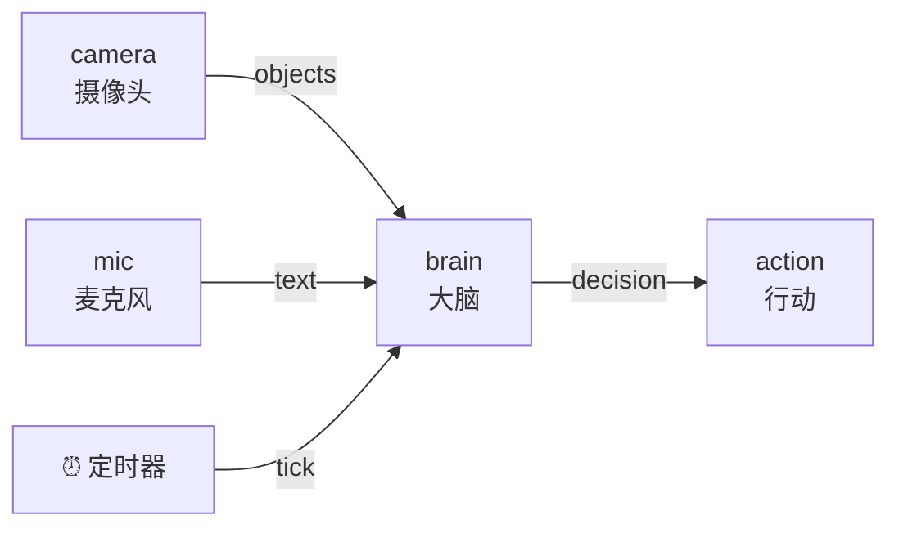

# 5.3 多输入合并

到目前为止，我们的节点大多只处理一路输入。但真实的小多远比这复杂——它的"大脑"要**同时**参考眼睛看到的、耳朵听到的、身体感觉到的，才能做决定。

这一节解决一个核心问题：**当一个节点有好几个输入时，怎么区分它们、又怎么把它们合起来用？**

:::info 小多说
我的大脑不能只听一只耳朵。它得同时收下眼睛的画面、耳朵的声音，凑齐了才好做判断。这就是"多输入合并"要教的本事。
:::

## 学习目标

学完本节，你将能够：

- 给一个节点配置**多个输入**，并在代码里用 `event["id"]` 区分；
- 理解多路数据是**一个一个来的**（异步），不是一起到的；
- 掌握"**最新值缓存**"这个对齐多输入的经典模式；
- 知道什么时候该等"数据凑齐"再处理。

## 前置要求

- 完成 [5.2 常见数据类型](./data-types)，会造和读各类数据；
- 记得[第四章 4.3](../python-node/connect-node) 里 `inputs` 的连线写法。

## 一个节点可以有很多输入

回顾第四章，节点的输入在 `dataflow.yml` 里配置。一个节点可以配**好几个输入**，只要名字不同：

```yaml
  - id: brain                    # 小多的"大脑"节点
    path: brain.py
    inputs:
      vision: camera/objects     # 输入一：来自摄像头的识别结果
      voice: mic/text            # 输入二：来自麦克风的文字
      tick: dora/timer/secs/1    # 输入三：定时器
    outputs:
      - decision
```

这个 `brain` 节点有三路输入：`vision`、`voice`、`tick`。



## 关键：多路输入是"一个一个来"的

这是最重要、也最容易误解的一点。你可能以为 `vision` 和 `voice` 会**同时**到达，一起交给你。**并不是。**

DORA 的事件循环，一次只给你**一个**事件。摄像头来数据了，触发一次 `INPUT`（`id` 是 `vision`）；麦克风来数据了，再触发一次 `INPUT`（`id` 是 `voice`）。它们**先后到达、各触发一次循环**。

所以处理多输入的标准姿势，就是在循环里用 **`event["id"]` 判断这次来的是哪一路**：

```python
from dora import Node

def main():
    node = Node()
    for event in node:
        if event["type"] == "INPUT":
            if event["id"] == "vision":
                # 这次来的是摄像头数据
                objects = event["value"].to_pylist()
                print(f"看到了：{objects}", flush=True)

            elif event["id"] == "voice":
                # 这次来的是麦克风数据
                text = event["value"][0].as_py()
                print(f"听到了：{text}", flush=True)

            elif event["id"] == "tick":
                # 这次是定时器到点
                print("滴答", flush=True)

        elif event["type"] == "STOP":
            break

if __name__ == "__main__":
    main()
```

用课堂比喻：老师（事件循环）一次只喊一位同学发言。张三（vision）说完，李四（voice）再说，不会两个人同时开口。你要做的，就是**听清这次是谁在说**（`event["id"]`），再决定怎么回应。

:::warning 别期待多路数据"一起到"
新手常写出这样的错误逻辑："等 vision 和 voice 都到了，在同一次循环里一起处理"——这在 DORA 里行不通，因为一次循环只有一个事件。正确做法见下面的"最新值缓存"。
:::

## 核心模式：最新值缓存

既然数据一个一个来，那当我需要"结合眼睛和耳朵一起判断"时怎么办？

答案是这个非常实用的模式：**把每一路最新到的数据先存起来，等需要时再一起拿出来用。** 我们叫它"**最新值缓存**"。

思路：

1. 用变量记住每一路的**最新值**；
2. 每次某一路来了新数据，就更新它对应的变量；
3. 在合适的时机（比如定时器到点，或某个关键输入到达时），把各路最新值凑一起处理。

```python
# brain.py —— 用"最新值缓存"合并多路输入
import pyarrow as pa
from dora import Node


def main():
    node = Node()

    # 先准备好"抽屉"，存每一路的最新值（一开始还没有数据，设为 None）
    latest_vision = None
    latest_voice = None

    for event in node:
        if event["type"] == "INPUT":
            if event["id"] == "vision":
                latest_vision = event["value"].to_pylist()   # 更新最新画面

            elif event["id"] == "voice":
                latest_voice = event["value"][0].as_py()     # 更新最新语音

            elif event["id"] == "tick":
                # 定时器到点，尝试用"目前凑齐的"信息做判断
                if latest_vision is not None and latest_voice is not None:
                    decision = f"听到「{latest_voice}」，看到 {latest_vision}"
                    node.send_output("decision", pa.array([decision]))
                else:
                    print("还没凑齐眼睛和耳朵的数据，再等等…", flush=True)

        elif event["type"] == "STOP":
            break


if __name__ == "__main__":
    main()
```

关键点：

- `latest_vision` 和 `latest_voice` 是**缓存抽屉**，各自记住那一路最近一次的数据。
- 用 `None` 表示"还没收到过"。判断时先检查 `is not None`，**避免用还不存在的数据**。
- `tick`（定时器）在这里当"**决策时机**"：每秒钟拿当前凑齐的信息判断一次。

:::info 小多说
就像我一边走一边记：眼睛最新看到啥、耳朵最新听到啥，都记在小本本上。等"该做决定了"（滴答一声），翻开本本，把最新的信息合一块儿想一想。
:::

## 该在什么时机"合并处理"？

用哪一路当"触发合并"的时机，取决于你的需求。常见三种：

| 触发时机 | 做法 | 适合场景 |
|---------|------|---------|
| **定时触发** | 用 `tick`，每隔一段合并一次 | 稳定节奏，如每秒决策一次 |
| **关键输入触发** | 某一路（如 `vision`）一到就立刻合并 | 以某一路为主、其它作参考 |
| **凑齐才触发** | 等所有路都更新过才处理一次 | 必须信息完整才能算 |

上面的 `brain.py` 用的是"定时触发"。如果改成"vision 一到就决策"，只要把合并逻辑挪到 `vision` 分支里即可：

```python
if event["id"] == "vision":
    latest_vision = event["value"].to_pylist()
    # 画面一来就立刻结合最新语音做判断
    if latest_voice is not None:
        decision = f"听到「{latest_voice}」，看到 {latest_vision}"
        node.send_output("decision", pa.array([decision]))
```

:::tip 没有唯一正确答案
"该用哪种时机"是设计问题，看你的机器人要多灵敏、多稳定。这也是数据流编程有意思的地方——**同样的输入，不同的合并策略，行为大不同**。
:::

## 动手练习

:::tip 练习：温度 + 湿度合并报告
假设有两个传感器节点，分别往 `temperature` 和 `humidity` 输出数字。写一个节点，用"最新值缓存"，每次**任一数据更新**时，就打印一句"当前温度 X，湿度 Y"（两者都收到过才打印）。
:::

:::details 参考答案
```python
from dora import Node

def main():
    node = Node()
    temp = None
    humi = None

    for event in node:
        if event["type"] == "INPUT":
            if event["id"] == "temperature":
                temp = event["value"][0].as_py()
            elif event["id"] == "humidity":
                humi = event["value"][0].as_py()

            # 任一更新后都尝试报告；两者齐了才打印
            if temp is not None and humi is not None:
                print(f"当前温度 {temp}，湿度 {humi}", flush=True)

        elif event["type"] == "STOP":
            break

if __name__ == "__main__":
    main()
```

对应 YAML 的 `inputs` 要配两路：`temperature: sensor_t/value` 和 `humidity: sensor_h/value`。
:::

## 常见报错 FAQ

:::warning `TypeError: ... NoneType ...`
你在数据还没到（值还是 `None`）时就拿去用了。**处理前先判断 `is not None`**，这是最新值缓存模式的必备防护。
:::

:::warning 某一路输入的数据一直是旧的 / 没更新
检查 `event["id"]` 的判断分支名，是否和 `dataflow.yml` 里 `inputs` 的**输入名完全一致**。名字写错，那一路的数据永远进不了对应分支，缓存也就不会更新。
:::

:::warning 想"等所有输入都到齐再处理"，但节点卡住不动
如果某一路上游节点根本没发数据（比如它坏了或没连），"凑齐才处理"会永远凑不齐。调试时可先用"定时触发 + 判断 None"，更健壮。
:::

## 小结

- 一个节点可以有**多个输入**，在 YAML 里配、在代码里用 **`event["id"]`** 区分。
- 多路数据是**异步的**——一个一个来，一次循环只有一个事件，别期待它们同时到。
- **最新值缓存**是合并多输入的经典模式：各路最新值先存起来，需要时一起用，用前判断 `is not None`。
- **合并时机**可以是定时、关键输入到达、或凑齐才处理，按需选择。

下一节是本章的实战——我们把这几节学的东西串起来，动手做**小项目②：数据处理流水线**，让数据在多个节点间生成、变换、汇总。
