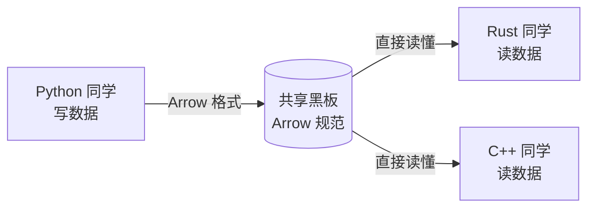
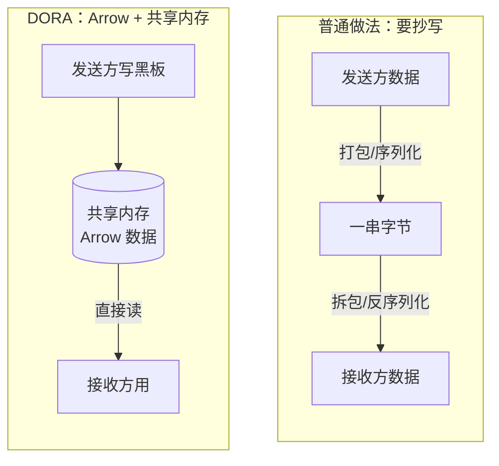
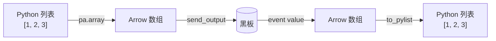

# 5.1 为什么是 Arrow

第四章里，你已经无数次写过 `pa.array([...])` 和 `.to_pylist()`，但可能一直有个疑问：**为什么不能直接发一个普通的 Python 数字或字符串，非要用 `pa.array` 包一下？**

这一节就把这个"为什么"讲透。理解了它，你就真正懂了 DORA 传数据的底层逻辑，后面处理图片、数组也就顺理成章。

:::info 小多说
我身上的零件越来越多，它们之间要交换的东西也越来越复杂——数字、文字、图片、传感器读数……大家得说"同一种语言"才不会鸡同鸭讲。这种语言，就叫 Arrow。
:::

## 学习目标

学完本节，你将能够：

- 说清 DORA 为什么统一用 **Apache Arrow** 传数据；
- 理解 Arrow 和"零拷贝""共享内存"是怎么配合起来变快的；
- 明白 `pa.array`（造数据）和 `.to_pylist()` / `.to_numpy()`（读数据）的关系；
- 知道"列式存储"大概是怎么回事，为什么它对数据处理友好。

## 前置要求

- 完成[第四章](../python-node/)，写过并跑通过 Python 节点；
- 记得第一章讲过的"黑板的统一书写规范"（[核心概念图解](../concepts/core-concepts)）。

## 先回到那块黑板

第一章我们打过一个比方：如果教室里每个同学都用**自己的火星文**在黑板上写字，那别人看之前得先"翻译"一遍，又慢又容易错。

所以 DORA 定了一条铁规矩：**所有人上黑板，都必须用同一套书写规范。** 这套规范就是 **Apache Arrow**——一种标准的、所有语言都认识的数据格式。



有了它，Python 节点写的数据，Rust 节点、C++ 节点**抬眼就能读懂，不用翻译**。这就是 Arrow 要解决的第一个问题：**多语言之间零翻译**。

## 问题一：不统一格式会怎样？

想象没有 Arrow 的世界。Python 节点想把一张图片发给 Rust 节点，它得：

1. 把图片按自己的方式打包成一串字节；
2. Rust 节点收到后，得**知道 Python 是怎么打包的**，再按规则拆开、还原。

只要两边对"怎么打包"的理解有一点点出入，数据就乱了。而且每加一种语言，就要多写一套"打包/拆包"的约定，越来越乱。

**Arrow 一举解决了这件事**：它规定死了"数字、数组、文字在内存里到底长什么样"。于是无论谁写、谁读，大家看到的都是同一副样子，天然对齐。

:::tip 一句话理解
Arrow 就像**全世界通用的集装箱标准**。有了统一尺寸的集装箱，不管货轮、火车、卡车是哪个国家造的，都能直接装卸，不用为每种运输工具重新设计箱子。
:::

## 问题二：Arrow 为什么还能让传输变快？

这才是 Arrow 最厉害的地方，也是第一章"零拷贝"那句话的真正来源。

### 普通做法：传纸条要"抄一遍"

一般的程序间传数据（比如 ROS2），大数据要经历**序列化 / 反序列化**——发送方把数据"抄"成一长串字节递过去，接收方再"抄"回自己能用的样子。数据越大（比如一整张图片），这一抄就越费时间。这就是第一章说的"传纸条要写、折、拆、誊抄"。

### Arrow + 共享内存：直接看黑板，不抄

Arrow 在内存里的排布方式是**标准且紧凑**的。配合 DORA 的**共享内存**（那块公共黑板），就能做到：

- 发送方把 Arrow 数据写到共享内存（黑板）上；
- 接收方**直接对着黑板读**，不用抄到自己本子上。

这就是**零拷贝（Zero-copy）**——省掉了"抄写"这一整步。数据越大，省得越多，这正是 DORA 比 ROS2 快 10-17 倍的核心原因之一。



:::info 小多说
"零拷贝"听起来高深，其实就是"别抄啦，抬头看黑板就行"。我的眼睛拍一张大图片放黑板上，大脑直接看，中间不用誊写——又快又不占地方！
:::

:::details 进阶延伸：4KB 的门槛（可跳过）
DORA 并不是所有数据都走共享内存。它内部有个阈值（当前约 **4KB**）：

- **大于 4KB** 的数据（如图片）：走共享内存，享受零拷贝；
- **小于 4KB** 的小数据（如几个数字）：直接随消息带过去，因为"专门开一块共享内存"的开销反而比复制这点小数据还大。

这层优化 DORA 自动处理，你写代码时完全不用管——照常 `send_output` 即可。
:::

## 问题三：什么是"列式存储"？

你可能听过 Arrow 是"列式（columnar）"格式。这对处理数据很有好处，用一个表格就能讲明白。

假设我们有三条机器人姿态记录，每条有 `x`、`y`、`角度` 三个字段：

| 记录 | x | y | 角度 |
|------|---|---|------|
| 1 | 10 | 20 | 90 |
| 2 | 11 | 22 | 91 |
| 3 | 12 | 24 | 92 |

- **行式存储**（按行存）：内存里排成 `10,20,90, 11,22,91, 12,24,92`——像"一条一条记录挨着放"。
- **列式存储**（按列存，Arrow 用的）：内存里排成 `10,11,12, 20,22,24, 90,91,92`——像"同一个字段的值挨着放"。

为什么列式对数据处理更快？因为很多操作是"**对某一整列做同样的事**"。比如"把所有 x 加 1"，列式存储下这些 x 值紧挨着，CPU 可以一次性、批量地处理，效率极高。

:::tip 用 Excel 理解
这就像 Excel：如果你要"把 x 那一列整体求和/加倍"，数据按列排在一起时，计算机扫一遍那一列就行，不用在每行里跳来跳去找 x。**批量处理同类数据，列式最快。**
:::

这也是为什么 Arrow 特别适合 AI 和数据处理——它们几乎都是"对成批的数据做同样的运算"。

## 回到代码：`pa.array` 与 `.to_pylist()`

理解了原理，再看第四章那两个老朋友，就通透了。它们是一对**互逆**的操作：

```python
import pyarrow as pa

# 造数据：普通 Python 列表 → Arrow 数组（写黑板前）
arr = pa.array([1, 2, 3])        # <pyarrow.Array> [1, 2, 3]

# 读数据：Arrow 数组 → 普通 Python 列表（从黑板读到后）
values = arr.to_pylist()         # [1, 2, 3]
```

- **`pa.array([...])`**：把你熟悉的 Python 数据，翻译成"黑板规范"（Arrow）再发出去。
- **`.to_pylist()`**：把从黑板读到的 Arrow 数据，翻译回你熟悉的 Python 列表来用。



所以第四章那句"造数据用 `pa.array`，读数据用 `.to_pylist()`"，本质就是**在你的 Python 世界和 DORA 的 Arrow 黑板之间做翻译**。

:::warning 为什么不能直接发普通 Python 对象？
因为普通的 Python `int`、`str`、`list` 不是黑板认的"标准字"。你直接 `send_output("data", 123)` 发一个裸整数，DORA 不知道该怎么把它放上共享黑板、也不保证别的语言能读懂。**先用 `pa.array` 翻译成 Arrow，才是合法的"黑板书写"。**
:::

## 动手观察：Arrow 数组长什么样

在朵拉魔盒终端里打开 Python，敲几行感受一下（这里不涉及数据流，纯粹玩 pyarrow）。下面每一行 `>>>` 是你输入的命令，紧跟的没有 `>>>` 的行是 Python 打印出的结果：

```python
python                            # 在终端里启动 Python 交互环境（出现 >>> 提示符）

>>> import pyarrow as pa          # 导入 pyarrow，起个简称 pa，之后用 pa. 调用它

>>> arr = pa.array([1, 2, 3, 4, 5])   # 把一个 Python 列表造成 Arrow 数组，存进变量 arr

>>> arr                           # 直接敲变量名，Python 会把它的内容打印出来
<pyarrow.lib.Int64Array object at 0x...>   # ← 这行告诉你：它是一个"Int64（64位整数）数组"
[                                 # ← 下面是数组里的 5 个元素
  1,
  2,
  3,
  4,
  5
]

>>> arr.to_pylist()              # 把整个 Arrow 数组"翻译"回普通 Python 列表
[1, 2, 3, 4, 5]                  # ← 结果就是我们最初放进去的列表

>>> len(arr)                     # 用 len() 看数组里有几个元素
5                                # ← 一共 5 个

>>> arr[0]                       # 用中括号取第 0 个元素（Python 从 0 开始数）
<pyarrow.Int64Scalar: 1>         # ← 注意：取出的不是普通数字，而是一个"Arrow 标量"

>>> arr[0].as_py()               # 在标量后面加 .as_py()，才真正变回普通 Python 数字
1                                # ← 现在它就是我们能直接拿去计算的整数 1
```

逐条看懂了这几行，你就摸清了 Arrow 数组的"脾气"：

- 造：`pa.array([...])` 把 Python 列表变成 Arrow 数组；
- 看全部：`.to_pylist()` 一次性变回普通列表；
- 看单个：`arr[0]` 得到的是 **Arrow 标量**（还没"落地"），要再 `.as_py()` 才是普通 Python 值；
- 数个数：`len(arr)` 告诉你有几个元素。

注意那个容易踩的点：**`arr[0]` 取出的是 Arrow 标量，不是普通数字**，必须再 `.as_py()` 才能变回你熟悉的 `1`。这几个方法（`to_pylist`、`as_py`、`len`）下一节还会反复用到。

## 动手练习（思考题）

小多的摄像头每秒要往黑板上放 30 张图片，每张约 900KB。请你用这一节学的知识，解释：**为什么 DORA 能扛得住这么大的数据量，而不会卡成幻灯片？**

:::details 参考答案
两个关键点：

1. **零拷贝 + 共享内存**：这么大的图片（远超 4KB）会走共享内存。摄像头把图片写到公共黑板上，下游节点直接对着黑板读，**中间没有"抄写"（序列化/反序列化）的开销**，省掉了最耗时的部分。
2. **Arrow 标准格式**：图片以 Arrow 规范排布，接收方拿到共享内存的引用后能直接按格式读取，不用重新解析。

一句话：因为"大家看同一块黑板、谁都不用誊抄"，所以又快又省内存。
:::

## 小结

- **Arrow = 黑板的统一书写规范**：所有节点、所有语言用同一种数据格式，**零翻译**。
- Arrow 配合**共享内存**实现**零拷贝**：大数据直接对着黑板读，省掉序列化/反序列化，这是 DORA 快的核心原因。
- Arrow 是**列式存储**：同类数据挨着放，批量处理极快，天生适合 AI 与数据处理。
- **`pa.array`（造）与 `.to_pylist()`（读）** 是你和 Arrow 黑板之间的一对互逆翻译。

下一节，我们把小多最常用的几种数据类型——**数字、数组、图像**——一个个讲清楚，教你怎么造、怎么读。
