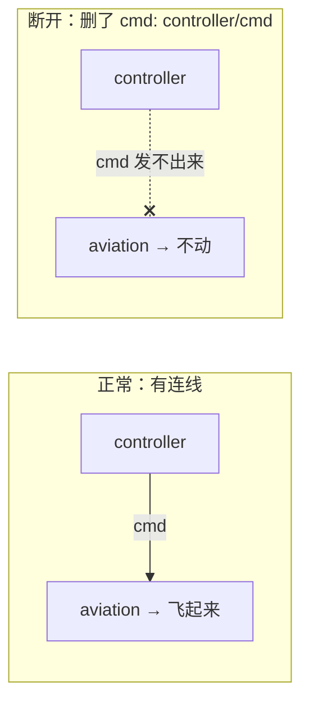

# 3.5 啊哈实验：删掉连线

前面的内容都是"读"和"看"。这一节我们动手做一个实验——**改一行 YAML，观察现象的变化**。通过这个"啊哈"瞬间，你会真正理解"连线=数据在流动"。

## 学习目标

学完本节，你将能够：

- 通过修改 `dataflow.yml` 改变数据流的行为
- 用"连线断了"的现象反向理解"连线"的本质
- 证明 DORA 数据流中"数据通过 YAML 定义的连线流动"

## 实验准备

1. 确保之前的数据流已停止（`Ctrl+C` 终止）。
2. 进入 `aviation/` 目录。
3. 打开 `dataflow.yml`：

```bash
cd aviation
cat dataflow.yml
```

当前内容：

```yaml
nodes:
  - id: controller
    path: target/release/aviation-controller
    inputs:
      tick: dora/timer/millis/16
    outputs: [cmd]

  - id: aviation
    path: target/release/aviation-dora
    inputs:
      cmd: controller/cmd
    outputs: [pose]
```

## 实验：删掉连线

把 aviation 的 `inputs` 中的 `cmd: controller/cmd` 这一行删掉（或注释掉），改为：

```yaml
nodes:
  - id: controller
    path: target/release/aviation-controller
    inputs:
      tick: dora/timer/millis/16
    outputs: [cmd]

  - id: aviation
    path: target/release/aviation-dora
    inputs:
      # cmd: controller/cmd    ← 这行被注释了！
    outputs: [pose]
```

保存文件。

## 观察现象

现在运行数据流：

```bash
dora run dataflow.yml
```

两个窗口仍然会弹出，但这次：**无论你怎么按控制器上的按钮，小飞机都一动不动。**

终端中，你也看不到 `aviation` 节点收到 `cmd` 的日志了——它只会打印 `Publishing pose: ...`，但 `pose` 的值永远不变（飞机停在起点）。

按 `Ctrl+C` 停止。

## 恢复原状

把 `dataflow.yml` 改回来，取消注释：

```yaml
    inputs:
      cmd: controller/cmd
```

保存后重新 `dora run`，小飞机复活了——又能动了！

## "啊哈"时刻

这个实验告诉我们什么呢？

> **`dataflow.yml` 中 `cmd: controller/cmd` 这一行，就是"连接 controller 和 aviation 的管道"。删掉它，管道就断了，数据不再流动，小飞机自然收不到指令。**

实验中你没有改任何代码，只是改了一行 YAML。这就是 DORA 的核心思想：**数据流的拓扑结构由配置定义，和代码分离。**



:::info 小莫
看到没有？仅仅把一行文字注释掉，整个系统的行为就变了——这就是"配置即代码"的威力。controller 节点明明还在运行、还在发数据，但因为"管道"断了，接收方就永远收不到。就像两个人在打电话，电话线拔了，喊得再大声也听不见。
:::

## 延伸思考

如果反过来，删掉 controller 的 `tick: dora/timer/millis/16` 这一行呢？

```yaml
    inputs:
      # tick: dora/timer/millis/16    ← 删了定时器
```

试试看会发生什么。（提示：controller 还在运行，但不再被"闹钟"叫醒，所以不会发送指令，小飞机也不动。）

## 动手练习

:::tip 练习：拆掉控制器，让 aviation 独立运行
如果把 `dataflow.yml` 中的 controller 节点整个删掉（删掉 `- id: controller` 到 `outputs: [cmd]` 这 7 行），只保留 aviation 节点，然后 `dora run`，会怎样？

:::

:::details 参考答案
aviation 节点会启动，弹出一个窗口，但控制器的窗口不会出现。由于没有控制器发送 `cmd`，小飞机停在原地不动。但 aviation 节点**不会报错**——它只是安静地等待永远不会到来的 `cmd`。

这说明了 DORA 的一个重要特性：**节点之间是解耦的**，一个节点不存在不会导致另一个节点崩溃——它只是收不到数据而已。
:::

## 常见问题 FAQ

:::warning 注释不生效，小飞机还能动
确认保存文件后再运行 `dora run`。如果改动后还在用之前启动的旧进程，请先 `Ctrl+C` 停止再重新启动。
:::

:::warning 恢复后小飞机还是不动
确认删除了注释符号（`#`），确保 YAML 格式正确。YAML 对缩进很敏感，`inputs:` 和 `cmd:` 要对齐。
:::

## 小结

- 注释掉 `cmd: controller/cmd` 一行 → "连线断了"，小飞机不动。
- **不改代码只改配置**，就能改变数据流的行为——这是 DORA 数据流架构的核心特性。
- 反过来也成立：没有定时器，controller 不会触发；没有 controller，aviation 只会空等。
- **数据流不是靠代码硬编码，而是靠 YAML 配置定义。**

做完这个实验，你已经理解了 DORA 数据流的核心机制。下一章我们将开始自己写节点——从 Python 开始，亲手创建你的第一个 DORA 节点！

## 🚀 终极挑战：飞机大战

想不想看看 DORA 数据流真正的威力？这里有一个基于 DORA 构建的**增强版飞机大战**：点击下方视频查看效果

<video src="/aviation.mp4" controls width="400">
  您的浏览器不支持视频播放，请查看 `/aviation.mp4` 文件。
</video>

在这个游戏中：
- 敌机会不断生成并向你逼近
- 你可以操控战机躲避并反击
- 得分、生命值、游戏状态实时更新
- 所有游戏逻辑都由 **DORA 节点** 驱动

**你没有看错——整个游戏就是用你正在学的 DORA 数据流搭建的。** 每一个敌机、每一次碰撞、每一分得分，都是数据在节点之间流动的结果。

---

## 🎮 动手试试：改一下 dataflow.yml，玩增强版

飞机大战和小飞机用的是同一个 `dataflow.yml`，只是节点不同。增强版的二进制也已经编译好了，就在 `target/release/` 目录下。

任务来了：**修改 `dataflow.yml`，把基础的小飞机节点换成飞机大战节点。**

先看看有哪些二进制可用：

```bash
cd aviation
ls target/release/aviation*
```

除了之前见过的 `aviation-dora`、`aviation-controller`，是不是还多了几个陌生的？把它们作为节点写进 `dataflow.yml`，替换掉原来的节点，再用 `dora run` 启动试试。

:::warning 提示
对照 3.3 节学过的 `dataflow.yml` 结构，你需要修改 `nodes:` 下的节点定义——`id`、`path`、`inputs`、`outputs` 都要配正确。改错了大不了不启动，多试几次就对了。
:::

玩够之后，把 `dataflow.yml` 恢复成原来的小飞机节点，继续学习下一章。

:::tip 你想亲手做出这个游戏吗？
从第四章开始，你将学会写 Python 节点。等学完第六、七章，掌握多路通信和实时数据处理，你就有能力自己实现这个飞机大战了。**学完本课程全部 12 章，做出这个游戏将不再是问题。**

> 提示：游戏的核心机制——玩家控制、敌人生成、碰撞检测、得分逻辑——每个都可以是一个独立的 DORA 节点。你已经在第三章见过最简单的版本（小飞机），剩下的就是用节点组合出完整的游戏逻辑。

:::

等你学完全课程，回来挑战自己吧！💪
