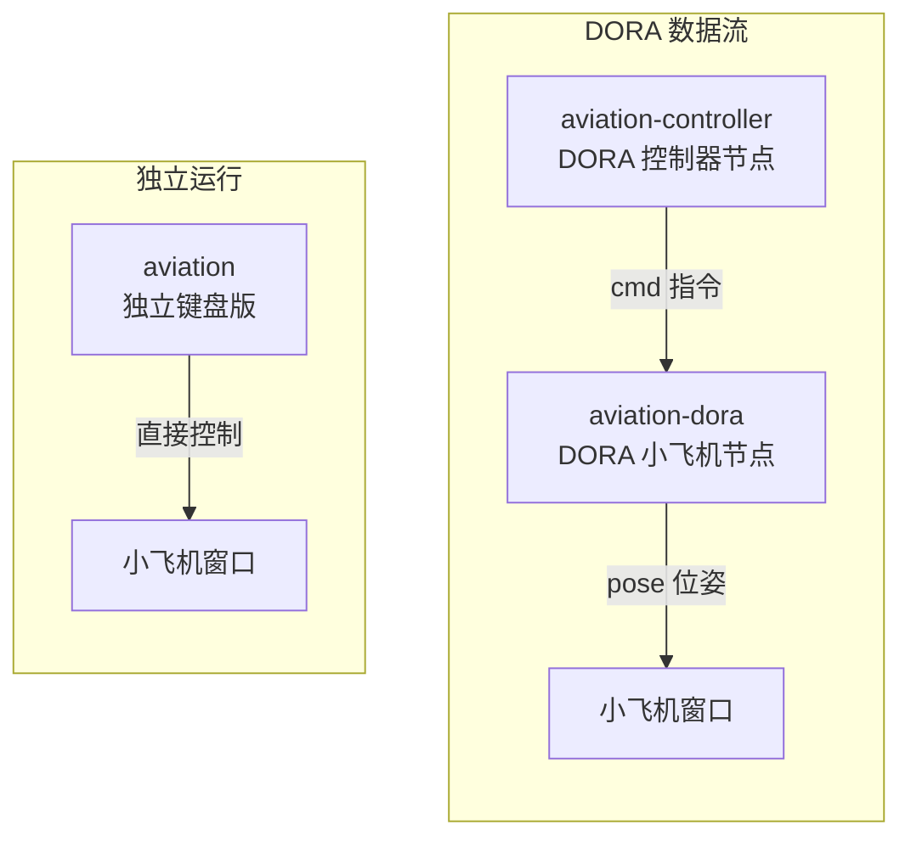

# 3.1 获取并编译小飞机工程

本章使用的 dora 小飞机是一个现成的 Rust 工程，托管在 GitHub 上。它包含三个可执行程序，分别对应独立键盘版、DORA 控制器节点和 DORA 小飞机节点。

## 学习目标

学完本节，你将能够：

- 从 GitHub 克隆一个 Rust 工程
- 使用 Rust 特性标记（`--features dora`）编译指定功能的二进制文件
- 理解三个二进制各自的作用

## 第一步：克隆仓库

在终端中执行：

```bash
git clone https://github.com/DoraCN/aviation.git
cd aviation
```

:::tip 国内网络加速
如果 `github.com` 访问慢，可使用国内镜像：

```bash
git clone https://atomgit.com/DoraCN/aviation.git
cd aviation
```

:::

克隆完成后，`aviation/` 目录下有以下关键文件：

```
aviation/
├── Cargo.toml          # Rust 项目配置与依赖声明
├── dataflow.yml        # DORA 数据流配置文件（本章核心）
├── src/
│   ├── main.rs         # 独立键盘版入口
│   ├── dora_main.rs    # DORA 节点版入口
│   └── lib.rs          # 共享逻辑（组件、运动系统）
├── assets/             # 图片和字体资源
└── README.md
```

## 第二步：编译

小飞机工程提供三个二进制（bin）：

| 二进制 | 编译命令 | 用途 |
|--------|---------|------|
| `aviation` | `cargo run`（默认） | 独立键盘版，不依赖 DORA，可单独运行 |
| `aviation-controller` | 需 `--features dora` | DORA 控制器节点，GUI 按钮 + 键盘 |
| `aviation-dora` | 需 `--features dora` | DORA 小飞机节点，接收控制指令飞行 |

本章需要编译的是带 `dora` 特性的两个节点，执行：

```bash
cargo build --release --features dora --bins
```

这条命令的含义：

- `cargo build --release`：以 release（发布）模式编译，产物更小、运行更快
- `--features dora`：启用 `dora` 特性，编译 `aviation-dora` 和 `aviation-controller`
- `--bins`：编译项目中所有的二进制（bin），产出三个可执行文件

:::tip 首次编译会较慢
Rust 首次编译需要下载并构建依赖（Bevy 等库），耗时 5-20 分钟，这是**正常的**。后续编译使用缓存，会快很多。耐心等待即可。
:::

:::warning 图形驱动检查
如果编译过程中出现关于 Vulkan/Metal/OpenGL 的警告，通常不影响编译完成。真正需要图形驱动的是**运行时**打开窗口，不是编译时。
:::

## 查看编译产物

编译完成后，产物在 `target/release/` 目录下：

```bash
ls -lh target/release/aviation*
```

应看到三个可执行文件：

```
-rwxr-xr-x  target/release/aviation
-rwxr-xr-x  target/release/aviation-controller
-rwxr-xr-x  target/release/aviation-dora
```

如果 `aviation-controller` 和 `aviation-dora` 存在，说明编译成功。

## 三个二进制的关系



- **aviation**（独立键盘版）：直接键盘控制，不依赖 DORA——适合快速体验和调试。
- **aviation-controller + aviation-dora**（DORA 数据流版）：通过 DORA 数据流通信，分别启动，靠 `dataflow.yml` 连接——这是真正的 DORA 使用方式。

:::info 小莫
本章我们主要体验的是 DORA 版本（两个节点通过数据流通信）。独立键盘版可以玩一玩感受下，但真正体现 DORA 价值的是数据流方式。
:::

## 独立键盘版试玩（可选）

编译完成后，你可以在进入 DORA 之前先试试独立键盘版：

```bash
cargo run
```

会弹出一个标题为"航空模拟器"的窗口。使用 `W/A/S/D` 或方向键控制小飞机飞行。这是验证你的机器能正常显示 Bevy 窗口的好方法。

按 `Ctrl+C` 停止（或在终端按 `Ctrl+C` 结束进程）。

## 小结

- 从 GitHub 或 AtomGit 克隆了 aviation 工程。
- `cargo build --release --features dora --bins` 编译了三个二进制。
- `aviation-controller` 和 `aviation-dora` 是接下来要通过 DORA 运行的节点。
- 独立键盘版 `aviation` 可用于验证图形环境正常。

编译完成，下一步就是：[3.2 dora run 跑起来](./run-dataflow)。
