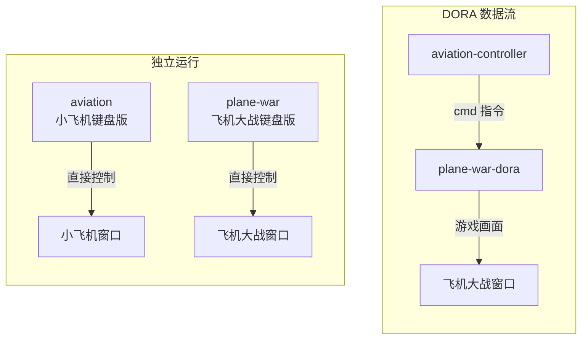

import { Tab, Tabs } from "@rspress/core/theme";

# 3.1 获取并编译小飞机工程

本章使用的 dora 小飞机是一个现成的 Rust 工程，托管在 GitHub 上。它包含五个可执行程序：两个独立键盘版小游戏和三个 DORA 节点。

## 学习目标

学完本节，你将能够：

- 从 GitHub 克隆一个 Rust 工程
- 使用 Rust 特性标记（`--features dora`）编译指定功能的二进制文件
- 理解五个二进制各自的作用

## 第一步：克隆仓库

在终端中执行：

```bash
git clone https://github.com/DoraCN/aviation.git
cd aviation
```

:::tip 国内网络加速
如果 `github.com` 访问慢，可使用国内镜像：

```bash
git clone https://atomgit.com/DoraCN/aviation.git
cd aviation
```

:::

克隆完成后，`aviation/` 目录下有以下关键文件：

```
aviation/
├── Cargo.toml          # Rust 项目配置与依赖声明
├── Cargo.lock          # 依赖版本锁定
├── dataflow.yml        # DORA 数据流配置文件（本章核心）
├── .gitignore
├── README.md
├── README.zh.md
├── assets/             # 图片和字体资源
└── src/
    ├── main.rs                    # → aviation（独立键盘版小飞机）
    ├── lib.rs                     # 共享逻辑
    ├── plane_war/                 # 飞机大战模块
    │   ├── mod.rs
    │   ├── assets.rs
    │   ├── components.rs
    │   ├── resources.rs
    │   └── systems.rs
    └── bin/
        ├── dora.rs                # → aviation-dora
        ├── controller.rs          # → aviation-controller
        ├── plane_war.rs           # → plane-war
        └── plane_war_dora.rs      # → plane-war-dora
```

:::warning Linux 用户：编译常见问题

aviation 使用 Bevy 游戏引擎，在 Linux 上首次编译时常因缺少系统库而失败。以下是两个典型错误：

**错误 1：`wayland-sys` 编译失败**

报错结尾可见：

```
The pkg-config command could not be found.
```

或：

```
Package `wayland-client` was not found in the pkg-config search path.
```

**原因**：Bevy 的窗口系统依赖 Wayland（或 X11），编译 `wayland-sys` 时需要 `pkg-config` 工具和 Wayland 开发头文件。裸系统通常未安装这些包。

---

**错误 2：`libudev-sys` 编译失败**

报错结尾可见：

```
Package libudev was not found in the pkg-config search path.
```

**原因**：Bevy 通过 `gilrs` 支持游戏手柄输入，依赖 `libudev-sys` crate 与 Linux 的 udev 设备管理器通信。需要 `libudev-dev` 系统包。

---

**解决方案**：Ubuntu/Debian 执行以下命令安装所有必需的开发库：

```bash
sudo apt install -y pkg-config libwayland-dev libxkbcommon-dev libasound2-dev libudev-dev
```

如果当前使用 X11 桌面而非 Wayland，还需安装 X11 支持：

```bash
sudo apt install -y libx11-dev libxrandr-dev libxinerama-dev libxcursor-dev libxi-dev libudev-dev
```

安装后重新执行编译命令即可。这些包一次安装永久有效，后续编译不会再因此报错。
:::

## 第二步：编译

小飞机工程提供五个二进制（bin）：

| 二进制                | 编译条件          | 用途                        |
| --------------------- | ----------------- | --------------------------- |
| `aviation`            | 默认              | 独立键盘版小飞机模拟        |
| `plane-war`           | 默认              | 独立键盘版飞机大战          |
| `aviation-controller` | `--features dora` | DORA 控制器节点，GUI + 键盘 |
| `aviation-dora`       | `--features dora` | DORA 小飞机模拟节点         |
| `plane-war-dora`      | `--features dora` | DORA 飞机大战节点           |

执行编译：

```bash
cargo build --release --features dora --bins
```

这条命令的含义：

- `cargo build --release`：以 release（发布）模式编译
- `--features dora`：启用 `dora` 特性，编译三个 DORA 节点
- `--bins`：编译项目中所有二进制，产出五个可执行文件

:::tip 首次编译会较慢
Rust 首次编译需要下载并构建依赖（Bevy 等库），耗时 5-20 分钟，这是**正常的**。后续编译使用缓存，会快很多。耐心等待即可。
:::

:::warning 图形驱动检查
如果编译过程中出现关于 Vulkan/Metal/OpenGL 的警告，通常不影响编译完成。真正需要图形驱动的是**运行时**打开窗口，不是编译时。
:::

## 查看编译产物

编译完成后，产物在 `target/release/` 目录下：

<Tabs groupId="os">
<Tab label="macOS / Linux">

```bash
ls target/release/
```

应看到五个可执行文件：

```
target/release/
├── aviation*
├── aviation-controller*
├── aviation-dora*
├── plane-war*
└── plane-war-dora*
```

</Tab>
<Tab label="Windows">

```powershell
dir target\release\*.exe
```

应看到五个可执行文件：

```
target\release\aviation.exe
target\release\aviation-controller.exe
target\release\aviation-dora.exe
target\release\plane-war.exe
target\release\plane-war-dora.exe
```

</Tab>
</Tabs>

如果 `aviation-controller` 和 `plane-war-dora` 存在，说明 DORA 节点编译成功。

## 五个二进制的关系



- **aviation / plane-war**（独立键盘版）：直接键盘控制，不依赖 DORA——适合快速体验和调试。
- **aviation-controller + plane-war-dora**（DORA 数据流版）：通过 DORA 数据流通信，分别启动，靠 `dataflow.yml` 连接——这是真正的 DORA 使用方式。当前 `dataflow.yml` 配置的是飞机大战节点，也可切换为 `aviation-dora`。

:::info 小莫
本章我们主要体验的是 DORA 版本（三个节点通过数据流通信）。独立键盘版可以玩一玩感受下，但真正体现 DORA 价值的是数据流方式。
:::

## 独立键盘版试玩（可选）

前面编译时已经生成了独立键盘版的 release 二进制，直接运行即可：

<Tabs groupId="os">
<Tab label="macOS / Linux">

```bash
./target/release/aviation
```

</Tab>
<Tab label="Windows">

```powershell
.\target\release\aviation.exe
```

</Tab>
</Tabs>

会弹出一个标题为"航空模拟器"（aviation）或"飞机大战"（plane-war）的窗口。使用 `W/A/S/D` 或方向键控制。这是验证你的机器能正常显示 Bevy 窗口的好方法。

按 `Ctrl+C` 停止（或在终端按 `Ctrl+C` 结束进程）。

## 小结

- 从 GitHub 或 AtomGit 克隆了 aviation 工程。
- `cargo build --release --features dora --bins` 编译了五个二进制。
- `aviation-controller` 和 `plane-war-dora` 是接下来要通过 DORA 运行的节点（`dataflow.yml` 已配置好）。
- 独立键盘版 `aviation` 和 `plane-war` 可用于验证图形环境正常。

编译完成，下一步就是：[3.2 dora run 跑起来](./run-dataflow)。
