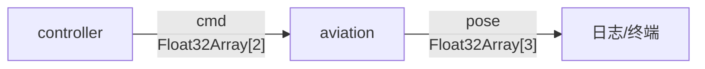

# 3.4 看懂在流动的数据：cmd 与 pose

上一节我们知道了数据流的长相（YAML 连线），但**黑板上流动的数据本身长什么样？** 这一节我们把 `cmd` 和 `pose` 的格式讲清楚——这是你第一次接触 DORA 的数据格式，也是后面第五章 Arrow 的铺垫。

## 学习目标

学完本节，你将能够：

- 看懂 `cmd` 数组的两个值（旋转系数、前进系数）含义
- 看懂 `pose` 数组的三个值（x、y、角度）含义
- 从终端日志中读取出正在流动的数据

## 两路数据概览

小飞机数据流中有两路数据在流动：



| 数据 | 方向 | 类型 | 内容 |
|------|------|------|------|
| `cmd` | controller → aviation | `Float32Array[2]` | `[旋转系数, 前进系数]` |
| `pose` | aviation → 日志/下游 | `Float32Array[3]` | `[x坐标, y坐标, 角度]` |

## cmd：控制指令

`cmd` 是一个包含**两个浮点数**的数组：

```
cmd = [旋转系数, 前进系数]
```

| 字段 | 取值范围 | 含义 |
|------|---------|------|
| `旋转系数` | [-1, 1] | 负 = 顺时针，正 = 逆时针，0 = 不旋转 |
| `前进系数` | [-1, 1] | 负 = 后退，正 = 前进，0 = 不动 |

当你操作控制器时，控制器会根据你的按键生成对应的系数：

| 操作 | cmd（约值） |
|------|------------|
| 什么也不按 | `[0.0, 0.0]` |
| 按 ↑ | `[0.0, 1.0]` |
| 按 ↑ + → | `[0.5, 1.0]` |
| 按 ← | `[-1.0, 0.0]` |
| 按 ↓ | `[0.0, -1.0]` |

### 这些值怎么来的？

控制器的代码大约是这样判断的：

```
按下 W/↑ → 前进系数 += 1.0
按下 S/↓ → 前进系数 -= 1.0
按下 A/← → 旋转系数 -= 1.0
按下 D/→ → 旋转系数 += 1.0
```

然后把两个系数限制在 [-1, 1] 范围内，通过 `send_output("cmd", ...)` 发送出去。

:::info 小莫
`[0.5, 1.0]` 的意思就是"向右转 50% 的速度、全速前进"。这两个数就是控制指令的全部——简单、高效、一目了然。
:::

## pose：位置姿态

`pose` 是一个包含**三个浮点数**的数组：

```
pose = [x坐标, y坐标, 角度]
```

| 字段 | 取值范围 | 含义 |
|------|---------|------|
| `x坐标` | [0, 1200] | 小飞机在水平方向的位置（像素） |
| `y坐标` | [0, 640] | 小飞机在垂直方向的位置（像素） |
| `角度` | [0, 360) | 小飞机的朝向角度（度） |

小飞机每收到一次 `cmd`，就会根据指令更新自己的位置，然后通过 `send_output("pose", ...)` 发布最新的 `pose`。

## 在终端中观察真实数据

写好之后或跑起来时，你会看到终端中的日志输出类似：

```
[aviation] Received cmd: [0.0, 1.0]
[controller] Publishing cmd: [0.0, 1.0]
[aviation] Publishing pose: [25.3, 30.1, 12.5]
[aviation] Received cmd: [0.0, 1.0]
[aviation] Publishing pose: [26.8, 32.3, 12.5]
[aviation] Received cmd: [0.0, 1.0]
[aviation] Publishing pose: [28.2, 34.5, 12.5]
```

这 6 行日志中包含的信息：

1. controller 以 60Hz 持续发送 `cmd = [0.0, 1.0]`（前进）
2. aviation 每次收到 `cmd` 就更新位置，并发布新的 `pose`
3. 可以看到 x 坐标在不断增大（飞机在水平前进），y 也在缓慢变化（轨迹可能有小偏移），角度稳定在 12.5 度

当你同时按 ↑ 和 → 时：

```
[controller] Publishing cmd: [0.5, 1.0]
[aviation] Publishing pose: [30.0, 36.0, 35.2]
[aviation] Publishing pose: [30.3, 36.1, 36.8]
```

旋转系数 0.5 使得角度在递增（飞机在向右转弯）。

## 数据类型：Arrow Float32Array

`cmd` 和 `pose` 在 DORA 内部都是以 **Arrow 格式**传递的。具体来说：

- `cmd` 是 `Float32Array[2]`——包含两个 32 位浮点数的 Arrow 数组
- `pose` 是 `Float32Array[3]`——包含三个 32 位浮点数的 Arrow 数组

虽然你现在还不需要自己写代码造 Arrow 数据，但可以记住：**节点之间传的都是 Arrow 数组**（第五章会系统讲）。你现在看到的这两个就是最简单的例子——一串同类数字。

## 动手练习

:::tip 练习：从日志中判断飞机的运动状态
假设你看到终端日志如下，请描述飞机当前在做什么：

```
[controller] Publishing cmd: [-0.3, 0.0]
[aviation] Publishing pose: [150.0, 50.0, 45.2]
[controller] Publishing cmd: [-0.3, 0.0]
[aviation] Publishing pose: [150.0, 50.0, 48.1]
[controller] Publishing cmd: [-0.3, 0.0]
[aviation] Publishing pose: [150.0, 50.0, 51.0]
```

:::

:::details 参考答案
从数据可以看出：
- `cmd` 的旋转系数为 -0.3，前进系数为 0.0
- 所以飞机在**原地顺时针旋转**（不前进，x 和 y 不变）
- 角度从 45.2 → 48.1 → 51.0，正在持续增加（顺时针）

:::

## 小结

- **cmd** = `[旋转系数, 前进系数]`，范围 [-1, 1]，控制器的输出。
- **pose** = `[x, y, 角度]`，小飞机的位置和朝向。
- 终端日志可以实时看到数据的流动。
- cmd 和 pose 都是 Arrow 格式的浮点数数组——这是第五章的提前预览。

下一节，我们做一个"啊哈实验"——改掉 YAML 的一行，看看会发生什么。
