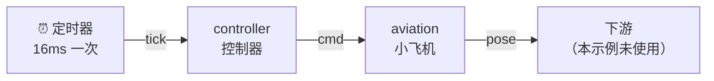

# 3.3 读懂 dataflow.yml

上一节你亲手跑起了小飞机，但那条数据流是怎么工作的？答案就藏在 `dataflow.yml` 这个"值日表"里。这一节我们把它的每一行都拆开讲透。

## 学习目标

学完本节，你将能够：

- 读懂 `dataflow.yml` 中节点（nodes）、输入（inputs）、输出（outputs）的声明
- 说清"控制器的输出怎么连到小飞机的输入"
- 用黑板比喻解释数据流的工作原理

## dataflow.yml 全文

打开 `aviation/dataflow.yml`，你会看到这样的内容：

```yaml
nodes:
  - id: controller
    path: target/release/aviation-controller
    inputs:
      tick: dora/timer/millis/16
    outputs: [cmd]

  - id: aviation
    path: target/release/aviation-dora
    inputs:
      cmd: controller/cmd
    outputs: [pose]
```

只有两个节点，共 12 行。我们来逐段拆解。

## 顶层结构

```yaml
nodes:
```

一个数据流由一个或多个**节点（node）** 组成。`nodes:` 下面列出所有节点，每个节点以 `- id:` 开头。

这和我们第四章以后写的节点是同一个概念——每个节点是一个独立的程序，负责一件事。

## 节点一：controller

```yaml
  - id: controller          # 节点的唯一名字
    path: target/release/aviation-controller  # 可执行文件路径
    inputs:
      tick: dora/timer/millis/16    # 定时器：每 16 毫秒触发一次（≈60Hz）
    outputs: [cmd]                  # 它会往一个叫 cmd 的输出写数据
```

**`id`**：节点的名字，在同一条数据流里必须唯一。其他节点靠这个名字来引用它的输出。这里叫 `controller`。

**`path`**：怎么启动这个节点。`target/release/aviation-controller` 就是我们在 3.1 编译出的二进制文件。

**`inputs`**：这个节点要收什么数据。这里只有一项：

- `tick` 是输入的名字
- `dora/timer/millis/16` 是输入来源——这是一个**内置定时器**，每 16 毫秒发一次事件（约每秒 60 次）。这个帧率让控制器能以 60Hz 的频率持续发送指令。

**`outputs`**：这个节点会往外写什么数据。这里只有一项：

- `[cmd]` 表示它有一个名为 `cmd` 的输出

用黑板比喻：**controller 同学的任务是——被闹钟（tick）叫醒后，把控制指令写到黑板的 `cmd` 区。**

## 节点二：aviation

```yaml
  - id: aviation
    path: target/release/aviation-dora
    inputs:
      cmd: controller/cmd    # 从 controller 的 cmd 输出读数据
    outputs: [pose]          # 它会往一个叫 pose 的输出写数据
```

**`inputs`**：

- `cmd` 是它内部使用的输入名
- `controller/cmd` 是数据来源——这个格式读作"`来源节点id`/`来源输出名`"，意思是"我从 controller 节点的 cmd 输出订阅数据"

**`outputs`**：

- `[pose]` 表示它会把自己的位置姿态写到 `pose` 输出

用黑板比喻：**aviation 同学的任务是——抬头看黑板的 `cmd` 区（收到控制指令），计算新的位置，然后把当前位置（pose）写到黑板的 `pose` 区。**

## 完整的数据流

把两个节点连起来看，整条数据流就是：



箭头表示数据的流动方向：

- 定时器（`dora/timer/millis/16`）每隔 16ms 触发一次 `tick` 事件
- controller 收到 `tick`，根据当前按键状态生成指令，写入 `cmd` 输出
- aviation 订阅了 `controller/cmd`，收到指令后更新飞机位置，写入 `pose` 输出
- 小飞机窗口同时显示飞机的运动状态

**数据是单向流动的**：定时器 → controller → aviation。

## 值和声明

`dataflow.yml` 里的 `outputs: [cmd]` 只是**声明**，告诉 DORA 运行时"这个节点会写 `cmd`"。真正把数据写出去，是在 `aviation-controller` 的代码里调用 `send_output("cmd", ...)`。

`inputs` 里的 `cmd: controller/cmd` 则是**连线**——把 controller 的 `cmd` 输出和 aviation 的 `cmd` 输入连接起来。

这种"声明 + 连线"的方式，让数据流的拓扑结构完全由 YAML 决定。换一个 YAML 文件，同样的节点可以连成完全不同的数据流。

## 动手练习

:::tip 练习：试着画一条反向数据流
假设我们想让小飞机关联一个数据记录节点，`pose` 数据要从 aviation 发到一个新的 `recorder` 节点。在下面补充 YAML：

```yaml
nodes:
  - id: controller
    ...
  - id: aviation
    ...
  - id: recorder         # 新增：记录飞行数据
    path: recorder.py
    inputs:
      pose: ______       # 从 aviation 的 pose 输出读数据
```

横线处应该填什么？
:::

:::details 参考答案
`pose: aviation/pose`。格式就是 `来源节点id/来源输出名`，来源节点是 `aviation`，来源输出是 `pose`。
:::

## 常见问题 FAQ

:::warning `dora/timer/millis/16` 是什么意思？
这是 DORA 内置的定时器语法格式。`millis` 表示毫秒，`16` 表示 16 毫秒。所以 `dora/timer/millis/16` 就是每 16 毫秒触发一次事件（≈60Hz）。也可以写成 `dora/timer/secs/1`（每秒一次）或 `dora/timer/hz/60`（每秒 60 次）。
:::

:::warning `outputs: [cmd]` 和 `path:` 有什么关系？
没有直接关系。`outputs` 是告诉 DORA 运行时"这个节点的代码会写一个叫 `cmd` 的输出"；`path` 是指定"这个节点的可执行程序在哪里"。两者是不同的维度。
:::

## 小结

- `dataflow.yml` 通过 `id`/`path`/`inputs`/`outputs` 声明每个节点和它们的连线。
- `controller/cmd` 格式是"来源节点 id / 来源输出名"，用来连接节点。
- 内置定时器 `dora/timer/millis/16` 让节点按固定频率触发。
- 数据流是**单向**的：定时器 → controller → aviation。
- 换一份 YAML 就能改变节点之间的连接——代码不需要动。

下一节，我们看看黑板上流动的数据（`cmd` 和 `pose`）到底长什么样。
