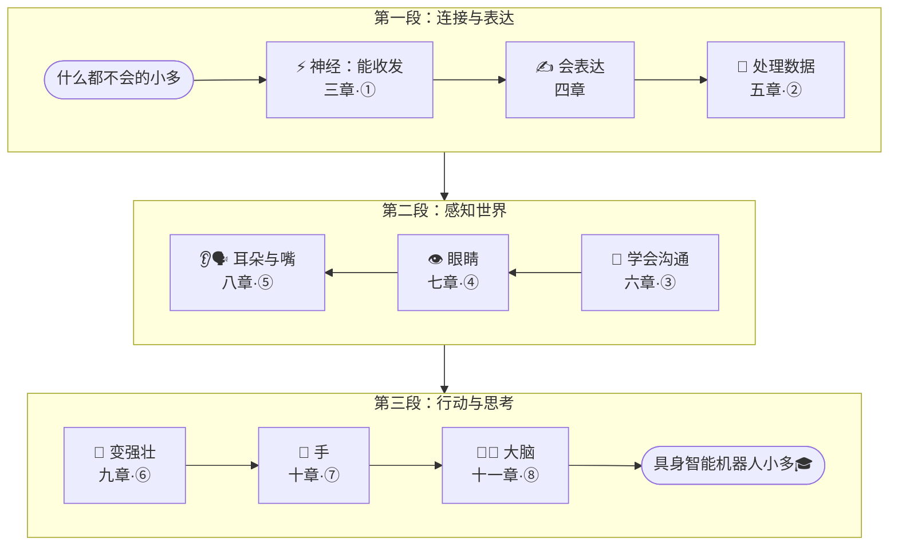

# 学习路线图

这门课就是**小多的成长日记**。它会从一个"什么都不会"的小机器人，一步步长出各种能力，最后成为一个能听懂你说话、看懂世界、动手做事的**具身智能**机器人。

## 小多的成长之旅

小多会像搭积木一样，一章解锁一项新能力，每项能力都对应一个能亲手运行的小项目，最后合体成毕业项目：

每解锁一项新能力，都对应一个能亲手运行的小项目。

## 12 章，一览全程

| 章 | 你会学到 | 小多解锁 | 小项目 |
|------|---------|---------|--------|
| 一 · 认识 DORA 与具身智能 | 数据流是什么、为什么比 ROS2 好 | 建立认知 | — |
| 二 · 朵拉魔盒与环境搭建 | 一键准备干净的开发环境 | 拥有工坊 | — |
| 三 · 第一个数据流：dora 小飞机 | 亲手跑起第一个数据流 | ⚡ 神经：能收发 | ① 玩转小飞机 |
| 四 · Python 节点开发基础 | 写出你自己的第一个节点 | ✍️ 会表达 | — |
| 五 · 数据的语言：Arrow | 让节点之间传各种数据 | 🧮 会处理数据 | ② 数据流水线 |
| 六 · 节点如何对话：四种通信模式 | Topic/Service/Action/Streaming | 💬 学会沟通 | ③ 问答/任务交互 |
| 七 · 让小多看见：视觉与感知 | 摄像头 + YOLO 物体检测 | 👁 眼睛 | ④ 实时物体检测 |
| 八 · 让小多听见与说话：语音与流式 | 语音识别与合成 | 👂🗣 耳朵与嘴 | ⑤ 语音互动 |
| 九 · 加速小多：Rust 节点 | 用 Rust 写高性能节点 | 💪 变强壮 | ⑥ 高频处理 |
| 十 · 让小多动起来：控制与仿真 | 用 PyBullet 控制机械臂 | 🦾 手 / 移动 | ⑦ 控制机械臂 |
| 十一 · 让小多思考并行动：VLM | 语言→感知→决策→动作闭环 | 🧠✨ 大脑 | ⑧ 毕业项目 |
| 十二 · 调试、部署与进阶 | 排错、录制回放、多机 | 自我成长 | — |

## 8 个小项目

1. **玩转 dora 小飞机**：像玩游戏一样，第一次感受"数据流"。
2. **数据处理流水线**：让数据在节点间生成、变换、显示。
3. **问答 / 任务交互**：让节点之间学会四种"对话"方式。
4. **实时物体检测**：小多睁开眼，认出画面里的物体。
5. **和小多语音互动**：对小多说话，它能听懂并回应。
6. **高频处理节点**：用 Rust 给小多"强身健体"。
7. **控制仿真机械臂**：让小多在仿真里挥动手臂。
8. **毕业项目**：说一句话，让小多**看到并抓取**你指定的东西。🎓

:::info 小多说
看到最后那个毕业项目了吗？那就是我的"成年礼"！等你陪我一路走到那里，我就是一个真正的具身智能机器人啦。
:::

:::tip 准备好了吗
从 [第一章 · 认识 DORA](../concepts/) 开始，先弄懂"数据流"到底是什么。这一章不用写代码，轻松入门。
:::

:::info 关于编程语言
DORA 支持 **Python / Rust / C / C++** 四种语言。本课程以 **Python** 为主（最易上手、AI 生态最全），并在第九章用 **Rust** 做"最小够用"的性能体验。**C 与 C++**（多用于硬件驱动、极限性能）不在本课，会放到未来的《DORA 进阶》中级课程。零基础的你，跟着 Python 走完全程完全没问题！
:::
