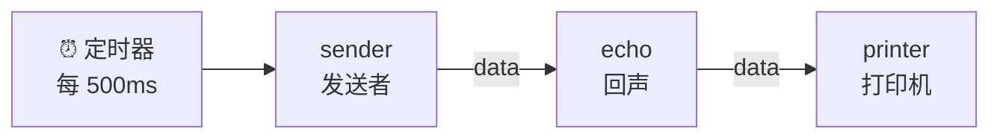

# 4.3 把节点接进数据流

上一节你写好了两个"零件"（`sender.py` 和 `echo.py`），但它们还是**孤零零躺在文件夹里**。这一节，我们用一张 `dataflow.yml`"值日表"把它们串起来，让它们真正协作、真正跑起来——这将是**你亲手运行的第一条自己写的数据流**！

:::info 小多说
零件造好了，但还没装到我身上。这一节就是"组装"环节——把它们接到我的黑板上，我就活起来啦！
:::

## 学习目标

学完本节，你将能够：

- 读懂并写出一张连接多个节点的 `dataflow.yml`；
- 理解 `outputs` 声明 与 `send_output` 、`inputs` 连线 之间的对应关系；
- 再写一个 **printer 节点** 把数据打印出来，亲眼看见数据在流动；
- 用 `dora build` 和 `dora run` 跑通整条数据流。

## 前置要求

- 已完成 [4.2](./write-node)，手头有 `sender.py` 和 `echo.py`；
- 会看 `dataflow.yml` 的基本结构（可随时回看[附录 · dataflow.yml 速查](../appendix/dataflow-yaml)）。

## 先想清楚：我们要连成什么样

我们要搭的数据流是这样一条链：



- **定时器**每半秒戳一下 sender；
- **sender** 收到就发一条"开/关"到它的 `data` 输出；
- **echo** 收到后原样转发到它自己的 `data` 输出；
- **printer** 收到后把内容打印到屏幕，让我们**肉眼看到数据**。

现在还差一个 printer，先补上。

## 补一个节点：printer（打印机）

`sender` 和 `echo` 都只是"发数据"，我们看不见结果。printer 的职责就是**把收到的数据打印出来**，这样才能验证整条流通不通。

新建 `printer.py`：

```python
# printer.py —— 打印机节点
# 职责：收到数据就打印到屏幕，让我们肉眼确认数据在流动。

from dora import Node


def main():
    node = Node()

    for event in node:
        if event["type"] == "INPUT":
            # event["value"] 是 Arrow 数组，用 .to_pylist() 变回普通 Python 列表好打印
            data = event["value"].to_pylist()
            print(f"printer 收到：{data}", flush=True)

        elif event["type"] == "STOP":
            break


if __name__ == "__main__":
    main()
```

两个新东西，解释一下：

- **`event["value"].to_pylist()`**：收到的数据是 Arrow 数组，`.to_pylist()` 把它转回你熟悉的 Python 列表（比如 `["开"]`），方便打印和查看。这是 4.2 里 `pa.array([...])` 的**逆操作**。
- **`print(..., flush=True)`**：`flush=True` 让打印**立刻**显示出来。在数据流里，不加它有时输出会被"攒着"不及时显示，加上更保险。

:::info 小多说
造数据用 `pa.array([...])`（列表 → Arrow），读数据用 `.to_pylist()`（Arrow → 列表）。一进一出，正好对称，好记吧！
:::

## 关键一步：写 `dataflow.yml`

现在三个零件齐了：`sender.py`、`echo.py`、`printer.py`。在同一个 `course/ch04` 目录下，新建 `dataflow.yml`：

```yaml
# dataflow.yml —— 把三个节点串成一条数据流
nodes:
  # 节点一：发送者
  - id: sender                       # 节点的唯一名字
    path: sender.py                  # 怎么启动它：运行这个 Python 文件
    inputs:
      tick: dora/timer/millis/500    # 内置定时器：每 500 毫秒发一次 tick
    outputs:
      - data                         # 声明：我会往一个叫 data 的输出写东西

  # 节点二：回声
  - id: echo
    path: echo.py
    inputs:
      data: sender/data              # 我的 data 输入，来自 sender 的 data 输出
    outputs:
      - data                         # 我也会写一个叫 data 的输出

  # 节点三：打印机
  - id: printer
    path: printer.py
    inputs:
      data: echo/data                # 我的 data 输入，来自 echo 的 data 输出
```

这张"值日表"就是整条数据流的灵魂。我们逐个字段拆开看。

### `id`：节点的名字

每个节点有一个唯一的 `id`。别的节点靠这个名字来"点名"它的输出。这里我们有 `sender`、`echo`、`printer` 三个名字。

### `path`：怎么启动这个节点

`path: sender.py` 告诉 DORA："要启动这个节点，就去运行 `sender.py`"。因为我们的节点是 Python 脚本，这里直接写文件名即可。

### `outputs`：声明"我会写哪些输出"

```yaml
outputs:
  - data
```

这是在**声明**："本节点会往一个叫 `data` 的输出上写东西。" 

:::warning 声明必须和代码对上
`outputs` 里写的名字，必须和代码里 `node.send_output("data", ...)` 的**第一个参数完全一致**。sender 代码里写的是 `send_output("data", ...)`，所以 YAML 里就得声明 `- data`。**名字对不上，运行时会报错。**
:::

### `inputs`：连线——"我从哪里读数据"

```yaml
inputs:
  data: sender/data
```

这一行是**连线的核心**，读作：

> 我（echo）有一个叫 `data` 的输入，它的数据来自 `sender` 节点的 `data` 输出。

格式是固定的：

```
本节点的输入名: 来源节点id/来源输出名
```

- 左边 `data` 是**你在自己代码里** `event["id"]` 会看到的名字；
- 右边 `sender/data` 指明数据的**来源**。

还有一种特殊来源就是**定时器**：

```yaml
inputs:
  tick: dora/timer/millis/500
```

`dora/timer/millis/500` 不是别的节点，而是 DORA **内置的定时器**——每 500 毫秒往 `tick` 这个输入发一个事件。这正是 sender"每半秒动一次"的来源。

:::info 小多说
把 `inputs`/`outputs` 想象成插线：`outputs` 是插头（我往外送），`inputs` 是插座（我往里收）。`data: sender/data` 就是把 sender 的插头插进 echo 的插座。全部插对，数据就通了！
:::

## 跑起来！`dora build` + `dora run`

一切就绪。在 `course/ch04` 目录下，先 build 再 run：

```bash
dora build dataflow.yml
```

`dora build` 会读 YAML 里每个节点的 `build` 指令做准备工作（装依赖、编译等）。我们这个例子的节点没写 `build`（纯 Python、无需额外依赖），所以这步很快就过。

然后正式运行：

```bash
dora run dataflow.yml
```

如果一切正常，你会看到 printer 每半秒打印一行，"开""关"交替出现：

```
printer 收到：['关']
printer 收到：['开']
printer 收到：['关']
printer 收到：['开']
...
```

**恭喜！这是你亲手写、亲手连、亲手跑通的第一条 DORA 数据流！** 🎉

按 `Ctrl+C` 即可停止。停止时运行时会给每个节点发 `STOP`，它们各自 `break` 退出——还记得 4.1 讲的"优雅退场"吗，此刻正在发生。

:::info 小多说
看到那一行行"开/关"了吗？那是数据真的在我的三个零件之间流动！sender 写、echo 传、printer 念——我的第一条神经彻底打通啦！
:::

## 回顾：三者是怎么对上的

把代码和 YAML 放一起看，你就彻底明白了"声明—发送—连线"的三角关系：

| 环节 | 在哪 | 写法 | 作用 |
|------|------|------|------|
| **发送** | `sender.py` | `send_output("data", ...)` | 代码里真正把数据写出去 |
| **声明** | `dataflow.yml` | `outputs: [data]` | 告诉 DORA 这个节点有 `data` 输出 |
| **连线** | `dataflow.yml` | `data: sender/data` | 把 sender 的输出接到 echo 的输入 |
| **接收** | `echo.py` | `event["id"] == "data"` | 代码里判断数据来自哪个输入 |

**四处的 `data` 名字必须一致、层层对应**，数据才能顺利流过。

## 动手练习

:::tip 练习一：去掉 echo，让 sender 直接连 printer
改 `dataflow.yml`，把 printer 的输入从 `echo/data` 改成 `sender/data`，并从数据流里删掉 echo 节点。重新 `dora run`，观察结果有没有变化。

想一想：这说明了什么？
:::

:::details 参考答案
结果几乎一样——printer 照样每半秒打印开/关。这说明 **echo 只是个"中转站"**，去掉它，数据从 sender 直达 printer 也完全可以。改后的 YAML：

```yaml
nodes:
  - id: sender
    path: sender.py
    inputs:
      tick: dora/timer/millis/500
    outputs:
      - data
  - id: printer
    path: printer.py
    inputs:
      data: sender/data
```

这也印证了第一章的思想：**节点之间是解耦的**，谁连谁由值日表（YAML）决定，改连线不用改代码。
:::

:::tip 练习二：让 printer 同时收 sender 和 echo
给 printer 加两个输入，分别来自 sender 和 echo，看看能不能区分它们。

提示：一个节点可以有多个输入，靠 `event["id"]` 区分是哪一个。
:::

:::details 参考答案
YAML 里给 printer 配两个输入（名字要不同）：

```yaml
  - id: printer
    path: printer.py
    inputs:
      from_sender: sender/data
      from_echo: echo/data
```

printer 代码里靠 `event["id"]` 区分：

```python
for event in node:
    if event["type"] == "INPUT":
        data = event["value"].to_pylist()
        print(f"来自 {event['id']}：{data}", flush=True)
    elif event["type"] == "STOP":
        break
```

这就是"多输入"的雏形，第五章还会深入。
:::

## 常见报错 FAQ

:::warning `output id not declared` / 输出未声明
代码里 `send_output("xxx", ...)` 用的名字，没在该节点的 `outputs:` 里声明。两边名字必须一字不差。
:::

:::warning `input source not found` / 找不到输入来源
`inputs` 里 `data: sender/data` 右边写错了——要么 `sender` 这个 id 拼错，要么 `sender` 根本没声明 `data` 输出。检查来源节点的 `id` 和 `outputs`。
:::

:::warning printer 什么也不打印
按顺序排查：
1. sender 有没有配 `tick` 定时器？没有定时器，sender 永远收不到 `INPUT`，也就不会发数据。
2. printer 的 `print` 有没有加 `flush=True`？
3. 三处连线的名字是否层层对上（见上面的"回顾"表）。

:::

:::warning YAML 缩进报错
YAML 对缩进极其敏感，**只能用空格、不能用 Tab**，且同级要对齐。`nodes:` 下每个节点以 `- id:` 开头，其内部字段再缩进。对照本节示例的缩进层级检查。
:::

## 小结

- **`dataflow.yml` 是数据流的灵魂**：声明有哪些节点、各自读什么写什么。
- 数据要流通，四处名字必须对上：**代码 `send_output` ↔ YAML `outputs` ↔ YAML `inputs` 连线 ↔ 代码 `event["id"]`**。
- **`dora build` 做准备，`dora run` 跑起来**——你已经跑通了第一条亲手写的数据流。
- 节点之间是**解耦**的，改连线只动 YAML、不动代码，这是数据流架构的巨大好处。

下一节，我们把"定时器"讲透，并学会**给节点传参数**——让同一份代码，通过配置就能有不同的行为。
