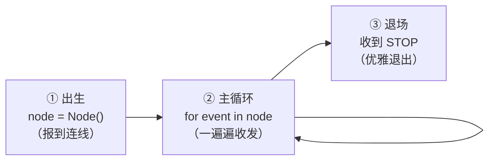

# 4.1 节点生命周期

从这一章开始，小莫要解锁一项大能力：**✍️ 会表达**——你将亲手写出它身上的第一个"零件"（节点）。

在动手敲代码之前，这一节先把一件最重要的事讲透：**一个节点从"出生"到"退场"，一生到底经历了什么。** 只要你脑子里有了这幅"生命周期"的画面，后面写代码就是水到渠成。

:::info 小莫说
在此之前，我身上的零件都是别人（比如小飞机工程）预先写好的，我只是"运行"它们。这一章，你要当我的"零件设计师"啦——先搞懂一个零件是怎么活着的，再动手造它。
:::

## 学习目标

学完本节，你将能够：

- 说清一个 DORA 节点的**三段人生**：连线 → 循环收发 → 退场；
- 理解**事件循环**为什么长成 `for event in node:` 这个样子；
- 认识节点会收到的几种**事件类型**（`INPUT` / `STOP` / `InputClosed` 等）；
- 明白 `send_output` 是怎么"往黑板上写字"的。

## 前置要求

- 读完[第一章](../concepts/)，脑子里有"黑板与课堂"的画面；
- 会一点点 Python（`for`、`if`、字典取值），不熟的话先看[附录 · Python 极简速成](../appendix/python-crash-course)；
- 装好了朵拉魔盒（[第二章](../environment/)），并跑通过[第三章的小飞机](../first-dataflow/)。

## 先回到黑板教室

第一章我们说过，一个**节点（Node）** 就是黑板教室里的一名**同学**，各管一摊事：有人负责读、有人负责算、有人负责写。

那么，一名"同学"在教室里的一天是怎么过的？其实非常简单，就三步：

1. **走进教室、报到**——让老师（DORA 运行时）知道"我来了，我是谁"；
2. **上课**——一遍遍地：抬头看黑板（收到新数据）→ 动脑处理 → 把结果写上黑板；
3. **下课铃响、离场**——听到"放学"（STOP）信号，收拾好东西，安静离开。

一个 DORA 节点的"一生"，和这个一模一样。我们给这三步起了正式的名字：



下面我们逐段拆开看。

## 第一段：出生——`node = Node()`

一个 Python 节点的代码，几乎总是这样开头：

```python
from dora import Node   # 从 DORA 库里，把 Node 这个"零件模板"拿进来

node = Node()           # 造出这个节点，并连上 DORA 运行时
```

这两行看着不起眼，背后却发生了一件关键的事：**`Node()` 把你的这段代码，接进了整个数据流。**

打个比方：`Node()` 就像新同学**走进教室、向老师报到**。报到之后，老师才知道：

- 你叫什么名字（节点的 `id`，来自 `dataflow.yml`）；
- 你该抬头看黑板的**哪一块区域**（你的 `inputs`）；
- 你能往黑板的**哪一块区域**写字（你的 `outputs`）。

:::info 小莫说
你可能会奇怪：代码里 `Node()` 括号里空空的，它怎么知道我叫什么、该收哪些数据？

秘密在于：这些信息**不写在代码里**，而写在 `dataflow.yml` 那张"值日表"里。运行时启动你时，会通过环境变量偷偷把这些告诉 `Node()`。所以**同一份节点代码，换一张值日表，就能有不同的名字和连线**——这非常灵活。
:::

:::details 进阶延伸：`Node()` 到底做了什么（可跳过）
`Node()` 会读取运行时注入的环境变量，找到与本节点通信的**控制通道**和**事件通道**，完成"握手"。此后：

- 运行时通过**事件通道**把 `INPUT`、`STOP` 等事件推给你；
- 你调用 `send_output` 时，数据通过**控制通道**（大数据则走**共享内存**）发出去。

你还可以给它传参数，比如动态节点连接到指定端口：`Node("my-node", daemon_port=6789)`。零基础阶段用不到，知道有这回事即可。
:::

## 第二段：主循环——`for event in node:`

报到之后，节点就进入了它一生中最主要的部分：**一个不停转的循环**，我们叫它**事件循环（Event Loop）**。

```python
for event in node:      # 一个接一个地，拿到发生的"事件"
    ...                 # 针对每个事件，决定做什么
```

### 为什么是"事件"，而不是"数据"？

这里有个很重要的观念转变。你可能以为节点是"等数据来了就处理"，但 DORA 的说法更准确：**节点等的是"事件（Event)"**。

什么叫事件？就是"**教室里发生的一件值得你知道的事**"。新数据到了，是一件事；老师喊放学，也是一件事；某个同学提前走了，也是一件事。这些都通过**同一个循环**通知给你。

所以 `for event in node:` 的含义是：

> 只要教室里发生了什么和我有关的事，就把它交给我，让我处理一下。

:::tip 这个循环会"卡住"，但那是正常的
当黑板上暂时没有新东西时，`for event in node:` 会**安静地等着**（专业叫"阻塞"），不会疯狂空转浪费 CPU。一旦有新事件，它立刻醒来把事件交给你。这正是我们想要的——**该等就等，该干就干**。
:::

### 每个 event 长什么样？

每次循环拿到的 `event`，是一个**字典（dict）**，你用中括号取里面的值。最常用的三个键：

| 取值写法 | 含义 | 例子 |
|---------|------|------|
| `event["type"]` | 事件的**类型** | `"INPUT"`、`"STOP"` |
| `event["id"]` | 这件事发生在**哪个输入**上 | `"image"`、`"tick"` |
| `event["value"]` | 事件**携带的数据** | 一个 Arrow 数组 |

于是一个节点处理事件的标准姿势就出来了——**先看类型，再看是哪个输入，最后取数据**：

```python
for event in node:
    if event["type"] == "INPUT":        # 如果是"来数据了"这类事件
        if event["id"] == "image":      # 且这份数据来自名叫 image 的输入
            data = event["value"]       # 就把数据取出来
            # ... 在这里处理 data ...
```

### 节点会遇到哪几种事件类型？

`event["type"]` 主要有这几种。零基础阶段你**真正要管的只有前两种**，其余先认个脸：

| 类型 | 课堂类比 | 你通常怎么办 |
|------|---------|-------------|
| **`INPUT`** | 黑板上出现了你要看的新内容 | ⭐ 最常见：取出数据、处理、可能写回输出 |
| **`STOP`** | 老师喊"放学了" | ⭐ 跳出循环，让节点干净退出 |
| `InputClosed` | 某个给你供数据的同学先走了 | 一般可忽略；关键输入没了可考虑收尾 |
| `ERROR` | 事件流本身出了岔子 | 记录一下，通常直接结束 |
| `RELOAD` | 通知你"热重载"配置 | 高级功能，本课用不到 |

:::info 小莫说
是不是有点像我上课的样子？大多数时候我在处理"新内容"（INPUT），偶尔听到"放学铃"（STOP）就收拾书包回家。其它情况很少见，先不用操心～
:::

## 第三段：退场——收到 `STOP`，优雅离开

节点不能永远转下去。当你在终端里停掉数据流（或数据流自然结束）时，运行时会给每个节点发一个 **`STOP` 事件**——这就是"放学铃"。

节点听到铃声，应该**跳出循环、干净地退出**：

```python
for event in node:
    if event["type"] == "INPUT":
        ...                          # 正常处理数据
    elif event["type"] == "STOP":
        break                        # 收到放学铃，跳出循环
```

`break` 之后，`for` 循环结束，函数返回，进程退出——这个节点的"一生"就圆满收场了。

:::warning 为什么一定要处理 STOP？
如果你不理会 STOP、赖着不走，运行时最后会**强制**把你的进程杀掉。就像放学了还不走，最后被保安清场——不体面，还可能丢掉没保存的东西。**养成 `elif event["type"] == "STOP": break` 的好习惯**，让每个节点都能优雅谢幕。
:::

:::details 进阶延伸：还有一种"活到自然结束"（可跳过）
除了等 STOP，节点也可以**自己决定什么时候结束**——比如"我只发 100 条数据就收工"：

```python
i = 0
for event in node:
    if i >= 100:
        break        # 发够了，主动退出
    i += 1
    node.send_output("data", ...)
```

当一个节点退出后，它的下游节点会收到 `InputClosed`；当整张数据流没有"活口"时，运行时会给大家发 STOP，数据流整体结束。
:::

## 把三段拼成一个完整骨架

现在，把出生、循环、退场三段拼起来，你就得到了**几乎所有 Python 节点都长这样**的通用骨架。请仔细看这段——它是本章后面所有代码的模板：

```python
from dora import Node          # ① 出生：拿到 Node 模板

def main():
    node = Node()              # ①   造出节点、连上运行时

    for event in node:         # ② 主循环：一遍遍收事件
        if event["type"] == "INPUT":
            data = event["value"]         # 取出数据
            # === 你的处理逻辑写在这里 ===
            # 处理完，可能把结果写回黑板：
            # node.send_output("输出名", 结果)

        elif event["type"] == "STOP":     # ③ 退场
            break                          #   收到放学铃，退出

if __name__ == "__main__":
    main()
```

:::tip 记住这个"三段式"
**连线 → 循环 → 退场**，是每个节点雷打不动的一生。以后你写任何节点，脑子里先默念这三段，代码结构就不会乱。
:::

## `send_output`：往黑板上写字

上面骨架里出现了 `node.send_output(...)`，它就是节点**"把结果写到黑板上"**的动作——也就是产生一个**输出（Output）**。它的样子是：

```python
node.send_output("输出名", 数据)
```

- **第一个参数**：输出的名字。它**必须**是你在 `dataflow.yml` 的 `outputs` 里声明过的名字（下一节会看到）。
- **第二个参数**：要写出去的数据。DORA 里数据统一用 **Arrow 格式**（还记得第一章"黑板的统一书写规范"吗），所以通常先用 `pyarrow` 把它包一下：

```python
import pyarrow as pa

node.send_output("data", pa.array([1, 2, 3, 4, 5]))
```

现在不必纠结 `pa.array` 的细节——第五章会专门讲 Arrow 数据。**这一节你只要记住：`send_output` = 写黑板，名字要和值日表对上。**

:::info 小莫说
"抬头看黑板"就是收到 `INPUT`，"在黑板上写字"就是调用 `send_output`。我的每个零件，一生都在重复这两个小动作，我就慢慢变聪明啦！
:::

## 动手练习（读代码）

下面这个节点，来自 DORA 官方示例，叫 **echo（回声）**。请你先别看解析，试着用"三段式"读懂它在干什么：

```python
from dora import Node

def main():
    node = Node()
    for event in node:
        if event["type"] == "INPUT":
            node.send_output("data", event["value"], event["metadata"])
        elif event["type"] == "STOP":
            break

if __name__ == "__main__":
    main()
```

问题：这个节点收到数据后，做了什么？

:::details 参考答案
它是一个"复读机"：

- **出生**：`node = Node()` 连上数据流；
- **循环**：每收到一个 `INPUT`，就立刻用 `send_output` 把**收到的同一份数据**（`event["value"]`）原样写到自己的 `data` 输出上——相当于"你说什么，我原样再喊一遍"；
- **退场**：收到 `STOP` 就 `break` 退出。

（那个多出来的 `event["metadata"]` 是随数据附带的"元信息"，这里一并原样转发。零基础阶段可以先忽略它。）
:::

## 常见报错 FAQ

:::warning `ModuleNotFoundError: No module named 'dora'`
说明当前环境里没有 DORA 的 Python 库。请确认你已正确安装了 DORA（参考第二章）。
:::

:::warning 节点一启动就立刻退出、什么也没干
最常见的原因：**忘了写 `for event in node:` 循环**，或循环体是空的。没有循环，节点报完到就"无事可做"直接结束了。对照上面的"三段式"骨架检查一下。
:::

:::warning 停不掉、Ctrl+C 之后还卡着
多半是**没处理 STOP**。确认你写了 `elif event["type"] == "STOP": break`。
:::

## 小结

- 一个节点的一生就是**三段式**：**出生（`Node()`）→ 主循环（`for event in node`）→ 退场（`STOP` 后 `break`）**。
- 节点等的是**事件**，不只是数据；每个 `event` 是个字典，看 `event["type"]`、`event["id"]`、`event["value"]`。
- 最常处理两种事件：**`INPUT`**（来数据了）和 **`STOP`**（该退场了）。
- **`send_output("名字", 数据)`** 就是"往黑板上写字"，名字要和 `dataflow.yml` 对上。

下一节，我们就用这套"三段式"骨架，**亲手写出你的第一个 Python 节点**。
