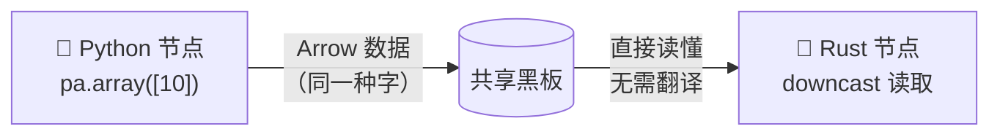
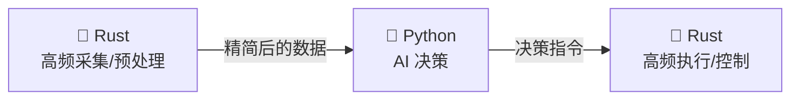

# 9.3 Python 与 Rust 混合

前两节，你分别认识了 Python 节点和 Rust 节点。但 DORA 真正的魔力在于——**它们能在同一条数据流里无缝协作！**

Python 节点写的数据，Rust 节点直接读；Rust 节点算完的结果，Python 节点接着用。中间**不需要任何翻译、转换、胶水代码**。这一节，我们就来见证这个魔法。

:::info 小莫说
我的"文科生"零件（Python）和"理科生"零件（Rust）可以在同一块黑板上无缝配合！Python 负责思考和调 AI，Rust 负责疯狂算数，各展所长——我就是这么又聪明又强壮的！
:::

## 学习目标

学完本节，你将能够：

- 理解为什么 Python 和 Rust 节点能**直接互通**（答案还是 Arrow）；
- 写出一条**同时包含 Python 和 Rust 节点**的 `dataflow.yml`；
- 认识混编 YAML 里的 `input_types` / `output_types`；
- 亲手跑通一条"Python 发、Rust 收"的跨语言数据流。

## 前置要求

- 完成 [9.2 写一个 Rust 节点](./write-rust-node)；
- 会写 Python 节点和 `dataflow.yml`（第四章）。

## 为什么能直接互通？答案是 Arrow

这是本节最核心的认知，其实你早就学过了。

回到第五章的比喻：**Arrow 是黑板的"统一书写规范"。** 不管是 Python 同学还是 Rust 同学，上黑板都用这一套标准的"字"。所以：

- Python 用 `pa.array([...])` 把数据写成 Arrow；
- Rust 用 `.into_arrow()` 把数据写成 Arrow；
- **写出来的是同一种"字"**，谁都能直接读懂。



**这就是 DORA 跨语言协作的全部秘密**——没有复杂的接口定义、没有序列化协议、没有胶水层。大家写同一块黑板、用同一套规范，自然就通了。

:::tip 对比一下传统做法
在很多框架里，让 Python 和 Rust 交换数据要写一堆"绑定代码"（把一种语言的数据转成另一种能懂的格式）。DORA 靠 Arrow 这个共同标准，**彻底省掉了这一步**——这是它"多语言零翻译"卖点的真正含义。
:::

## 动手：Python 发送 → Rust 接收

我们来跑通一条最简单的跨语言数据流：一个 Python 节点每隔一会儿发一个数字，一个 Rust 节点收到后打印出来验证。目录 `course/ch09-mix`。

### Python 发送方 `python_sender.py`

这就是你早就会写的普通 Python 节点，没有任何"为了跨语言"的特殊处理：

```python
# python_sender.py —— 每隔一会发一个整数
import time
import pyarrow as pa
from dora import Node


def main():
    node = Node()

    for i in range(10):
        value = i * 10
        # 关键：明确指定类型为 int64，让 Rust 端知道该怎么读
        node.send_output("values", pa.array([value], type=pa.int64()))
        print(f"python-sender: 发送 {value}")
        time.sleep(0.5)

    print("python-sender: 发送完毕")


if __name__ == "__main__":
    main()
```

唯一值得注意的一点：`pa.array([value], type=pa.int64())` **明确指定了数据类型是 `int64`**（64 位整数）。跨语言时，明确类型很重要——这样 Rust 端才能准确地按 `Int64` 去读。

:::warning 跨语言时务必明确数据类型
纯 Python 节点之间，类型可以"随意"一点。但和 Rust 混编时，**两边必须对数据类型达成一致**：Python 发 `int64`，Rust 就得按 `Int64Array` 读。类型对不上，Rust 端会报错。养成"跨语言就写明 `type=`"的习惯。
:::

### Rust 接收方 `src/main.rs`

```rust
// main.rs —— 接收 Python 发来的整数并打印
use dora_node_api::{DoraNode, Event, arrow};
use eyre::{Result, ContextCompat};

fn main() -> Result<()> {
    let (_node, mut events) = DoraNode::init_from_env()?;

    while let Some(event) = events.recv() {
        match event {
            Event::Input { id, data, .. } => {
                if id.as_str() == "values" {
                    // 把收到的 Arrow 数据，读成 Int64 数组
                    let arr = data
                        .as_any()
                        .downcast_ref::<arrow::array::Int64Array>()
                        .context("期望收到 Int64 数组")?;

                    // 取出第一个值并打印
                    let value = arr.value(0);
                    println!("rust-receiver: 收到 {value}");
                }
            }
            Event::Stop(_) => break,
            _ => {}
        }
    }

    Ok(())
}
```

只有"读数据"这一段是新的，讲解一下：

```rust
let arr = data
    .as_any()
    .downcast_ref::<arrow::array::Int64Array>()
    .context("期望收到 Int64 数组")?;
let value = arr.value(0);
```

- 收到的 `data` 是通用的 Arrow 数据，我们要"认领"它的具体类型；
- `.downcast_ref::<Int64Array>()` 意思是"把它当作 Int64 数组来看"——对应 Python 里的 `.to_pylist()` 或 `[0].as_py()`，都是"把 Arrow 数据还原成能用的形式"；
- `arr.value(0)` 取第 0 个值，对应 Python 的 `event["value"][0].as_py()`。

:::info 小莫说
看，Rust 读数据的 `downcast` + `value(0)`，其实就是 Python 的 `[0].as_py()` 换了身衣服！核心动作一模一样：把黑板上的字读回来变成能算的数。
:::

### 混编的 `dataflow.yml`

这是本节的重点——**一条数据流里，同时有 Python 节点和 Rust 节点**：

```yaml
nodes:
  # Python 节点：直接写 .py 文件
  - id: python-sender
    path: python_sender.py
    outputs:
      - values
    output_types:
      values: std/core/v1/Int64        # 声明输出类型

  # Rust 节点：要先编译，再指向编译产物
  - id: rust-receiver
    build: cargo build                  # 编译 Rust
    path: target/debug/my-rust-node     # 指向编译产物
    inputs:
      values: python-sender/values      # 订阅 Python 的输出
    input_types:
      values: std/core/v1/Int64        # 声明输入类型
```

对比一下两个节点的写法差异：

| | Python 节点 | Rust 节点 |
|---|-------------|-----------|
| `path` | 直接指向 `.py` 文件 | 指向编译产物 `target/debug/...` |
| `build` | 通常不需要 | 需要 `cargo build` 先编译 |
| 连线 `inputs`/`outputs` | **完全一样** | **完全一样** |

**连线部分毫无区别**——这正是关键：对 DORA 来说，节点是什么语言写的**根本不重要**，它只管"谁的输出接谁的输入"。

### 关于 `input_types` / `output_types`

你可能注意到混编 YAML 里多了 `input_types` / `output_types`：

```yaml
    output_types:
      values: std/core/v1/Int64
```

它显式声明了这个数据的类型（这里是 Int64 整数）。作用是：

- 让 DORA 和两端节点对"数据长什么样"有明确共识；
- 跨语言时尤其有用——避免 Python 发的和 Rust 收的对不上。

零基础阶段，你只要知道"**跨语言时加上类型声明更稳妥**"即可，常见类型有 `Int64`、`Float32`、`String` 等。

### 跑起来

```bash
dora build dataflow.yml      # 会编译 Rust 节点（首次稍慢）
dora run dataflow.yml
```

你会看到两种语言的节点在**同一条流里对话**：

```
python-sender: 发送 0
rust-receiver: 收到 0
python-sender: 发送 10
rust-receiver: 收到 10
python-sender: 发送 20
rust-receiver: 收到 20
...
```

**Python 发的数字，Rust 一个不差地收到了——跨语言协作成功！** 🎉 而这中间，你没写任何"翻译代码"。

:::info 小莫说
太神奇了！Python 零件和 Rust 零件像老搭档一样配合，我完全看不出它们是"两种语言"。这就是同一块黑板的力量——大家说的是同一种"话"（Arrow）！
:::

## 实战中的典型分工

明白了怎么混编，那**实际项目里该怎么分工**？一个常见又实用的模式：



- **前端**用 Rust：高频传感器采集、密集预处理（Rust 快）；
- **中间**用 Python：调 AI 模型做决策（Python 生态好）；
- **后端**用 Rust：高频执行控制指令（Rust 稳且快）。

这样**各取所长**：需要速度的地方用 Rust，需要智能和灵活的地方用 Python。这正是小项目⑥要实践的思路。

## 动手练习

:::tip 练习：反过来——Rust 发送，Python 接收
把上面的例子调转方向：写一个 Rust 节点每隔一会发一个数字，一个 Python 节点收到后打印。想想 `dataflow.yml` 该怎么改。
:::

:::details 参考答案
Rust 节点用 9.2 的"发随机数"模板（把随机数改成递增数即可）。Python 接收方就是普通节点：

```python
from dora import Node

def main():
    node = Node()
    for event in node:
        if event["type"] == "INPUT" and event["id"] == "values":
            value = event["value"][0].as_py()      # 和读 Python 数据一模一样
            print(f"python-receiver: 收到 {value}")
        elif event["type"] == "STOP":
            break

if __name__ == "__main__":
    main()
```

`dataflow.yml` 把发送方换成 Rust（带 `build`）、接收方换成 Python（`.py`）即可。**注意**：Python 读 Rust 发来的数据，用的还是 `[0].as_py()`——因为大家都是 Arrow，Python 完全不用管这数据是 Rust 写的。
:::

## 常见报错 FAQ

:::warning Rust 端 `downcast_ref` 返回 None / 报"期望 Int64 数组"
类型对不上。检查：Python 端是否 `pa.array([...], type=pa.int64())` 明确指定了 int64；Rust 端 `downcast_ref::<Int64Array>()` 是否用了对应的类型。两边类型必须一致。
:::

:::warning 数据能连上，但值是乱的
通常还是类型不匹配（比如一端当整数、一端当浮点数读）。跨语言时坚持在两端都明确写清类型（Python 的 `type=`、YAML 的 `input_types`/`output_types`）。
:::

:::warning Rust 节点编译失败，Python 节点却正常
Python 不用编译，所以它"没问题"只是因为没走编译。Rust 的编译错误要单独看 `dora build` 的输出。先确保 Rust 节点能单独 `cargo build` 通过。
:::

## 小结

- Python 和 Rust 节点能**直接互通**，靠的就是 **Arrow 这个共同的"黑板书写规范"**——无需任何翻译或胶水代码。
- 混编 `dataflow.yml` 里，Python 节点指向 `.py`、Rust 节点用 `build` + 编译产物路径，但**连线写法完全一样**。
- 跨语言时**务必明确数据类型**（Python 的 `type=`、YAML 的 `input_types`/`output_types`），避免两端对不上。
- 实战常见分工：**高频/密集用 Rust，AI/决策用 Python**，各取所长。

下一节是本章实战——**小项目⑥：高频处理节点**，我们用 Rust 写一个高频计算节点，配 Python 可视化，真正体验"Rust 加速"的威力。
