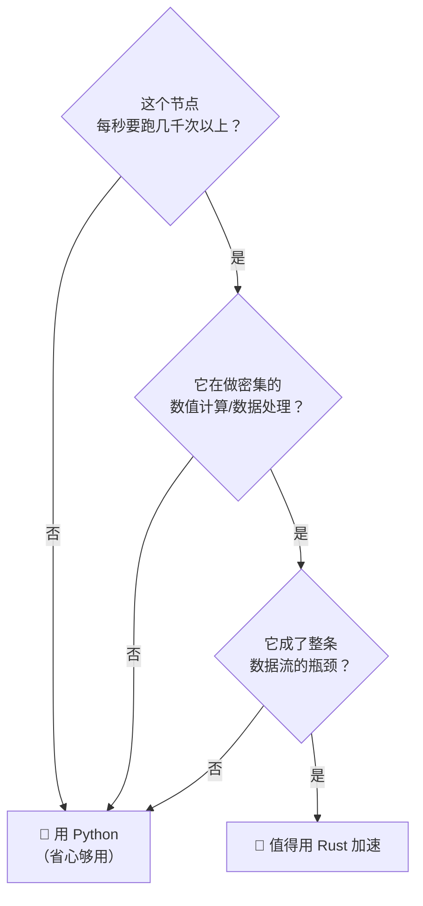

# 9.1 何时用 Rust

前面八章，小莫身上所有零件都是 Python 写的。Python 好写、好懂、AI 生态最全——但它有个小短板：**算得不够快**。当某些零件需要"每秒处理成千上万次"时，Python 就有点吃力了。

这一章，我们给小莫请来一位"心算高手"帮忙：**Rust**。它能让关键零件跑得飞快，让小莫真正**💪 变强壮**。

:::info 小莫说
我的大脑（Python）很擅长思考和讲故事，但遇到"疯狂快速的计算"就有点喘。这时候得叫上 Rust 这位"心算冠军"搭把手——各显所长，我才能又聪明又强壮！
:::

## 学习目标

学完本节，你将能够：

- 说清 Python 和 Rust 各自的所长（用"两种同学"的比喻）；
- 判断**什么样的节点值得用 Rust** 来写；
- 理解本课对 Rust 的定位——**"最小够用"**，不系统学语法；
- 打消对 Rust 的畏惧：你只需要"看得懂、能照着改"。

## 前置要求

- 完成第四到六章，会用 Python 写节点、连数据流、用四种通信模式；
- 不需要任何 Rust 基础——这一章会从零带你认识它。

## 回到黑板教室：两种同学

第一章我们说过，节点就是黑板教室里的**同学**。其实同学分两种"性格"：

| | 🐍 Python 同学 | 🦀 Rust 同学 |
|---|---------------|-------------|
| 性格 | 灵活、健谈、学得快 | 心算极快、从不算错、话不多 |
| 擅长 | 理解画面、调用 AI、快速试验 | 高频读写、每秒上千次的密集计算 |
| 上手 | 极易，随写随跑 | 较难，要先"编译"才能跑 |
| 短板 | 密集计算偏慢 | 写起来更啰嗦、门槛高 |

关键在于：**它们用的是同一套黑板书写规范（Arrow）**。所以 Python 同学写在黑板上的数据，Rust 同学**抬眼就能读懂，反之亦然**——这正是第五章讲的 Arrow 统一格式带来的好处。

:::info 小莫说
就像班里既有能说会道的文科生，也有算得飞快的理科生。他们用同一种"文字"（Arrow）交流，配合起来天下无敌！
:::

## Python 为什么会"慢"？

这不是 Python 的错，而是它的设计取舍。Python 为了**好写、好读、灵活**，牺牲了一部分运行速度：

- 它运行时要做很多"幕后照顾"（比如自动管理内存、随时检查类型），这让写代码很省心，但每一步都有额外开销；
- 对"偶尔算一次"的任务，这点开销**完全无所谓**（你根本感觉不到）；
- 但对"每秒要算几千上万次"的任务，这点开销**累积起来就明显了**。

Rust 则相反：它把这些"照顾"放在**编译时**一次性检查好，运行时几乎是"裸奔"式的全速前进——所以它快，而且不容易出运行时错误。

:::tip 一个直觉类比
Python 像**开着导航、系好安全带、按规矩慢行**——安全省心，适合日常。Rust 像**赛道上的专业赛车**——赛前全面检查（编译），上场就全力飙速。日常通勤用不着赛车，但要破纪录就得靠它。
:::

## 什么样的节点值得用 Rust？

**绝大多数节点用 Python 就够了。** 只有少数"性能热点"值得换成 Rust。判断标准很简单，问自己三个问题：

**适合 Rust 的典型场景：**

| 场景 | 为什么 |
|------|--------|
| 高频传感器数据预处理 | 每秒上千帧，Python 跟不上 |
| 实时信号滤波 / 数学运算 | 密集浮点计算，Rust 快几十倍 |
| 底层硬件驱动 | 需要极致稳定和低延迟 |
| 整条流水线的性能瓶颈节点 | 换掉它能让全流程提速 |

**不适合、也不必用 Rust 的场景：**

- 调用 AI 模型（YOLO、大模型）——瓶颈在模型本身，不在语言；
- 偶尔触发的控制逻辑、决策逻辑——Python 足够快；
- 快速试验、原型验证——Python 改起来更快。

:::warning 不要过早优化
新手常犯的错：一上来就想"全用 Rust 岂不是更快？" **千万别。** Rust 写起来慢、门槛高，把好写的 Python 逻辑全改成 Rust 是巨大的浪费。正确做法是：**先全用 Python 跑通，发现哪个节点真的慢了、成了瓶颈，再针对性地换成 Rust。** 这叫"按需优化"。
:::

## 本课对 Rust 的定位：最小够用

看到这里你可能有点慌："Rust 那么难，我零基础能行吗？"

**放心，本课不教你系统学 Rust。** 我们的定位非常明确——**"最小够用"**：

- ✅ 让你**看得懂**一个 Rust 节点的大致结构；
- ✅ 让你能**照着模板改一个节点**（比如把"随机数"改成"读输入 ×2"）；
- ✅ 让你**亲身体验** Rust 节点和 Python 节点在同一数据流里协作；
- ❌ **不**要求你掌握 Rust 的所有权、生命周期、泛型等硬核概念。

为什么能这样"偷懒"？因为**DORA 的节点结构是统一的**——不管什么语言，都是"连线 → 事件循环 → 收发"那套三段式（还记得第四章吗）。你已经在 Python 里烂熟于心了，换到 Rust 只是"换个说法写同一件事"。

:::info 小莫说
我也不是要变成 Rust 大师！我只要会"照葫芦画瓢"改一个高频节点，就能给自己提速啦。真正想深入 Rust，等修完这门课再说～
:::

:::details 进阶延伸：想系统学 Rust 怎么办？（可跳过）
本课只覆盖"够用"的部分。如果你后续想深入 Rust（比如写复杂的高性能节点、做硬件驱动、自定义算子），可以：

- 读官方的《Rust 程序设计语言》（The Book，有中文版）；
- 关注未来的《DORA 进阶》中级课程，那里会系统讲 Rust 节点开发、C/C++ 混编、性能调优等。

但这些都不是现在的任务。现在，跟着走完这一章的"最小够用"就好。
:::

## 一个真实的对比数字

还记得第一章说的吗——DORA 在 Python 场景下能比 ROS2 快 10-17 倍。而在**语言层面**，对于密集计算，Rust 通常比 Python 快**几十倍甚至上百倍**。

但请记住：**这个差距只在"密集计算"时才显现**。对于"调用一次 AI 模型""每秒决策几次"这类任务，Python 和 Rust 的体感速度**没有区别**——因为瓶颈根本不在语言。

所以，Rust 是一把"专用的快刀"，不是"处处都要用的万能钥匙"。

## 动手练习（思考题）

小莫有下面几个节点，你觉得哪些**值得**考虑用 Rust 写，哪些用 Python 就好？说说理由。

1. 摄像头节点：每秒读取 30 帧图像；
2. YOLO 物体检测节点：调用 AI 模型识别画面里的物体；
3. 一个滤波节点：对每秒上万个传感器读数做实时平滑计算；
4. 决策节点：每秒判断一两次"该往左还是往右"。

:::details 参考答案
- **1 摄像头**：看情况。单纯读图 Python 通常够用；但如果每帧还要做重的预处理、成了瓶颈，可考虑 Rust。
- **2 YOLO 检测**：用 **Python**。瓶颈在 AI 模型本身，换语言没用，而且 Python 的 AI 生态最全。
- **3 滤波节点**：最**值得用 Rust**！每秒上万次密集数值计算，正是 Rust 的主场。
- **4 决策节点**：用 **Python**。每秒才一两次，语言速度完全无所谓，Python 写起来还更灵活。

规律：**"高频 + 密集计算 + 是瓶颈" 才考虑 Rust，其余一律 Python。**
:::

## 小结

- Python 和 Rust 是黑板教室里的**两种同学**：Python 灵活健谈、Rust 心算极快，**用同一套 Arrow 规范交流**。
- Python 为易用牺牲了一点速度，对偶发任务无所谓，对**高频密集计算**才明显。
- **只有"高频 + 密集计算 + 成了瓶颈"的节点才值得用 Rust**，绝大多数节点用 Python 就好，切忌过早优化。
- 本课对 Rust **只求"最小够用"**：看得懂、能照着改、能体验混编，不系统教语法。

下一节，我们就动手**写一个 Rust 节点**——你会发现它和 Python 节点长得出奇地像。
