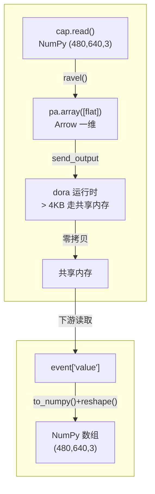

# 7.2 图像在数据流中传递

上一节我们实现了摄像头节点发送图像，接收节点还原显示。但背后有不少细节值得深入：**图像数据到底是怎么在节点之间传递的？大图的零拷贝怎么工作？尺寸信息怎么同步？**

本节把这些问题一个个讲透。

## 学习目标

学完本节，你将能够：

- 说清图像从发送到接收的完整数据流
- 解释为什么大图像要走零拷贝、怎么看阈值
- 在元数据中传递图像尺寸，避免接收端写死尺寸
- 理解多个节点订阅同一路图像时的行为

## 前置要求

- 完成 [7.1 摄像头节点](./camera-node)，能发送和接收图像
- 完成 [5.1 为什么是 Arrow](../data/why-arrow)，理解零拷贝概念

## 图像数据流的完整路径

一张图像从摄像头节点到下游节点，经历以下路径：



核心是三步：

1. **发送方**：`frame.ravel()` 将三维压为一维，再用 `pa.array([frame.ravel()])` 包裹成 Arrow 数组
2. **DORA 运行时**：判断数据大小，超过 4KB 自动走共享内存（零拷贝）
3. **接收方**：从事件中取出 Arrow 数组，用 `.to_numpy()` 转回 NumPy，再用 `.reshape()` 还原形状

## 数据超过 4KB 走零拷贝

第五章提到过，DORA 内部有一个阈值（约 4KB），数据超过这个阈值时自动走共享内存。

一张 640×480 的彩色图像有多大：

```
640 × 480 × 3 = 921,600 字节 ≈ 900KB
```

**远超过 4KB**，所以摄像头发的每一帧图像都走共享内存——**零拷贝**。

这意味着：发送方把图像数据写到共享内存后，接收方**直接读取同一块内存**，不需要复制数据。对于 30fps 的视频流，这种节省非常可观。

:::info 小莫说
摄像头每秒发 30 帧，每帧近 1MB。如果没有零拷贝，每秒要把 30MB 的数据来回复制，CPU 和内存带宽很快被吃光。走共享内存后，这 30MB 只是在"黑板"上写一次，读的人直接看——又快又省。
:::

## 关键难点：图像尺寸怎么同步？

接收方还原图像时需要知道原始尺寸 `(高度, 宽度, 通道数)`。最简单的做法是**硬编码**：

```python
frame = flat.view(np.uint8).reshape((480, 640, 3))
```

但这样做不够灵活——如果摄像头分辨率变了，接收方也要改代码。

更好的做法是**把尺寸信息放在消息中一起传**。有两种方式：

### 方式一：在数据中同时发送尺寸

```python
# 发送方
height, width = frame.shape[:2]
node.send_output(
    "image",
    pa.array([frame.ravel(), pa.array([height, width], type=pa.int32())]),
)
```

```python
# 接收方
data = event["value"]
flat = data[0].values.to_numpy(zero_copy_only=False)
h = data[1][0].as_py()    # 读出高度
w = data[1][1].as_py()    # 读出宽度
frame = flat.view(np.uint8).reshape((h, w, 3))
```

### 方式二：使用元数据（推荐）

```python
# 发送方
height, width = frame.shape[:2]
node.send_output(
    "image",
    pa.array([frame.ravel()]),
    metadata={"height": str(height), "width": str(width)},
)
```

```python
# 接收方
meta = event["metadata"]
h = int(meta["height"])
w = int(meta["width"])
flat = event["value"][0].values.to_numpy(zero_copy_only=False)
frame = flat.view(np.uint8).reshape((h, w, 3))
```

:::tip 推荐用元数据传尺寸
元数据不占用数据通道，且接收方能直接从 `event["metadata"]` 读取，不影响数据本体。这是 DORA 的推荐做法。注意元数据的值必须是字符串。
:::

## 多路订阅：一个摄像头供多个节点

Topic 模式支持"一发多收"。同一个摄像头的图像，可以同时被多个下游节点订阅：

```yaml
nodes:
  - id: camera
    path: camera_node.py
    inputs:
      tick: dora/timer/millis/33
    outputs:
      - image

  - id: yolo_detection
    path: detection.py
    inputs:
      image: camera/image

  - id: recorder
    path: recorder.py
    inputs:
      image: camera/image
```

`detection` 和 `recorder` 同时订阅 `camera/image`。DORA 会在共享内存上做引用计数，只有所有订阅者都处理完一帧后，内存才会被回收。

:::warning 注意帧率叠加
如果两个下游节点处理一帧各需要 20ms，串行的话总延迟约 40ms。DORA 的节点是独立进程，可以并行处理，但受 CPU 核心数限制。如果发现掉帧，适当降低摄像头帧率。
:::

## 动手练习

:::tip 练习：用元数据传尺寸
改造 7.1 的 `camera_node.py`，在发送图像时在元数据中包含高度和宽度。并改造 `image_viewer.py`，从元数据中读取尺寸来还原图像，而不是硬编码。
:::

:::details 参考答案
发送方关键改动：
```python
h, w = frame.shape[:2]
node.send_output(
    "image",
    pa.array([frame.ravel()]),
    metadata={"height": str(h), "width": str(w)},
)
```

接收方关键改动：
```python
meta = event["metadata"]
h = int(meta["height"])
w = int(meta["width"])
flat = event["value"][0].values.to_numpy(zero_copy_only=False)
frame = flat.view(np.uint8).reshape((h, w, 3))
```
:::

## 小结

- 图像在 DORA 中走**压平 → 发送 → 还原**三步，核心是 `ravel()` 和 `reshape()`。
- 单帧 900KB 远超 4KB 阈值，自动走共享内存**零拷贝**。
- **图像尺寸**推荐通过元数据 `metadata` 传递，接收方从 `event["metadata"]` 读取。
- 一个摄像头输出可被多个节点同时订阅，共享内存引用计数管理生命周期。

下一节，我们给图像加上"眼睛"——用 YOLO 物体检测识别画面中的物体。
