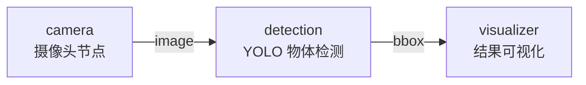

# 🎯 小项目④：实时物体检测

本章的知识，到这里派上用场。我们把摄像头、YOLO 检测、结果可视化串成一条完整的流水线——小莫第一次真正"看见"并"认出"了世界。

:::info 小莫说
摄像头是我的眼睛，YOLO 是我的大脑视觉皮层。从本节开始，我不只是拍画面，还能"看懂"画面里有什么——这感觉太棒了！👁
:::

## 项目目标

搭一条三节点的实时视觉流水线：



- **camera**：读取摄像头画面，发送图像数据
- **detection（yolo_node.py）**：用 YOLOv8 做物体检测，输出边界框
- **visualizer**：在图像上绘制检测框和标签，实时显示

## 你将综合运用

- 7.1：OpenCV 摄像头节点
- 7.2：图像在数据流中的传递（ravel/reshape、零拷贝）
- 7.3：Node Hub 接入 YOLO
- 第五章：Arrow 数据格式（`.to_pylist()`）
- 第四章：多输入节点（订阅 `image` 和 `bbox`）

## 前置要求

- 完成 7.1 - 7.3
- 摄像头可用
- 安装了依赖：`opencv-python`、`ultralytics`

## 准备目录

import { Tab, Tabs } from '@rspress/core/theme';

<Tabs groupId="os">
<Tab label="macOS / Linux">

```bash
mkdir -p course/ch07-vision
cd course/ch07-vision
```

</Tab>
<Tab label="Windows">

```powershell
mkdir course\ch07-vision
cd course\ch07-vision
```

</Tab>
</Tabs>

## 第一步：摄像头节点

新建 `camera.py`（如果已有可直接复制过来）：

```python
# camera.py —— 读取摄像头画面，发送图像和尺寸元数据
import cv2
import numpy as np
import pyarrow as pa
from dora import Node


def main():
    cap = cv2.VideoCapture(0)
    if not cap.isOpened():
        print("错误：无法打开摄像头", flush=True)
        return

    cap.set(cv2.CAP_PROP_FRAME_WIDTH, 640)
    cap.set(cv2.CAP_PROP_FRAME_HEIGHT, 480)

    node = Node()

    for event in node:
        if event["type"] == "INPUT":
            ret, frame = cap.read()
            if not ret:
                continue

            h, w = frame.shape[:2]
            node.send_output(
                "image",
                pa.array([frame.ravel()]),
                metadata={"height": str(h), "width": str(w)},
            )

        elif event["type"] == "STOP":
            break

    cap.release()


if __name__ == "__main__":
    main()
```

与 7.1 相比，这里的改进是**通过元数据传递了图像尺寸**，接收方不需要硬编码。

## 第二步：结果可视化节点

这个节点是本节的核心——它同时接收两路数据：`image`（原始画面）和 `bbox`（检测结果），把边界框画到画面上并实时显示。

新建 `visualizer.py`：

```python
# visualizer.py —— 在图像上绘制检测框并显示
import numpy as np
import cv2
from dora import Node


def main():
    node = Node()

    current_frame = None     # 缓存最新一帧图像
    current_bbox = []        # 缓存最新检测结果

    for event in node:
        if event["type"] == "INPUT":

            if event["id"] == "image":
                # 还原图像
                meta = event["metadata"]
                h = int(meta["height"])
                w = int(meta["width"])
                flat = event["value"][0].values.to_numpy(zero_copy_only=False)
                current_frame = flat.view(np.uint8).reshape((h, w, 3))

            elif event["id"] == "bbox":
                # 取检测结果
                current_bbox = event["value"].to_pylist()

            # 只要有图像，就绘制并显示
            if current_frame is not None:
                display = current_frame.copy()

                for obj in current_bbox:
                    x, y, w, h = int(obj["x"]), int(obj["y"]), int(obj["w"]), int(obj["h"])
                    label = obj["label"]
                    conf = obj["confidence"]

                    # 画边界框（绿色矩形）
                    cv2.rectangle(display, (x, y), (x + w, y + h), (0, 255, 0), 2)

                    # 画标签 + 置信度
                    text = f"{label} {conf:.2f}"
                    cv2.putText(
                        display, text, (x, y - 10),
                        cv2.FONT_HERSHEY_SIMPLEX, 0.5, (0, 255, 0), 2,
                    )

                cv2.imshow("DORA 物体检测", display)
                cv2.waitKey(1)

        elif event["type"] == "STOP":
            break

    cv2.destroyAllWindows()


if __name__ == "__main__":
    main()
```

### 代码详解

```python
current_frame = None
current_bbox = []
```

因为 `image` 和 `bbox` 是**异步到达**的（来自两个不同的上游节点），我们用"最新值缓存"模式（第五章学的）分别记住最新的画面和最新的检测结果。

```python
if event["id"] == "image":
    # ...还原图像，更新 current_frame
elif event["id"] == "bbox":
    # ...更新 current_bbox
```

两路数据各自更新自己的缓存。

```python
cv2.rectangle(display, (x, y), (x + w, y + h), (0, 255, 0), 2)
```

OpenCV 的矩形绘制函数，参数依次为：图像、左上角、右下角、颜色（BGR）、线宽。

```python
cv2.putText(display, text, (x, y - 10), ...)
```

在框上方画标签文字。

## 第三步：连成数据流

`dataflow.yml`：

```yaml
nodes:
  - id: camera
    path: camera.py
    inputs:
      tick: dora/timer/millis/33
    outputs:
      - image

  - id: detection
    path: yolo_node.py
    inputs:
      image: camera/image
    outputs:
      - bbox

  - id: visualizer
    path: visualizer.py
    inputs:
      image: camera/image
      bbox: detection/bbox
```

注意 `visualizer` 有两路输入：`image: camera/image` 和 `bbox: detection/bbox`。

## 第四步：跑起来

```bash
dora run dataflow.yml
dora run dataflow.yml
```

三个窗口将出现：

1. **摄像头画面窗口**（标题 "DORA 物体检测"）：实时显示摄像头画面，检测到的物体被绿色框框出，框上有标签和置信度
2. 终端持续输出日志信息

**对着摄像头做动作**——挥手、拿手机、展示书本——看实时检测效果！

按 `Ctrl+C` 停止。

:::info 小莫说
看到画面上的绿色框了吗？那些就是"我看到的东西"！框上面写着名字和置信度——比如 `person 0.95` 代表"我 95% 确定这是个人"。这是我第一次真正"看懂"世界，太激动了！👁✨
:::

## 体验与调整

### 观察检测效果

YOLOv8n 能检测 80 种常见物体。尝试：

- 在摄像头前放一个**手机**
- 展示一本书或一个瓶子
- 让其他人走进画面
- 在画面中挥手

### 调整参数

| 参数 | 位置 | 效果 |
|------|------|------|
| 摄像头帧率 | `dora/timer/millis/33` → 改大或改小 | 改大（如 `66`）降低帧率减轻 CPU 负载 |
| 检测置信度阈值 | YOLO 默认 0.25 | 可通过环境变量调整 |
| 摄像头分辨率 | `cap.set(...)` 中的数值 | 降低到 320×240 可提高帧率 |

## 动手挑战

:::tip 挑战一：给检测框加颜色编码
改造 `visualizer.py`，让不同类别的物体显示不同颜色（如人=绿色、车=蓝色、手机=红色）。

提示：准备一个颜色字典，如 `{"person": (0,255,0), "car": (255,0,0)}`。
:::

:::details 参考答案思路
```python
COLORS = {
    "person": (0, 255, 0),     # 绿
    "car": (255, 0, 0),        # 蓝
    "cell phone": (0, 0, 255), # 红
    "book": (255, 255, 0),     # 青
}
color = COLORS.get(obj["label"], (128, 128, 128))  # 未定义类别用灰色
cv2.rectangle(display, (x, y), (x + w, y + h), color, 2)
```
:::

:::tip 挑战二：截屏保存检测到的物体
在检测到 `person` 置信度超过 0.9 时，将当前帧保存为图片文件。提示：`cv2.imwrite()`。
:::

## 常见问题 FAQ

:::warning `cv2.imshow` 窗口无响应
OpenCV 的 GUI 需要在主线程运行。如果窗口卡死，试试在循环末尾加 `cv2.waitKey(1)`（前面已经加了）。在某些 macOS 和 Linux 环境下，可能需要特殊处理。
:::

:::warning 检测很慢 / 画面卡顿
YOLOv8n 在 CPU 上每帧约 50-200ms。你可以：
1. 降低摄像头帧率到 `millis/100`（10fps）
2. 降低摄像头分辨率到 320×240
3. 使用更小的模型（`yolov8nano`）

:::

:::warning `dora-yolo` 安装失败
确认已安装 ultralytics，执行 `uv pip install ultralytics`。
:::

## 小结

你完成了**小项目④：实时物体检测**！在这个项目里，你：

- 用 OpenCV 摄像头节点采集实时画面
- 通过自己写的 yolo_node.py 做物体检测
- 用可视化节点把检测结果绘制到画面上
- 实现了第一条多节点、多输入的完整视觉数据流

## 本章回顾：👁 视觉

第七章到此圆满。回顾这一章的收获：

- **7.1**：用一个简单的摄像头节点入门，`ravel()` 压平 + `send_output` 发送图像
- **7.2**：图像数据流的零拷贝原理、元数据传尺寸、多路订阅
- **7.3**：YOLO 检测的概念、`bbox` 输出的结构化数据格式
- **小项目④**：完整的三节点视觉流水线，让 DORA 实时识别摄像头画面中的物体

继续前进，下一章让小莫长"耳朵和嘴巴"——语音识别与合成！
