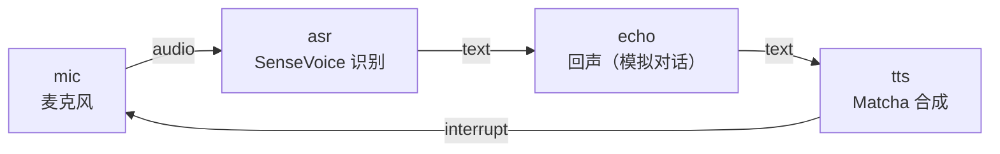

# 🎯 小项目⑤：和小莫语音互动

本章的知识全部串起来，完成一条完整的语音交互流水线：**你说，小莫听 → 听懂 → 回答 → 说出来**。

:::info 小莫说
我终于能听见声音并开口说话了！虽然现在的我还只能做简单回声，但听和说的基础已经打好——未来加上 AI 大脑，我就能和你真正聊天啦！👂🗣
:::

## 项目目标



## 你将综合运用

- 8.1：麦克风音频采集
- 8.2：sherpa-onnx SenseVoice ASR
- 8.3：sherpa-onnx Matcha TTS
- 8.4：Streaming 打断
- 第四章：多输入、dataflow.yml

## 前置要求

- 完成 8.1 - 8.4
- 已下载 SenseVoice 和 Matcha 模型
- 安装了 `sherpa-onnx`、`sounddevice`

## 第一步：回声节点

在 ASR 和 TTS 之间加一个简单的回声节点，把 ASR 识别的文字原样返回给 TTS。实际项目中这里可以接入 AI 对话模型。

`echo_brain.py`：

```python
import pyarrow as pa
from dora import Node


def main():
    node = Node()

    for event in node:
        if event["type"] == "INPUT":
            if event["id"] == "question":
                text = event["value"][0].as_py()
                if not text:
                    continue
                # 简单回声：将来可以换成 AI 回答
                answer = f"你说的是「{text}」"
                node.send_output("answer", pa.array([answer]))

        elif event["type"] == "STOP":
            break


if __name__ == "__main__":
    main()
```

## 第二步：完整数据流

`dataflow.yml`：

```yaml
nodes:
  - id: mic
    path: mic_node.py
    inputs:
      tick: dora/timer/millis/100
    outputs:
      - audio

  - id: asr
    path: asr_node.py
    inputs:
      audio: mic/audio
    outputs:
      - text
      - interrupt

  - id: brain
    path: echo_brain.py
    inputs:
      question: asr/text
    outputs:
      - answer

  - id: tts
    path: tts_node.py
    inputs:
      text: brain/answer
      interrupt: asr/interrupt    # 打断信号
```

## 第三步：体验

```bash
dora run dataflow.yml
```

对麦克风说话，稍等片刻（ASR 累积 1 秒音频后识别），小莫会用语音回复你说的话。

## 动手挑战

:::tip 挑战：让"大脑"支持多条回复
改造 `echo_brain.py`，支持多条预设回复。当用户说"你好"时回复"你好，我是小莫！"；说"再见"时回复"下次再聊！"；其他内容保持原样回声。
:::

## 小结

你完成了语音交互流水线的最简闭环。接下来可以接入 AI 模型（如调用大模型 API）替代回声节点，完成真正的智能对话系统。
