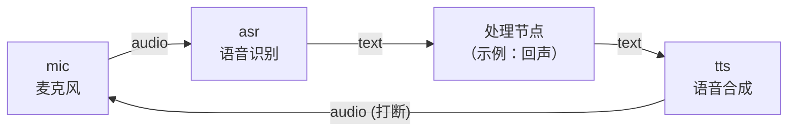

# 8.4 可打断对话

前几节实现了 ASR（听）和 TTS（说）。现在把它们组合起来，并加入**打断**能力——小莫正在说话时，你一开口，它应立刻闭嘴听你的。

这是第六章学过的 Streaming 模式中 `flush` 的应用。

## 学习目标

学完本节，你将能够：

- 用 `flush` 元数据实现语音打断
- 设计 ASR → 处理 → TTS 的流水线
- 理解为什么打断在语音交互中至关重要

## 流水线架构



当 TTS 正在播放时，如果麦克风采集到新的语音，asr 节点发一条带 `flush=true` 的消息让 TTS 丢弃未播放的音频。

## 打断机制

第六章讲过，Streaming 模式通过 `flush` 元数据实现打断。在语音场景下的具体做法：

```python
# 当检测到新的语音输入时，发送 flush 信号
node.send_output(
    "interrupt",
    pa.array([""]),
    metadata={"flush": "true"},
)
```

TTS 节点收到 `flush` 后，应停止当前播放、清空待合成队列。

## 可打断 TTS 节点

```python
# tts_interruptible.py —— 支持打断的 TTS 节点
import sherpa_onnx
import sounddevice as sd
import numpy as np
import threading
from dora import Node


def create_tts():
    config = sherpa_onnx.OfflineTtsConfig(
        model=sherpa_onnx.OfflineTtsModelConfig(
            matcha=sherpa_onnx.OfflineTtsMatchaModelConfig(
                acoustic_model="./models/matcha-tts/matcha-icefall-zh-baker/model-steps-3.onnx",
                vocoder="./models/matcha-tts/vocos-22khz-univ.onnx",
                lexicon="./models/matcha-tts/matcha-icefall-zh-baker/lexicon.txt",
                tokens="./models/matcha-tts/matcha-icefall-zh-baker/tokens.txt",
            ),
            num_threads=2,
        ),
    )
    return sherpa_onnx.OfflineTts(config)


def main():
    tts = create_tts()
    node = Node()

    is_speaking = False
    current_playback = None

    for event in node:
        if event["type"] == "INPUT":
            if event["id"] == "text":
                text = event["value"][0].as_py()
                if not text:
                    continue

                # 合成语音
                audio = tts.generate(text, sid=0, speed=1.0)

                # 播放（非阻塞）
                is_speaking = True
                sd.play(audio.samples, samplerate=audio.sample_rate)

            elif event["id"] == "interrupt":
                # 收到打断信号，停止播放
                sd.stop()
                is_speaking = False
                print("TTS: 已打断", flush=True)

        elif event["type"] == "STOP":
            break


if __name__ == "__main__":
    main()
```

使用 `sd.stop()` 可以立即停止当前播放，实现打断。

## 动手练习

:::tip 练习：在 ASR 识别到文字时发送打断信号
修改 `asr_node.py`，当识别到新文字时，向 `interrupt` 输出发一条打断信号，让 TTS 停下。
:::

:::details 参考答案
在 `asr_node.py` 中添加：

```python
# 收到音频时，先发打断信号
node.send_output(
    "interrupt",
    pa.array([""]),
    metadata={"flush": "true"},
)
```

并在 `dataflow.yml` 中为 asr 增加 `outputs: [text, interrupt]`。
:::

## 小结

- Streaming 的 `flush` 机制天然适用于语音打断。
- `sd.stop()` 立即停止播放，实现即时打断。
- 打断对语音交互体验至关重要——不可打断的语音助手体验极差。
